# QuickShot 标注系统技术文档

## 1. 概述

QuickShot 的标注系统是跨场景复用的图形标注功能，支持**截屏**（SnipScreen）、**录屏**（SnipScreen 实时 overlay 合成）、**贴图**（PinWindow）三大使用场景。通过 `AnnotationInteractionHandler` Mixin 工具类将标注交互逻辑统一到一处，两处窗口通过注入 Host 回调实现差异化。

标注系统提供 8 种工具、完整的撤销/重做/清除栈、修饰键约束（Shift/Alt）、控制点精调、马赛克像素化、局部橡皮擦、光标样式反馈等全部功能，录屏中每帧同步 overlay，确保绘制过程与最终结果完整出现在视频里。

### 1.1 工具清单

| 工具 | ToolId | 控制点 | 支持拖动 | 说明 |
|---|---|---|---|---|
| 矩形 | Rectangle=0 | 8 个（4 角 + 4 边中点） | ✅ | 框选区域 |
| 椭圆 | Ellipse=1 | 4 个（左/右/上/下） | ✅ | 圈选区域 |
| 箭头 | Arrow=2 | 2 个（起点/终点） | ✅ | 指向性标注 |
| 画笔 | Pen=3 | — | ✅ | 自由书写 |
| 直线 | Line=4 | 2 个（起点/终点） | ✅ | 连接两点 |
| 文本 | Text=5 | — | ✅ | 输入文字，字号/颜色可调 |
| 马赛克 | Mosaic=6 | — | ❌ | 对敏感信息做像素化模糊（块大小可全局配置） |
| 橡皮擦 | Eraser=7 | — | ❌ | 局部擦除任意标注笔迹（支持撤销） |

### 1.2 快捷键

标注快捷键由 `AnnotationShortcutController` 统一管理，SnipScreen 与 PinWindow 均实现 `IShortcutHandler` 接口作为策略。画笔粗细范围 1-20（`kMinPenWidth`/`kMaxPenWidth`），与子工具栏滑块联动。

| 快捷键 | 动作 | 说明 |
|---|---|---|
| `1`-`8` | 切换标注工具 | 依次对应矩形/椭圆/箭头/画笔/直线/文本/马赛克/橡皮擦 |
| `Ctrl+Z` | 撤销 | 优先级：清除 → 移动 → 最后一步操作 |
| `Ctrl+Y` / `Ctrl+Shift+Z` | 重做 | 优先级同上 |
| `Delete` / `Backspace` | 清除全部标注 | 可通过撤销恢复 |
| `[` | 画笔宽度 -1 | 与马赛克块、橡皮擦半径联动 |
| `]` | 画笔宽度 +1 | |
| `Tab` | 循环切换颜色 | 默认顺序：红→蓝→黑→黄→绿→白→红 |
| `Esc` | 取消当前操作 | 优先级：文本编辑 → 取消录制 → 退出截图/贴图 |

文本编辑框获得焦点时，以上裸键（数字键、`[`/`]`、`Tab`、`Esc`、`Delete`/`Backspace`）会被临时禁用，避免与文本输入冲突。

---

## 2. 整体架构

### 2.1 分层架构图

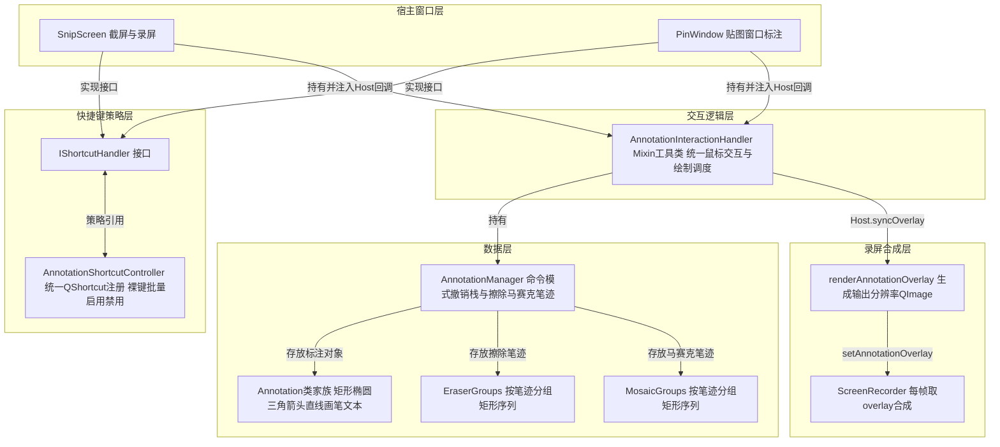

### 2.2 核心类图

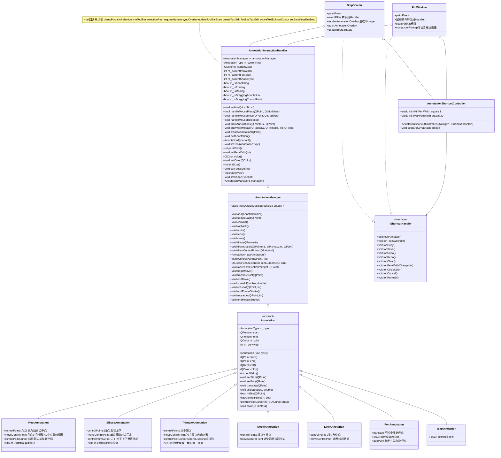

### 2.3 相关文件清单

| 文件 | 说明 |
|---|---|
| `src/capture/Annotation.h` | 标注基类 + 7 个子类 + 控制点/工具枚举 |
| `src/capture/AnnotationManager.h` | 标注管理器（撤销栈、马赛克、橡皮擦、控制点） |
| `src/capture/AnnotationInteractionHandler.h` | Mixin 交互处理器 + Host 回调接口 |
| `src/capture/AnnotationInteractionHandler.cpp` | 鼠标事件、绘制调度、标注创建逻辑 |
| `src/shortcut/AnnotationShortcutController.h` | 标注快捷键控制器（策略模式，基于 QShortcut） |
| `src/shortcut/IShortcutHandler.h` | 宿主窗口需实现的快捷键动作接口 |
| `src/widgets/OverlayTextEdit.h` | 文本工具使用的独立编辑框 |
| `src/capture/SnipScreen.cpp` | 截屏/录屏宿主（注入 Host 回调） |
| `src/widgets/PinWindow.cpp` | 贴图宿主（注入 Host 回调，支持滚轮缩放标注） |

---

## 3. 核心组件详解

### 3.1 Annotation 标注类型体系

**设计模式：模板方法模式**。基类 `Annotation` 负责通用绘制调度（`draw()` 设置统一的画笔属性后调用虚函数 `drawAnnotation()`）和通用属性（start/end/color/penWidth）；子类只需实现 `drawAnnotation()` 即可，可选重写 `controlPoints()`、`moveControlPoint()`、`hitTest()`、`translate()`、`scale()` 等以支持控制点、特殊命中检测、缩放同步等高级能力。

控制点采用 **`ControlPoint{ pos, role }`** 结构，`role` 由子类自定义，`hitControlPoint(pos, 6)` 做命中检测（绘制半径 5px，容差 6px 便于点击）。控制点绘制样式统一为 **白填充 + 灰色边框 5px 圆**（`drawControlPoints()`）。

### 3.2 AnnotationManager（命令模式）

`AnnotationManager` 是纯数据层，不依赖 Qt 窗口，可独立复用于任何场景。内部维护**多条操作序列**，并通过全局操作序号（`nextOpSeq`）统一比较撤销优先级。

#### 操作序列与撤销优先级

| 操作类型 | 数据结构 | 提交函数 |
|---|---|---|
| 标注创建/修改 | `undoStack` / `redoStack` | `commit()` 清空 redo |
| 标注整体移动 | `undoMoveState` / `redoMoveState`（MoveRecord） | `endMove()` 保留原始位置使 undo 生效 |
| 橡皮擦笔迹 | `eraserGroups` / `redoEraserGroups`（按 Stroke 分组） | `endEraserStroke()` |
| 马赛克笔迹 | `mosaicGroups` / `redoMosaicGroups`（按 Stroke 分组） | `endMosaicStroke()` |
| 整体清除 | `clearUndoSnapshot` / `clearRedoSnapshot`（完整快照） | `clear()` |

#### undo() 决策流程图

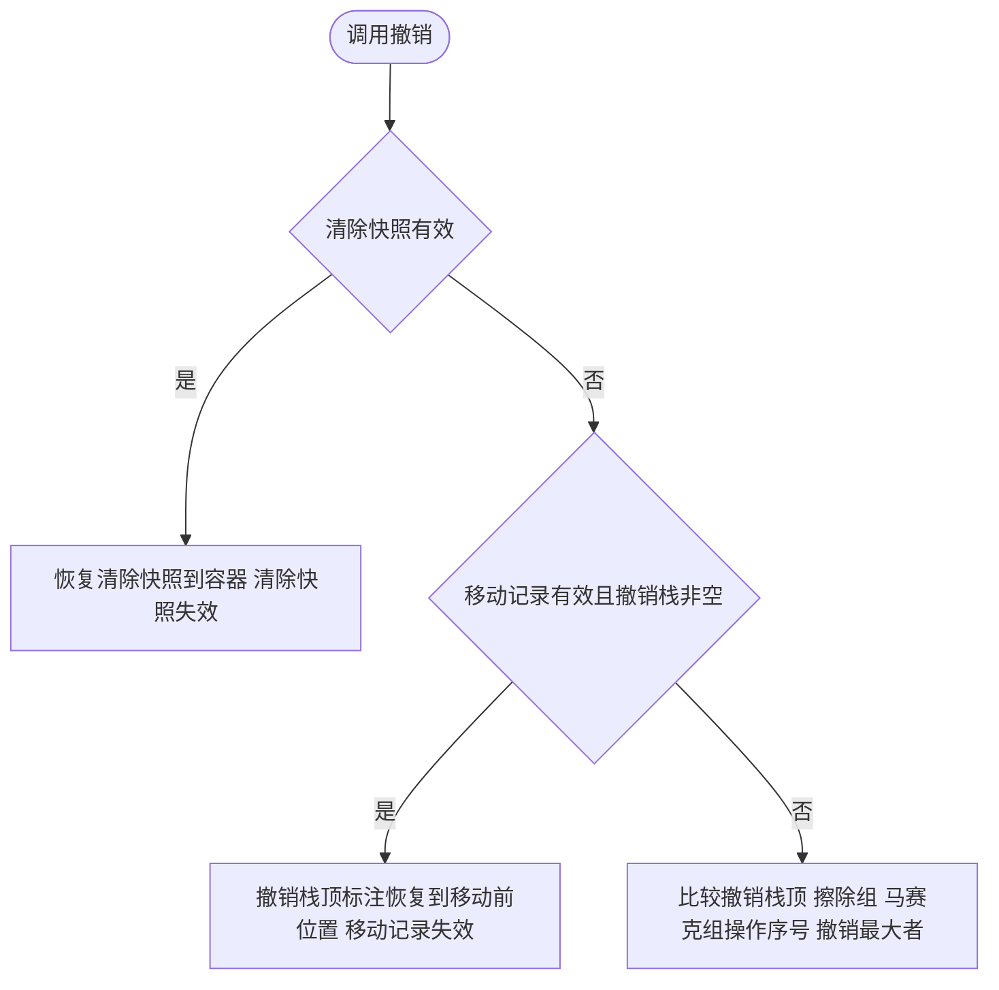

#### redo() 决策流程图

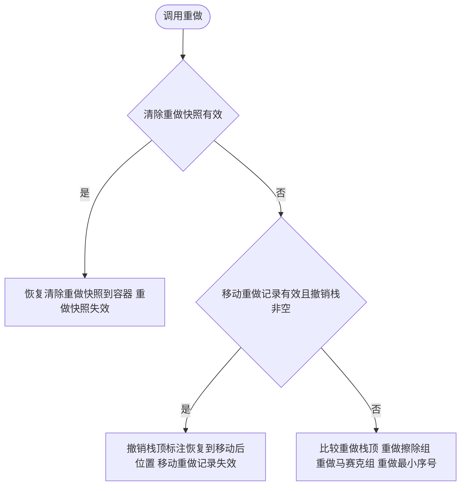

#### 马赛克绘制流程图（drawMosaicRects）

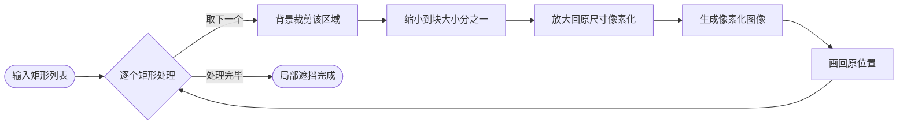

马赛克按 Stroke 以"一组矩形块"存储（每帧鼠标位置的 bounding rect，大小为画笔宽度乘 2）。
常量 `AnnotationManager::kDefaultMosaicBlockSize = 7`，一处修改全局生效。`blockSize` 越大模糊越强（3 为轻度，7 为默认，10 以上为强遮挡）。

#### 橡皮擦实现

橡皮擦不修改标注对象，而是在 `draw()` 时用 `QRegion::subtracted()` 把 eraserRegion 从 `clipRegion` 中扣除，达到**局部擦除笔迹**的视觉效果。擦除范围同样为画笔宽度乘 2 的一系列矩形。

---

### 3.3 AnnotationInteractionHandler（Mixin 工具类）

统一 SnipScreen 和 PinWindow 高度重复的标注交互。内部持有 `AnnotationManager` 实例和一组**属性状态**（tool/color/penWidth/fontSize/shapeType）。

#### Host 回调接口

Host 为 12 个 `std::function` 回调，用于在不引入继承耦合的前提下解决两处窗口差异：

| 回调 | SnipScreen 实现 | PinWindow 实现 |
|---|---|---|
| `clampPos(pos)` | 限制到选区矩形内 | 限制到窗口 rect 内 |
| `isInSelection(pos)` | `m_selector->selected().contains()` | 恒 true（窗口即选区） |
| `isInToolBar(pos)` | `isMouseInToolBar(pos)`（防止点击工具栏被当作标注） | 恒 false（独立顶层工具栏） |
| `selectionRect()` | `m_selector->selected()` | `rect()` |
| `requestUpdate()` | `update()` | `update()` |
| `syncOverlay()` | `pushAnnotationOverlay()`（录屏每帧同步 overlay） | 空（无录屏） |
| `updateToolBarState(u, r)` | `updateToolBarState(u, r)` + 录屏工具栏同步 | `updateToolBarState()` |
| `createTextEdit(globalPos)` | 创建 OverlayTextEdit，全局→本地坐标，设置边界 | 创建 OverlayTextEdit，窗口本地坐标 |
| `finalizeTextEdit()` | 提取文本 → 创建 TextAnnotation → 清理 | 提取文本 → 创建 TextAnnotation → 清理 |
| `activeTextEdit()` | 返回 `m_textEdit` | 返回 `m_textEdit` |
| `setCursor(shape)` | `m_selector->setCursor(shape)` | `setCursor(shape)` |
| `setBareKeysEnabled(e)` | 启用/禁用标注快捷键裸键 | 启用/禁用标注快捷键裸键 |

#### handleMousePress 交互优先级流程图

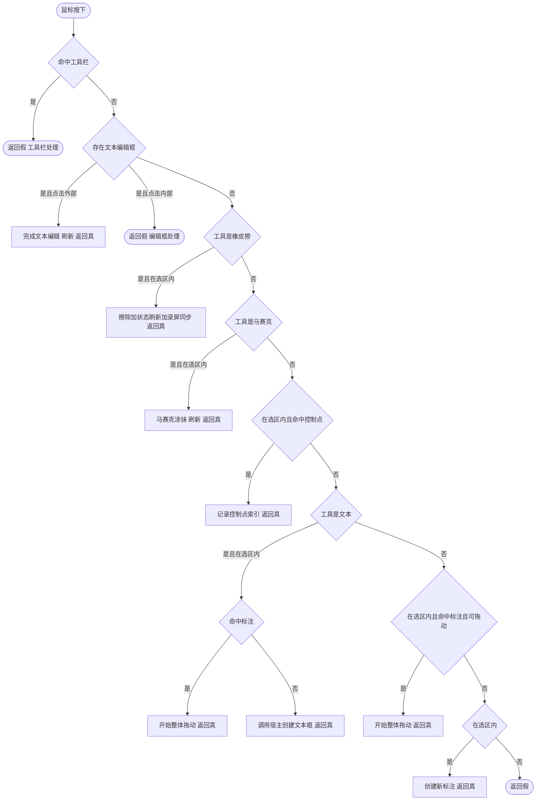

#### handleMouseMove 交互优先级流程图

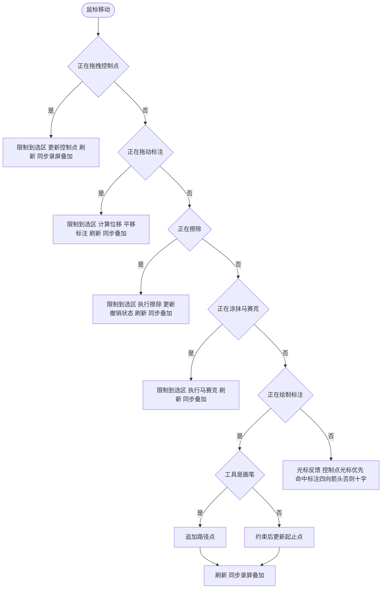

---

### 3.4 AnnotationShortcutController（策略模式）

解决两处窗口重复实现快捷键，并修复 PinWindow 原先使用 keyPressEvent 导致的焦点时序 bug：
- SnipScreen/PinWindow 均实现 `IShortcutHandler` 作为策略
- 控制器以 `parent` 为宿主在构造时注册全部 `QShortcut`，不再依赖 keyPressEvent
- `setBareKeysEnabled(bool)` 批量启用/禁用裸键快捷键，文本编辑框创建时禁用，完成后恢复
- `canAnnotate()` 前置检查统一在控制器完成，宿主无需每个动作重复判断

#### 生命周期时序图

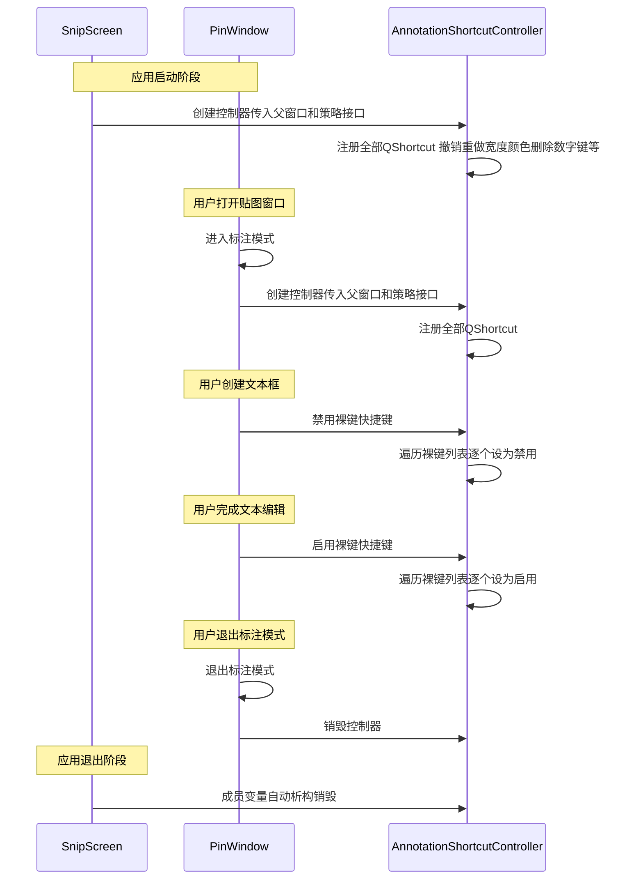

生命周期总结：
- SnipScreen：构造时创建（成员变量），析构时销毁
- PinWindow：`enterAnnotationMode` 创建（堆对象），`exitAnnotationMode` 销毁

---

## 4. 绘制流程

### 4.1 常规绘制时序图（无马赛克/橡皮擦）

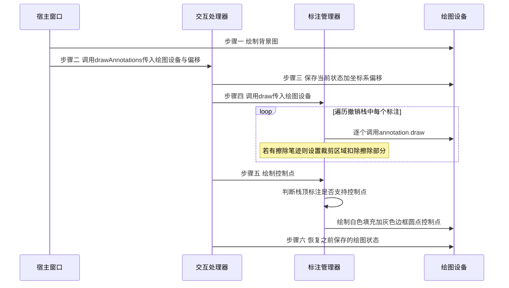

### 4.2 马赛克/橡皮擦绘制（离屏 canvas）流程图

由于马赛克需要对已经画了标注和背景的图像做采样像素化，且橡皮擦使用 clipRegion 扣减，必须先渲染到离屏 QPixmap 再一次性画回窗口。控制点在马赛克之后绘制，确保其白灰圆点清晰可见不被像素化模糊。

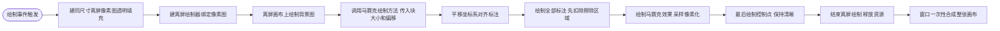

### 4.3 录屏 overlay 同步时序图（renderAnnotationOverlay）

录屏视频只允许标注通过 overlay 合成，为此通过 SetWindowDisplayAffinity 加 WDA_EXCLUDEFROMCAPTURE 将 SnipScreen 排除出 BitBlt 捕获。每次状态变化都调用 syncOverlay 刷新 overlay 图像，录屏器每帧合成。

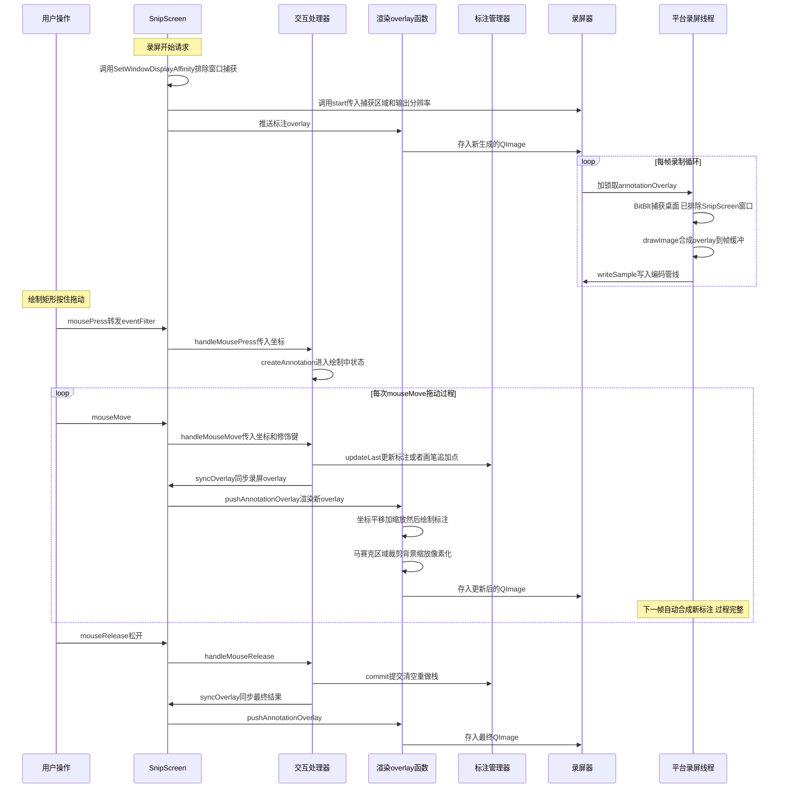

关键坐标对齐：`renderAnnotationOverlay` 内部使用的捕获区域等于选区减去边框宽度，与 `ScreenRecorder::start` 传入的捕获矩形完全一致，消除边框宽度带来的标注偏移。

---

## 5. 关键技术点

### 5.1 Shift 与 Alt 修饰键约束

`AnnotationManager::applyModifierConstraints` 在 handleMouseMove 绘制分支中调用：
- **Shift 等比**：矩形和椭圆约束为正方形或圆形 直线箭头约束为45度倍数
- **Alt 中心**：以鼠标按下点为锚点向两侧对称展开
- **Shift加Alt**：两种约束可以组合使用
- **边界限制**：最终起止点被限制在选区内 防止标注超出选区或窗口

### 5.2 控制点与光标映射

| 标注 | 控制点数 | 光标映射 |
|---|---|---|
| RectAnnotation | 8（TL/TR/BL/BR / T/B/L/R） | 角点斜双箭头光标 边中点单轴光标 |
| EllipseAnnotation | 4（左右上下） | 左右为水平光标 上下为垂直光标 |
| TriangleAnnotation | 3（三个顶点） | 四向箭头光标 |
| ArrowAnnotation | 2（起点终点） | 四向箭头光标 |
| LineAnnotation | 2（起点终点） | 四向箭头光标 |

悬停在标注边框命中但非控制点时统一显示四向箭头光标表示可整体拖动。马赛克与橡皮擦工具悬停始终显示十字光标。

### 5.3 PinWindow 标注缩放同步 scaleAll

PinWindow 滚轮缩放窗口时所有标注必须随图像同步缩放否则标注偏离原位置。调用 `manager().scaleAll(sx, sy)`：
- 每个标注调用 scale 矩形类缩放起止点 画笔额外缩放路径点 文本额外缩放字号
- 画笔宽度按平均缩放 保证视觉一致
- 马赛克与橡皮擦矩形笔迹同步缩放 保证遮挡与擦除区域匹配

### 5.4 录屏过程完整性

每个操作的 Move 阶段和 Release 阶段都会调用 syncOverlay 确保视频中的过程与窗口绘制一致。

| 操作 | Move 拖动过程 | Release 结束提交 | 修复前遗留问题 |
|---|---|---|---|
| 控制点拖拽 | 已同步 | 已同步 | 无 |
| 标注整体拖动 | 已同步 | 已同步 | 修复前拖动过程未显示 |
| 橡皮擦擦除 | 已同步 | 已同步 | 无 |
| 马赛克涂抹 | 已同步 | 已同步 | 无 |
| 绘制矩形椭圆箭头直线画笔 | 已同步 | 已同步 | 修复前绘制过程未显示只看到最终结果 |

---

## 6. 扩展指南 如何新增一种标注类型

### 新增 StarAnnotation 流程图

```mermaid
graph LR
    S1([新增五角星子类继承标注基类]) --> S2([重写绘制方法 可选支持控制点])
    S2 --> S3([实现五个顶点控制点和拖动与光标])
    S3 --> S4([重写命中检测与缩放平移同步顶点])
    S4 --> S5([标注类型枚举加五角星成员 编号为八])
    S5 --> S6([交互处理器创建标注时新增五角星分支])
    S6 --> S7([三类工具栏加五角星按钮 toolId设为八])
    S7 --> S8([快捷键注册加数字键九的快捷方式])
    S8 --> S9([八项验证 绘制约束拖动擦除 撤销重做清除导出])
```

### 验证清单（步骤 9）

1. **绘制**：鼠标按下拖动松开五角星正常出现
2. **控制点调节**：五个控制点可拖拽变形 撤销可以恢复到原始形态
3. **修饰键约束**：绘制中 Shift 与 Alt 行为表现合理符合直觉
4. **拖动**：悬停显示四向箭头光标 拖动中位置实时同步
5. **橡皮擦**：局部擦除五角星边线 擦除笔迹可正常撤销恢复
6. **撤销重做清除**：整体清除后可通过撤销恢复 三层优先级表现正常
7. **导出**：截屏复制与保存 贴图复制与保存中的五角星形状均正确
8. **录屏overlay同步**：录制过程中绘制五角星过程完整可见 结果不重复不偏移

---

## 7. 修复历史

| 提交 | 说明 |
|---|---|
| ca951f5 | 创建 AnnotationInteractionHandler 提取公共标注交互逻辑 阶段一 |
| e8eb7d0 | SnipScreen 接入 Handler 净减少约三百二十二行 阶段二 |
| ba69e55 | PinWindow 接入 Handler 净减少约二百四十八行 阶段三 |
| a8843a8 | 修复录屏视频中标注重复显示 排除SnipScreen窗口捕获加overlay坐标与边框对齐 |
| 08e0c2e | 修复录屏过程中绘制与拖动过程不显示 补充handleMouseMove分支中两处syncOverlay调用 |
