# QuickShot 架构技术文档

## 1. 概述

QuickShot 是一款跨平台的截图与录屏工具，基于 **Qt 6.10.2** 框架开发。支持全屏截图、区域截图、窗口截图、区域录屏、窗口录屏等多种功能，内置丰富的标注工具、智能 OCR 识别能力和多引擎文字翻译。

### 1.1 技术栈

| 组件 | 技术 | 说明 |
|------|------|------|
| UI 框架 | Qt 6.10.2 | 跨平台 GUI 框架 |
| C++ 标准 | C++17 | 现代 C++ 特性 |
| 构建系统 | CMake | 跨平台构建工具 |
| OCR 引擎 | ONNX Runtime + PP-OCRv4 | 文字识别 |
| 翻译引擎 | Qt6::Network + 多引擎抽象 | MyMemory 默认 + 百度/DeepL/LibreTranslate |
| 屏幕捕获 | Win32 GDI / ScreenCaptureKit / X11 | 原生屏幕捕获 |
| 视频编码 | Media Foundation / AVAssetWriter / FFmpeg | 视频录制 |
| 音频捕获 | WASAPI / ScreenCaptureKit+AVCaptureSession | 系统音频+麦克风 |
| 数据存储 | SQLite（Qt6::Sql） | 历史记录本地数据库 |
| 国际化 | Qt Linguist + JSON | 多语言支持 |
| 并发执行 | QtConcurrent / std::thread | 异步任务处理 |

### 1.2 核心特性

- **多种截图模式**：全屏、区域、窗口、显示器
- **智能选区**：自动吸附到窗口/显示器边界，支持滚轮切换吸附层级
- **丰富标注工具**：矩形、椭圆、三角形、画笔、箭头、直线、文本、马赛克、橡皮擦
- **标注约束**：绘制矩形/椭圆/箭头/直线时支持 Shift 等比约束与 Alt 中心约束，自动限制在选区内
- **标注控制点调节光标**：矩形/椭圆/箭头/直线标注的控制点根据位置自动适配光标样式（对角/水平/垂直/四向）
- **马赛克与橡皮擦联动**：马赛克块大小与橡皮擦半径同步联动画笔粗细（m_currentPenWidth × 2），全局马赛克算法消除逐块错位
- **标注交互逻辑统一**：SnipScreen 与 PinWindow 的标注交互通过 AnnotationInteractionHandler 共享实现，通过 Host 回调注入窗口差异
- **实时录屏**：支持区域录制和窗口录制，带实时标注（录屏时 SnipScreen 使用 WDA_EXCLUDEFROMCAPTURE 排除捕获，避免标注重复；overlay 坐标与 captureRect 对齐消除偏移）
- **音频录制**：系统音频 + 麦克风
- **OCR 识别**：中英文、英文、日文、韩文识别，支持贴图窗口识别
- **文字翻译**：OCR 结果弹窗内对照翻译、截图/录屏/贴图工具栏一键译文叠加显示，支持 4 种引擎
- **贴图窗口标注模式**：PinWindow 右键进入标注模式，支持 8 种标注工具与 Shift/Alt 约束，独立工具栏
- **贴图历史分页（Alt+P）**：首次按下以鼠标屏幕为中心显示最新截图，后续按时间倒序循环显示历史截图，位置依次偏移 (24,24)
- **可配置全局热键**：9 个可自定义全局热键（截图/录屏/历史/贴图/全屏/活动窗口/录屏暂停/录屏停止/隐藏贴图），通过 ShortcutManager 集中管理
- **标注快捷键统一**：SnipScreen 与 PinWindow 通过 AnnotationShortcutController + QShortcut 统一注册标注快捷键（数字键1-8切换工具、[/]调笔宽、Tab循环颜色等），文本编辑框获得焦点时自动禁用裸键避免输入冲突
- **历史记录**：截图与剪贴板文本历史记录，支持多选、批量删除、搜索、自动清理
- **多语言界面**：简体中文、繁体中文（台湾）、繁体中文（香港）、英文、日文、韩文
- **跨平台**：Windows、macOS、Linux
- **主题定制**：自定义工具栏颜色、边框颜色等
- **工具栏防闪烁**：BaseToolBar 子工具栏切换时使用同步 delete + setUpdatesEnabled 双重保护，PinWindow 顶层窗口额外添加 WA_NoSystemBackground 阻止系统背景清除

---

## 2. 整体架构

### 2.1 分层架构图


```mermaid
graph TB
    subgraph 应用层
        A[SnipScreen 主窗口]
        B[PinWindow 贴图窗口]
        C[SettingsWindow 设置窗口]
        D[OcrResultDialog OCR结果]
        E[RecordingControlWindow 录制控制]
        F2[HistoryWindow 历史记录窗口]
        TW[TranslateOverlayWindow 译文叠加窗口]
    end

    subgraph 业务逻辑层
        F[Selector 选区组件]
        AIH[AnnotationInteractionHandler 标注交互处理器]
        G[AnnotationManager 标注管理]
        H[Hunter 窗口捕捉]
        I[OcrEngine OCR引擎]
        J[ScreenRecorder 录屏器]
        H2[HistoryManager 历史记录管理]
        C2[ClipboardMonitor 剪贴板监听]
        TS[TranslateService 翻译服务]
    end

    subgraph 快捷键系统层
        SM[ShortcutManager 管理器外观]
        SR[ShortcutRegistry 注册表]
        TMB[TrayMenuBuilder 托盘构建器]
        ASC[AnnotationShortcutController 标注控制器]
        ISH[IShortcutHandler 策略接口]
    end

    subgraph UI组件层
        K[ScreenshotToolBar 截图工具栏]
        L[RecordingToolBar 录屏工具栏]
        M[BaseToolBar 基础工具栏]
        N[OverlayTextEdit 文本编辑框]
        O[PrecisionSlider 精度滑块]
    end

    subgraph 翻译引擎层
        TE[TranslateEngine 抽象接口]
        MM[MyMemoryEngine 默认免注册]
        BD[BaiduTranslateEngine]
        DL[DeepLEngine]
        LT[LibreTranslateEngine]
    end

    subgraph 核心服务层
        P[ConfigManager 配置管理]
        Q[StyleManager 样式管理]
        R[TranslationManager 翻译管理]
        S[GlobalShortcut 全局热键底层]
        T[Logger 日志系统]
        U2[Utils 工具函数]
    end

    subgraph 基础设施层
        U[Qt Framework]
        V[ONNX Runtime]
        W[平台API Windows/macOS/Linux]
        X[FFmpeg]
        Y[SQLite 数据库]
        NET[Qt6::Network]
    end

    A --> F
    A --> AIH
    AIH --> G
    B --> AIH
    A --> K
    A --> L
    A --> I
    A --> J
    A --> H
    A --> H2
    A --> TS
    B --> I
    B --> H
    B --> TS
    D --> TS
    TW --> TS
    E --> J
    C --> P
    C --> Q
    C --> R
    C --> H2
    F2 --> H2
    F2 --> R
    F2 --> Q
    F2 --> U2
    C2 --> H2
    H2 --> Y
    F --> H
    G --> N
    K --> M
    L --> M
    I --> V
    J --> W
    J --> X
    TS --> TE
    TE --> MM
    TE --> BD
    TE --> DL
    TE --> LT
    TS --> NET

    SM --> SR
    SR --> S
    SM --> TMB
    A --> ASC
    B --> ASC
    ASC --> ISH
    A -- 实现 --> ISH
    B -- 实现 --> ISH
    C --> SM
    SM --> A
    SM --> F2

    P --> U
    Q --> U
    R --> U
    S --> W
    T --> U
    U2 --> U

    style A fill:#e1f5fe
    style B fill:#e1f5fe
    style C fill:#e1f5fe
    style D fill:#e1f5fe
    style E fill:#e1f5fe
    style F2 fill:#e1f5fe
    style AIH fill:#ffe0b2
    style F fill:#fff3e0
    style G fill:#fff3e0
    style H fill:#fff3e0
    style I fill:#fff3e0
    style J fill:#fff3e0
    style H2 fill:#fff3e0
    style C2 fill:#fff3e0
    style SM fill:#e1bee7
    style SR fill:#e1bee7
    style TMB fill:#e1bee7
    style ASC fill:#e1bee7
    style ISH fill:#e1bee7
    style K fill:#f3e5f5
    style L fill:#f3e5f5
    style M fill:#f3e5f5
    style N fill:#f3e5f5
    style O fill:#f3e5f5
    style P fill:#e8f5e9
    style Q fill:#e8f5e9
    style R fill:#e8f5e9
    style S fill:#e8f5e9
    style T fill:#e8f5e9
    style U2 fill:#e8f5e9
```

### 2.2 模块依赖关系

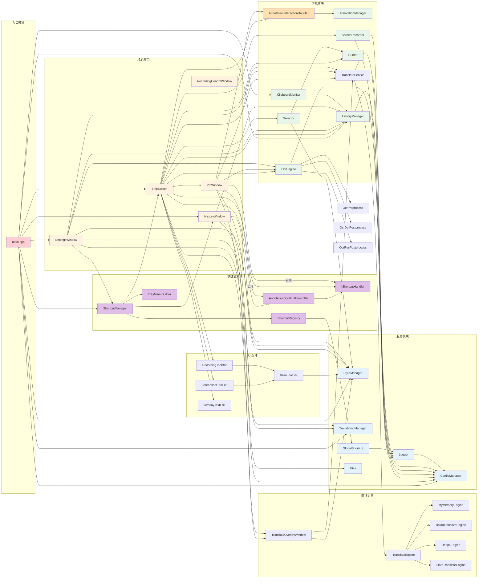
```mermaid
graph LR
    subgraph 入口模块
        main.cpp
    end

    subgraph 核心窗口
        SnipScreen
        PinWindow
        SettingsWindow
        RecordingControlWindow
        HistoryWindow
    end

    subgraph 功能模块
        Selector
        AnnotationInteractionHandler
        AnnotationManager
        ScreenRecorder
        OcrEngine
        Hunter
        HistoryManager
        ClipboardMonitor
        TranslateService
    end

    subgraph 快捷键系统
        ShortcutManager
        ShortcutRegistry
        TrayMenuBuilder
        AnnotationShortcutController
        IShortcutHandler
    end

    subgraph 翻译引擎
        TranslateEngine
        MyMemoryEngine
        BaiduTranslateEngine
        DeepLEngine
        LibreTranslateEngine
        TranslateOverlayWindow
    end

    subgraph UI组件
        ScreenshotToolBar
        RecordingToolBar
        BaseToolBar
        OverlayTextEdit
    end

    subgraph 服务模块
        ConfigManager
        StyleManager
        TranslationManager
        GlobalShortcut
        Logger
        Utils
    end

    main.cpp --> SnipScreen
    main.cpp --> SettingsWindow
    main.cpp --> ShortcutManager
    main.cpp --> ConfigManager
    main.cpp --> TranslationManager
    main.cpp --> StyleManager
    main.cpp --> HistoryManager
    main.cpp --> ClipboardMonitor
    main.cpp --> HistoryWindow

    ShortcutManager --> ShortcutRegistry
    ShortcutManager --> TrayMenuBuilder
    ShortcutRegistry --> GlobalShortcut
    SettingsWindow --> ShortcutManager
    ShortcutManager --> SnipScreen
    ShortcutManager --> HistoryWindow

    AnnotationShortcutController --> IShortcutHandler
    SnipScreen -- 实现 --> IShortcutHandler
    PinWindow -- 实现 --> IShortcutHandler
    SnipScreen --> AnnotationShortcutController
    PinWindow --> AnnotationShortcutController

    SnipScreen --> Selector
    SnipScreen --> AnnotationInteractionHandler
    PinWindow --> AnnotationInteractionHandler
    AnnotationInteractionHandler --> AnnotationManager

    SnipScreen --> ScreenshotToolBar
    SnipScreen --> RecordingToolBar
    SnipScreen --> ScreenRecorder
    SnipScreen --> OcrEngine
    SnipScreen --> Hunter
    SnipScreen --> OverlayTextEdit
    SnipScreen --> PinWindow
    SnipScreen --> HistoryManager
    SnipScreen --> TranslateService
    SnipScreen --> TranslateOverlayWindow

    Selector --> Hunter
    Selector --> StyleManager

    ScreenshotToolBar --> BaseToolBar
    RecordingToolBar --> BaseToolBar
    BaseToolBar --> StyleManager

    PinWindow --> OcrEngine
    PinWindow --> StyleManager
    PinWindow --> TranslateService
    PinWindow --> TranslateOverlayWindow

    SettingsWindow --> ConfigManager
    SettingsWindow --> TranslationManager
    SettingsWindow --> StyleManager
    SettingsWindow --> OcrEngine
    SettingsWindow --> HistoryManager
    SettingsWindow --> TranslateService

    HistoryWindow --> HistoryManager
    HistoryWindow --> TranslationManager
    HistoryWindow --> StyleManager
    HistoryWindow --> Utils

    ClipboardMonitor --> HistoryManager

    HistoryManager --> ConfigManager
    HistoryManager --> Logger

    ScreenRecorder --> Logger
    ScreenRecorder --> ConfigManager

    OcrEngine --> OcrPreprocess
    OcrEngine --> OcrDetPostprocess
    OcrEngine --> OcrRecPostprocess
    OcrEngine --> ConfigManager

    TranslateService --> TranslateEngine
    TranslateService --> ConfigManager
    TranslateService --> Logger
    TranslateEngine --> MyMemoryEngine
    TranslateEngine --> BaiduTranslateEngine
    TranslateEngine --> DeepLEngine
    TranslateEngine --> LibreTranslateEngine
    TranslateOverlayWindow --> TranslateService
    TranslateOverlayWindow --> StyleManager

    Logger --> ConfigManager
    GlobalShortcut --> Logger

    style main.cpp fill:#ffcdd2
    style SnipScreen fill:#fff3e0
    style PinWindow fill:#fff3e0
    style SettingsWindow fill:#fff3e0
    style RecordingControlWindow fill:#fff3e0
    style HistoryWindow fill:#fff3e0
    style Selector fill:#e8f5e9
    style AnnotationInteractionHandler fill:#ffe0b2
    style AnnotationManager fill:#e8f5e9
    style ScreenRecorder fill:#e8f5e9
    style OcrEngine fill:#e8f5e9
    style Hunter fill:#e8f5e9
    style HistoryManager fill:#e8f5e9
    style ClipboardMonitor fill:#e8f5e9
    style ShortcutManager fill:#e1bee7
    style ShortcutRegistry fill:#e1bee7
    style TrayMenuBuilder fill:#e1bee7
    style AnnotationShortcutController fill:#e1bee7
    style IShortcutHandler fill:#e1bee7
    style ConfigManager fill:#e3f2fd
    style StyleManager fill:#e3f2fd
    style TranslationManager fill:#e3f2fd
    style GlobalShortcut fill:#e3f2fd
    style Logger fill:#e3f2fd
    style Utils fill:#e3f2fd
```

---

## 3. UML 类图

### 3.1 核心窗口类图


```mermaid
classDiagram
    direction TB

    class SnipScreen {
        -Selector* m_selector
        -ScreenshotToolBar* m_toolbar
        -RecordingToolBar* m_recordingToolbar
        -RecordingControlWindow* m_recordingControl
        -ScreenRecorder* m_screenRecorder
        -unique_ptr~AnnotationInteractionHandler~ m_annotationHandler
        -AnnotationShortcutController* m_annotationShortcutController
        -QPixmap m_background
        -QPixmap m_annotatedBackground
        -QRect m_virtualGeometry
        -QPoint m_globalOffset
        -int m_pinHistoryIndex
        -QPoint m_lastPinPos
        -QPointer~PinWindow~ m_lastPinHistoryWindow
        -bool m_isRecordingMode
        -bool m_isRecordingCanceled
        -OverlayTextEdit* m_textEdit
        -QTimer* m_screenWatchTimer
        +void start()
        +void startRecording()
        +void exit()
        +void copy()
        +void save()
        +void pin()
        +void pinClipboard()
        +void grabFullscreen()
        +void grabActiveWindow()
        +void snapshotRequested()
        +std::pair~QPixmap, QPoint~ snip()
        +void showToolBar()
        +void hideToolBar()
        +void undoAnnotation()
        +void redoAnnotation()
        +void clearAnnotations()
        -void grabVirtualDesktop()
        -void initAnnotationHandler()
        -void switchToRecordingMode()
        -void switchToScreenshotMode()
        -void updateBorderColor()
        -void calculateToolbarPositions(...)
        -QPixmap captureSelectionForOcr()
        -void performOcr(pixmap)
        -void finalizeTextEdit()
        -QImage renderAnnotationOverlay()
        -void pushAnnotationOverlay()
        -void updateInputMask()
        -void updateToolBarState(...)
        -bool isMouseInToolBar(...)
        -QPoint clampToSelection(pos)
        -QPoint mapToSelection(globalPos)
        -void checkScreenSwitch()
        -void excludeFromCapture(exclude)
        +bool canAnnotate()
        +void onToolSwitch(id)
        +void onCopy()
        +void onSave()
        +void onUndo()
        +void onRedo()
        +void onClear()
        +void onPenWidthChange(delta)
        +void onCycleColor()
        +void onCancel()
        +void onRefresh()
    }

    class AnnotationInteractionHandler {
        -AnnotationManager m_annotationManager
        -Host m_host
        -bool m_isAnnotating
        -bool m_isErasing
        -bool m_isMosing
        -bool m_isDraggingAnnotation
        -bool m_isDraggingControlPoint
        -AnnotationType m_currentTool
        -QColor m_currentColor
        -int m_currentPenWidth
        -int m_currentFontSize
        -int m_currentShapeType
        +void setHost(host)
        +bool handleMousePress(pos, mods)
        +bool handleMouseMove(pos, mods)
        +bool handleMouseRelease()
        +void drawAnnotations(painter, offset)
        +void drawWithMosaic(painter, canvas, blockSize, offset)
        +void createAnnotation(start)
        +void exitAnnotation()
        +AnnotationManager& manager()
        +AnnotationType tool()
        +void setTool(tool)
        +QColor color()
        +void setColor(color)
        +int penWidth()
        +void setPenWidth(width)
        +int fontSize()
        +void setFontSize(size)
        +int shapeType()
        +void setShapeType(type)
        +bool isAnnotating()
        +bool isErasing()
        +bool isMosing()
        +bool isInteractionActive()
    }

    class Selector {
        -Resizer m_box
        -Prey m_prey
        -SelectorStatus m_status
        -SelectionScope m_scope
        -QLabel* m_infoLabel
        -QLabel* m_timerLabel
        -bool m_isAnnotationMode
        -QSize m_minSize
        +void start()
        +QRect selected(relative)
        +Prey prey()
        +SelectorStatus status()
        +void setScope(scope)
        +void setAnnotationMode(enabled)
        +bool isAnnotationMode()
        +void showTimerLabel()
        +void updateTimerText(text)
        +void hideTimerLabel()
        +void setCoordinate(window)
        +void setBorderPen(pen)
        +void setMaskColor(color)
        +void showCrossHair(show)
        +void setMinValidSize(w, h)
        +bool isInvalid()
        +void select(prey)
        +void select(rect)
        +void switchScreen(coordinate)
        +void updateInfoLabel()
        +QRegion getLabelGeometry()
    }

    class PinWindow {
        -QPixmap m_pixmap
        -bool m_isMoving
        -bool m_isResizing
        -QLabel* m_ocrLoadingLabel
        -unique_ptr~AnnotationInteractionHandler~ m_annotationHandler
        -AnnotationShortcutController* m_annotationShortcutController
        -PinAnnotationToolBar* m_toolBar
        -OverlayTextEdit* m_textEdit
        -bool m_annotationMode
        -bool m_hiddenByToggle
        -static int s_instances
        +static toggleAll()
        +static instanceCount()
        +void paintEvent(event)
        +void mousePressEvent(event)
        +void mouseMoveEvent(event)
        +void mouseReleaseEvent(event)
        +void mouseDoubleClickEvent(event)
        +void wheelEvent(event)
        +void contextMenuEvent(event)
        +void moveEvent(event)
        +void resizeEvent(event)
        +void closeEvent(event)
        -void copyToClipboard()
        -void saveToFile()
        -bool isInResizeArea(pos)
        -void enterAnnotationMode()
        -void exitAnnotationMode()
        -void initAnnotationHandler()
        -void finalizeTextEdit()
        -void performTranslate()
        -void updateToolBarState()
        +bool canAnnotate()
        +void onToolSwitch(id)
        +void onCopy()
        +void onSave()
        +void onUndo()
        +void onRedo()
        +void onClear()
        +void onPenWidthChange(delta)
        +void onCycleColor()
        +void onCancel()
    }

    class RecordingControlWindow {
        -QPushButton* btnStart
        -QPushButton* btnPause
        -QPushButton* btnResume
        -QPushButton* btnStop
        -QCheckBox* chkSystemAudio
        -QCheckBox* chkMicrophone
        -bool m_isRecording
        -bool m_isPaused
        +void retranslateUi()
        +void updateButtonStates(isRecording, isPaused)
        +void updateButtonStyles()
        +void updateBackgroundStyle()
        +void setRecording(recording)
        +void setPaused(paused)
    }

    SnipScreen *-- Selector
    SnipScreen *-- ScreenshotToolBar
    SnipScreen *-- RecordingToolBar
    SnipScreen *-- RecordingControlWindow
    SnipScreen *-- ScreenRecorder
    SnipScreen o-- AnnotationInteractionHandler
    SnipScreen o-- AnnotationShortcutController
    SnipScreen *-- OverlayTextEdit
    SnipScreen ..> PinWindow

    PinWindow o-- AnnotationInteractionHandler
    PinWindow o-- AnnotationShortcutController

    AnnotationInteractionHandler *-- AnnotationManager
```

### 3.2 工具栏类图

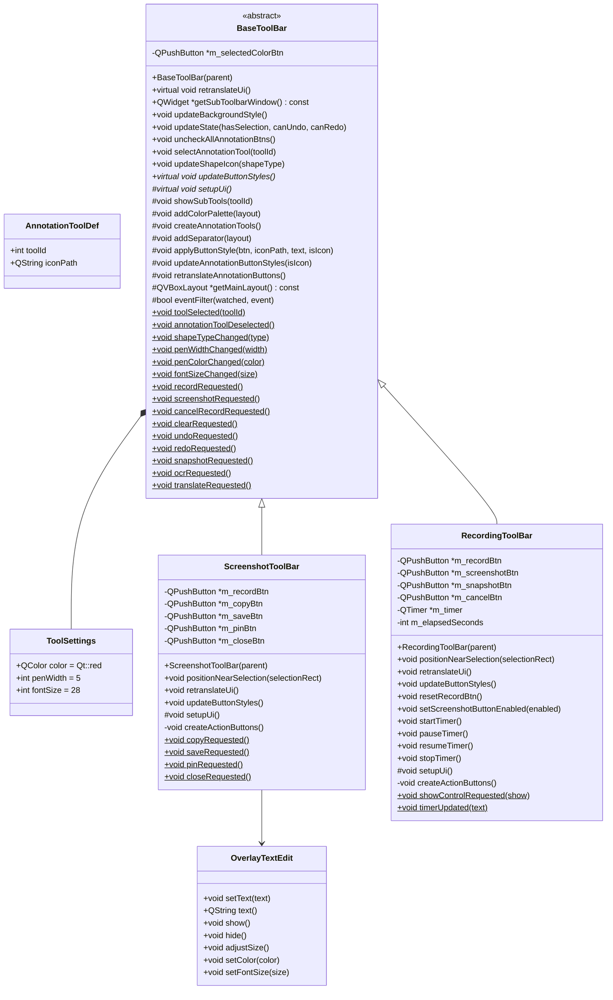
```mermaid
classDiagram
    direction TB

    class ToolSettings {
        +QColor color = Qt::red
        +int penWidth = 5
        +int fontSize = 28
    }

    class AnnotationToolDef {
        +int toolId
        +QString iconPath
    }

    class BaseToolBar {
        <<abstract>>
        +BaseToolBar(parent)
        +virtual void retranslateUi()
        +QWidget *getSubToolbarWindow() const
        +void updateBackgroundStyle()
        +void updateState(hasSelection, canUndo, canRedo)
        +void uncheckAllAnnotationBtns()
        +void selectAnnotationTool(toolId)
        +void updateShapeIcon(shapeType)
        +virtual void updateButtonStyles()*
        #virtual void setupUi()*
        #void showSubTools(toolId)
        #void addColorPalette(layout)
        #void createAnnotationTools()
        #void addSeparator(layout)
        #void applyButtonStyle(btn, iconPath, text, isIcon)
        #void updateAnnotationButtonStyles(isIcon)
        #void retranslateAnnotationButtons()
        #QVBoxLayout *getMainLayout() const
        #bool eventFilter(watched, event)
        -QPushButton *m_selectedColorBtn

        +void toolSelected(toolId)$
        +void annotationToolDeselected()$
        +void shapeTypeChanged(type)$
        +void penWidthChanged(width)$
        +void penColorChanged(color)$
        +void fontSizeChanged(size)$
        +void recordRequested()$
        +void screenshotRequested()$
        +void cancelRecordRequested()$
        +void clearRequested()$
        +void undoRequested()$
        +void redoRequested()$
        +void snapshotRequested()$
        +void ocrRequested()$
        +void translateRequested()$
    }

    class ScreenshotToolBar {
        +ScreenshotToolBar(parent)
        +void positionNearSelection(selectionRect)
        +void retranslateUi()
        +void updateButtonStyles()
        #void setupUi()
        -void createActionButtons()
        +void copyRequested()$
        +void saveRequested()$
        +void pinRequested()$
        +void closeRequested()$
        -QPushButton *m_recordBtn
        -QPushButton *m_copyBtn
        -QPushButton *m_saveBtn
        -QPushButton *m_pinBtn
        -QPushButton *m_closeBtn
    }

    class RecordingToolBar {
        +RecordingToolBar(parent)
        +void positionNearSelection(selectionRect)
        +void retranslateUi()
        +void updateButtonStyles()
        +void resetRecordBtn()
        +void setScreenshotButtonEnabled(enabled)
        +void startTimer()
        +void pauseTimer()
        +void resumeTimer()
        +void stopTimer()
        #void setupUi()
        -void createActionButtons()
        +void showControlRequested(show)$
        +void timerUpdated(text)$
        -QPushButton *m_recordBtn
        -QPushButton *m_screenshotBtn
        -QPushButton *m_snapshotBtn
        -QPushButton *m_cancelBtn
        -QTimer *m_timer
        -int m_elapsedSeconds
    }

    class OverlayTextEdit {
        +void setText(text)
        +QString text()
        +void show()
        +void hide()
        +void adjustSize()
        +void setColor(color)
        +void setFontSize(size)
    }

    BaseToolBar <|-- ScreenshotToolBar
    BaseToolBar <|-- RecordingToolBar
    BaseToolBar *-- ToolSettings
    ScreenshotToolBar --> OverlayTextEdit
```

> **说明**：
> - `toolSelected`、`undoRequested`、`redoRequested`、`clearRequested`、`ocrRequested`、`translateRequested`、`recordRequested`、`screenshotRequested`、`cancelRecordRequested`、`snapshotRequested` 等信号统一在 `BaseToolBar` 中声明，子类不再重复声明。
> - `BaseToolBar` 的 protected 方法（如 `createAnnotationTools`、`addSeparator`、`applyButtonStyle`、`updateAnnotationButtonStyles`、`retranslateAnnotationButtons`、`showSubTools`、`addColorPalette`）被子类共享调用。
> - `ToolSettings` 默认值：`color = Qt::red`、`penWidth = 5`（对应画笔粗细滑块 1~20 的 1/4）、`fontSize = 28`（对应字号滑块 8~48 的中位值）。
> - `applyButtonStyle` 中通过 `btn->objectName() == "cancelButton"` 识别取消/关闭按钮，对它们应用 `StyleManager::applyCloseButtonStyle()`（红色样式），避免被普通工具按钮样式覆盖。两个工具栏的取消按钮在创建时都设置了 `setObjectName("cancelButton")`。
> - `ScreenshotToolBar` 自有信号：`copyRequested`、`saveRequested`、`pinRequested`、`closeRequested`。
> - `RecordingToolBar` 自有信号：`showControlRequested`、`timerUpdated`；并新增计时控制方法 `startTimer/pauseTimer/resumeTimer/stopTimer`、`resetRecordBtn`、`setScreenshotButtonEnabled`。

### 3.3 标注系统类图

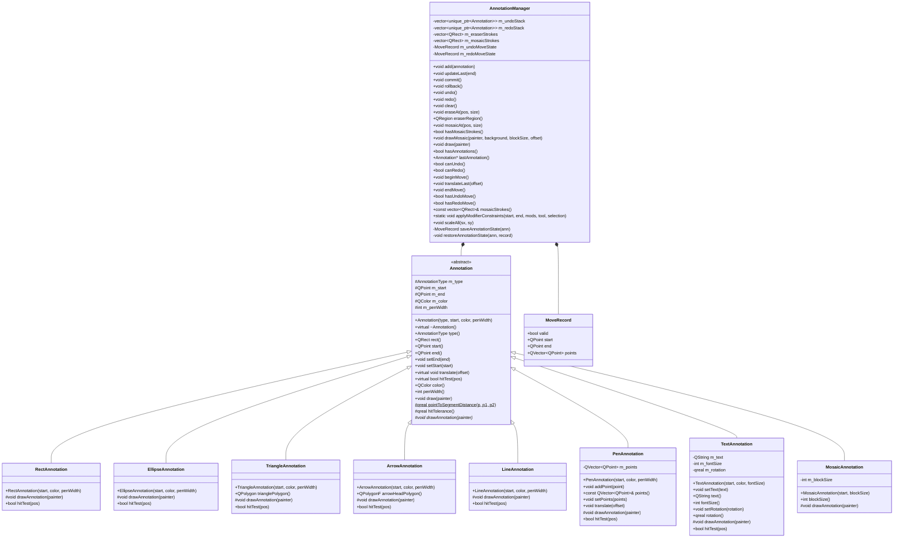
```mermaid
classDiagram
    direction TB

    class Annotation {
        <<abstract>>
        #AnnotationType m_type
        #QPoint m_start
        #QPoint m_end
        #QColor m_color
        #int m_penWidth
        +Annotation(type, start, color, penWidth)
        +virtual ~Annotation()
        +AnnotationType type()
        +QRect rect()
        +QPoint start()
        +QPoint end()
        +void setEnd(end)
        +void setStart(start)
        +virtual void translate(offset)
        +virtual bool hitTest(pos)
        +QColor color()
        +int penWidth()
        +void draw(painter)
        #qreal pointToSegmentDistance(p, p1, p2)$
        #qreal hitTolerance()
        #void drawAnnotation(painter)*
    }

    class RectAnnotation {
        +RectAnnotation(start, color, penWidth)
        #void drawAnnotation(painter)
        +bool hitTest(pos)
    }

    class EllipseAnnotation {
        +EllipseAnnotation(start, color, penWidth)
        #void drawAnnotation(painter)
        +bool hitTest(pos)
    }

    class TriangleAnnotation {
        +TriangleAnnotation(start, color, penWidth)
        +QPolygon trianglePolygon()
        #void drawAnnotation(painter)
        +bool hitTest(pos)
    }

    class ArrowAnnotation {
        +ArrowAnnotation(start, color, penWidth)
        +QPolygonF arrowHeadPolygon()
        #void drawAnnotation(painter)
        +bool hitTest(pos)
    }

    class LineAnnotation {
        +LineAnnotation(start, color, penWidth)
        #void drawAnnotation(painter)
        +bool hitTest(pos)
    }

    class PenAnnotation {
        -QVector~QPoint~ m_points
        +PenAnnotation(start, color, penWidth)
        +void addPoint(point)
        +const QVector~QPoint~& points()
        +void setPoints(points)
        +void translate(offset)
        #void drawAnnotation(painter)
        +bool hitTest(pos)
    }

    class TextAnnotation {
        -QString m_text
        -int m_fontSize
        -qreal m_rotation
        +TextAnnotation(start, color, fontSize)
        +void setText(text)
        +QString text()
        +int fontSize()
        +void setRotation(rotation)
        +qreal rotation()
        #void drawAnnotation(painter)
        +bool hitTest(pos)
    }

    class MosaicAnnotation {
        -int m_blockSize
        +MosaicAnnotation(start, blockSize)
        +int blockSize()
        #void drawAnnotation(painter)
    }

    class MoveRecord {
        +bool valid
        +QPoint start
        +QPoint end
        +QVector~QPoint~ points
    }

    class AnnotationManager {
        -vector~unique_ptr~Annotation~~ m_undoStack
        -vector~unique_ptr~Annotation~~ m_redoStack
        -vector~QRect~ m_eraserStrokes
        -vector~QRect~ m_mosaicStrokes
        -MoveRecord m_undoMoveState
        -MoveRecord m_redoMoveState
        +void add(annotation)
        +void updateLast(end)
        +void commit()
        +void rollback()
        +void undo()
        +void redo()
        +void clear()
        +void eraseAt(pos, size)
        +QRegion eraserRegion()
        +void mosaicAt(pos, size)
        +bool hasMosaicStrokes()
        +void drawMosaic(painter, background, blockSize, offset)
        +void draw(painter)
        +bool hasAnnotations()
        +Annotation* lastAnnotation()
        +bool canUndo()
        +bool canRedo()
        +void beginMove()
        +void translateLast(offset)
        +void endMove()
        +bool hasUndoMove()
        +bool hasRedoMove()
        +const vector~QRect~& mosaicStrokes()
        +static void applyModifierConstraints(start, end, mods, tool, selection)
        +void scaleAll(sx, sy)
        -MoveRecord saveAnnotationState(ann)
        -void restoreAnnotationState(ann, record)
    }

    Annotation <|-- RectAnnotation
    Annotation <|-- EllipseAnnotation
    Annotation <|-- TriangleAnnotation
    Annotation <|-- ArrowAnnotation
    Annotation <|-- LineAnnotation
    Annotation <|-- PenAnnotation
    Annotation <|-- TextAnnotation
    Annotation <|-- MosaicAnnotation
    AnnotationManager *-- Annotation
    AnnotationManager *-- MoveRecord
```

> **标注拖动移动说明**：
> - `Annotation` 基类提供 `translate(offset)` / `hitTest(pos)` / `setStart(start)` 三个核心方法支撑拖动能力。`hitTest` 默认实现为 bounding rect 命中检测，`translate` 默认同时平移 `m_start` 与 `m_end`。
> - 各子类按形状特征重写 `hitTest`：矩形/三角形为点到边距离、椭圆为 QPainterPathStroker 加粗轮廓、直线/箭头/画笔为点到线段距离、文本为旋转后的包围盒。
> - `PenAnnotation` 额外重写 `translate` 以同步平移路径点列表 `m_points`，并提供 `setPoints()` 支持撤销恢复。
> - 命中容差由 `hitTolerance()` 返回：`penWidth/2 + 2` 像素，保证点击精度合理。
> - **马赛克与橡皮擦不参与拖动**：`MosaicAnnotation` 不重写 `hitTest`/`translate`，标注拖动逻辑在 `SnipScreen` 中仅对栈顶非马赛克/橡皮擦标注生效。
> - `AnnotationManager` 通过 `MoveRecord` 结构保存栈顶标注的原始位置状态（start/end/points），提供 `beginMove()` → `translateLast(offset)` → `endMove()` 三段式拖动 API，并支持 `undo()`/`redo()` 优先撤销/重做移动操作。新添加标注或执行 commit/rollback 会使移动历史失效。

### 3.4 服务类图


```mermaid
classDiagram
    direction LR

    class ConfigManager {
        <<Singleton>>
        -ConfigManager* s_instance
        -QSettings* m_settings
        +ConfigManager* instance()
        +QString currentConfigFilePath()
        +QString currentConfigFileName()
        +QString defaultConfigFilePath()
        +bool isConfigFileExists()
        +bool isDefaultConfig()
        +bool openConfigFileLocation()
        +bool changeConfigFile(path, parent)
        +bool resetToDefaultConfig()
        +QSettings* getSettings()
        +QString getConfigDirectory()
        +void setValue(key, value)
        +QVariant value(key, defaultValue)
        +void sync()
        +constants: DEFAULT_VERSION / DEFAULT_LANGUAGE / DEFAULT_LOG_PRINT_ENABLED
    }

    class StyleManager {
        <<Static>>
        +colorSettingTable()$
        +initFromConfig(cm)$
        +getToolbarBackgroundStyle()
        +getSubToolbarStyle()
        +getToolButtonStyle()
        +getActionButtonStyle()
        +getCloseButtonStyle()
        +getButtonCheckedStyle()
        +getComboBoxStyle()
        +getCheckBoxStyle()
        +getColorButtonStyle(color, isSelected)
        +getOverlayTextEditStyle(color, fontSize)
        +getSnipInfoLabelStyle()
        +getRecordTimerLabelStyle()
        +getPinHintLabelStyle()
        +getOcrLoadingLabelStyle()
        +getOcrResultTextStyle()
        +getOcrResultTitleStyle()
        +getAppNameLabelStyle()
        +getMenuStyle()
        +getWindowStyle()
        +getPathEditStyle()
        +getKeySequenceEditStyle()
        +getGroupBoxStyle()
        +getSettingsButtonStyle()
        +getMessageBoxStyle()
        +getTabWidgetStyle()
        +getToolbarButtonStyle()
        +setToolbarButtonStyle(style)
        +getToolbarBgColor()
        +setToolbarBgColor(color)
        +getRecordControlBgColor()
        +setRecordControlBgColor(color)
        +getToolbarBtnColor()
        +setToolbarBtnColor(color)
        +getToolbarTextColor()
        +setToolbarTextColor(color)
        +getToolbarButtonHoverColor()
        +setToolbarButtonHoverColor(color)
        +getToolbarButtonDisabledColor()
        +setToolbarButtonDisabledColor(color)
        +getSubToolbarBgColor()
        +setSubToolbarBgColor(color)
        +getSettingButtonBgColor()
        +setSettingButtonBgColor(color)
        +getSettingButtonTextColor()
        +setSettingButtonTextColor(color)
        +getToolbarButtonCheckedColor()
        +setToolbarButtonCheckedColor(color)
        +getCloseButtonBgColor()
        +setCloseButtonBgColor(color)
        +getCloseButtonHoverColor()
        +setCloseButtonHoverColor(color)
        +getTabWidgetBgColor()
        +setTabWidgetBgColor(color)
        +getTabButtonBgColor()
        +setTabButtonBgColor(color)
        +getTabButtonTextColor()
        +setTabButtonTextColor(color)
        +getTabButtonSelectedBgColor()
        +setTabButtonSelectedBgColor(color)
        +getTabButtonSelectedTextColor()
        +setTabButtonSelectedTextColor(color)
        +getHandleCircleColor()
        +setHandleCircleColor(color)
        +getHandleCloseColor()
        +setHandleCloseColor(color)
        +getRecordBorderColor()
        +setRecordBorderColor(color)
        +getCaptureBorderColor()
        +setCaptureBorderColor(color)
        +applyToolButtonStyle(button)
        +applyActionButtonStyle(button)
        +applyCloseButtonStyle(button)
        +applyNormalButtonStyle(button)
        +resetToDefaults()
        +loadSvgIcon(path, size)
        +loadSvgIcon(path)
        +loadAppIcon()
        +reapplyGlobalStyleSheet()$
    }

    class TranslationManager {
        <<Singleton>>
        -TranslationManager* s_instance
        -QString m_currentLanguage
        +TranslationManager* instance()
        +QString get(key, defaultValue)
        +void setLanguage(language)
        +QString currentLanguage()
    }

    class GlobalShortcut {
        +registerShortcut(sequence, callback)
        +void updateShortcut(sequence)
        +void unregister()
    }

    class Logger {
        <<Singleton>>
        -Logger* s_instance
        +Logger* instance()
        +void info(message)
        +void warning(message)
        +void error(message)
        +void debug(message)
        +void setLogEnabled(enabled)
    }

    class Utils {
        <<Static>>
        +saveImageToDesktop(source, prefix)
        +getDesktopPath() QString
        +savePixmapToFile(parent, pixmapProvider, defaultName, title, filter) QString
    }

    class HistoryManager {
        <<Singleton>>
        -HistoryManager* s_instance
        -QRecursiveMutex m_mutex
        -QSqlDatabase m_database
        -bool m_screenshotEnabled
        -bool m_clipboardEnabled
        -int m_retentionDays
        -int m_maxItems
        -int m_thumbnailSize
        +HistoryManager* instance()$
        +void destroy()$
        +qint64 addScreenshot(filePath, windowTitle, imageSize)
        +qint64 addScreenshotPixmap(pixmap, windowTitle)
        +qint64 addClipboardText(text, sourceApp)
        +QList~HistoryItem~ getItems(type, page, pageSize)
        +QList~HistoryItem~ searchItems(keyword, type)
        +int getItemCount(type)
        +HistoryItem getItemById(id)
        +bool removeItem(id)
        +void clearAll()
        +void clearByType(type)
        +void cleanupExpired()
        +qint64 getStorageSize()
        +void setScreenshotEnabled(enabled)
        +void setClipboardEnabled(enabled)
        +void setRetentionDays(days)
        +void setMaxItems(count)
    }

    class HistoryItem {
        +qint64 id
        +HistoryType type
        +QString content
        +QString thumbnailPath
        +QString sourceApp
        +QString windowTitle
        +QDateTime timestamp
        +QSize imageSize
        +bool isScreenshot() const
        +bool isClipboardText() const
    }

    class ClipboardMonitor {
        -QClipboard* m_clipboard
        -QString m_lastText
        -bool m_isActive
        +void start()
        +void stop()
        +bool isActive() const
        -void onClipboardChanged()
        -QString getClipboardText()
        -QString getSourceAppName()
    }

    class HistoryWindow {
        -QTabWidget* m_tabWidget
        -QListWidget* m_listWidget
        -QPushButton* m_copyBtn
        -QPushButton* m_saveBtn
        -QPushButton* m_deleteBtn
        -QPushButton* m_clearBtn
        -QPushButton* m_loadMoreBtn
        -QPushButton* m_searchBtn
        -QLineEdit* m_searchEdit
        -QComboBox* m_filterCombo
        -QTimer* m_refreshTimer
        -QWidget* m_toolbarContainer
        -QWidget* m_listContainer
        -QWidget* m_bottomContainer
        +void refreshItems()
        +void retranslateUi()
        +void showEvent(event)
        -void onTabChanged(index)
        -void onSearchClicked()
        -void onItemSelectionChanged()
        -void onSaveScreenshot()
        -void onDeleteItem()
        -void onClearAll()
        -void onLoadMore()
        -void onCustomContextMenu(pos)
        -void onDpiChanged()
        -QList~qint64~ getSelectedItemIds() const
        -void updateButtonStates()
        -void updateWindowColors()
        -void updateControlSizes()
        -QSize calculateDpiScaledSize() const
    }

    class SettingsWindow {
        -QTabWidget* tabWidget
        -QScrollArea* styleScrollArea
        -QScrollArea* historyScrollArea
        -QPropertyAnimation* heightAnimation
        -int m_dpiScaledWidth
        +void retranslateUi()
        +bool eventFilter(obj, event)
        +void mousePressEvent(event)
        +void mouseMoveEvent(event)
        +void mouseReleaseEvent(event)
        +void showEvent(event)
        +int animatedHeight()
        +void setAnimatedHeight(height)
        +void setGlobalShortcuts(snip, record)
        -void setupUi()
        -void setupGeneralTab()
        -void setupShortcutsTab()
        -void setupAboutTab()
        -void setupTranslateTab()
        -void setupStyleTab()
        -void setupHistoryTab()
        -void onTabChanged(index)
        -void onDpiChanged()
        -void setFixedHeightWithAnimation(height)
        -void installEventFilterOnChildren()
        -QColor showColorDialog(currentColor)
        -QHBoxLayout* createColorRow(parent, labelText, color, outBtn, outLabel)
        -void updateColorButton(btn, color)
        -void saveStyleSettings()
        -void loadStyleSettings()
        -void updateDpiScaledWidth()
        -int calculateDpiScaledWidth() const
        -void updateGeneralControlWidths()
        -void updateHistoryComboWidth()
        -void updateControlWidths()
        -void updateHistoryStats()
        -void updateTranslateComboWidth()
        -const ColorSetting[]& colorSettingTable()
        -void applyColorChange(id)
        -void emitColorChangedSignal(signal)
        -void applyColorPostUpdate(category, newColor)
        +void languageChanged(langCode)$
        +void shortcutChanged(action, keySequence)$
        +void toolbarBgColorChanged()$
        +void toolbarButtonStyleChanged(style)$
    }

    ConfigManager ..> QSettings
    StyleManager ..> QColor
    TranslationManager ..> QTranslator
    GlobalShortcut ..> QShortcut
    Logger ..> QFile
    Utils ..> QPixmap
    HistoryManager ..> QSqlDatabase
    HistoryManager ..> HistoryItem
    HistoryWindow ..> HistoryManager
    HistoryWindow ..> Utils
    HistoryWindow ..> StyleManager
    SettingsWindow ..> ConfigManager
    SettingsWindow ..> StyleManager
    SettingsWindow ..> TranslationManager
    ClipboardMonitor ..> HistoryManager
```

### 3.5 数据结构类图

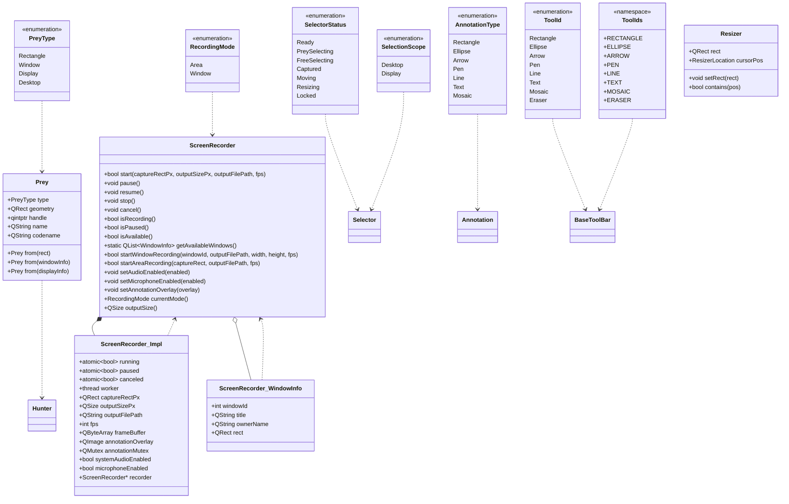
```mermaid
classDiagram
    direction TB

    class SelectorStatus {
        <<enumeration>>
        Ready
        PreySelecting
        FreeSelecting
        Captured
        Moving
        Resizing
        Locked
    }

    class SelectionScope {
        <<enumeration>>
        Desktop
        Display
    }

    class PreyType {
        <<enumeration>>
        Rectangle
        Window
        Display
        Desktop
    }

    class Prey {
        +PreyType type
        +QRect geometry
        +qintptr handle
        +QString name
        +QString codename
        +Prey from(rect)
        +Prey from(windowInfo)
        +Prey from(displayInfo)
    }

    class AnnotationType {
        <<enumeration>>
        Rectangle
        Ellipse
        Arrow
        Pen
        Line
        Text
        Mosaic
    }

    class ToolId {
        <<enumeration>>
        Rectangle
        Ellipse
        Arrow
        Pen
        Line
        Text
        Mosaic
        Eraser
    }

    class ToolIds {
        <<namespace>>
        +RECTANGLE
        +ELLIPSE
        +ARROW
        +PEN
        +LINE
        +TEXT
        +MOSAIC
        +ERASER
    }

    class RecordingMode {
        <<enumeration>>
        Area
        Window
    }

    class ScreenRecorder_WindowInfo {
        +int windowId
        +QString title
        +QString ownerName
        +QRect rect
    }

    class ScreenRecorder {
        +bool start(captureRectPx, outputSizePx, outputFilePath, fps)
        +void pause()
        +void resume()
        +void stop()
        +void cancel()
        +bool isRecording()
        +bool isPaused()
        +bool isAvailable()
        +static QList~WindowInfo~ getAvailableWindows()
        +bool startWindowRecording(windowId, outputFilePath, width, height, fps)
        +bool startAreaRecording(captureRect, outputFilePath, fps)
        +void setAudioEnabled(enabled)
        +void setMicrophoneEnabled(enabled)
        +void setAnnotationOverlay(overlay)
        +RecordingMode currentMode()
        +QSize outputSize()
    }

    class ScreenRecorder_Impl {
        +atomic~bool~ running
        +atomic~bool~ paused
        +atomic~bool~ canceled
        +thread worker
        +QRect captureRectPx
        +QSize outputSizePx
        +QString outputFilePath
        +int fps
        +QByteArray frameBuffer
        +QImage annotationOverlay
        +QMutex annotationMutex
        +bool systemAudioEnabled
        +bool microphoneEnabled
        +ScreenRecorder* recorder
    }

    class Resizer {
        +QRect rect
        +ResizerLocation cursorPos
        +void setRect(rect)
        +bool contains(pos)
    }

    SelectorStatus ..> Selector
    SelectionScope ..> Selector
    PreyType ..> Prey
    Prey ..> Hunter
    AnnotationType ..> Annotation
    ToolId ..> BaseToolBar
    ToolIds ..> BaseToolBar
    RecordingMode ..> ScreenRecorder
    ScreenRecorder_WindowInfo ..> ScreenRecorder
    ScreenRecorder_Impl ..> ScreenRecorder
    ScreenRecorder *-- ScreenRecorder_Impl
    ScreenRecorder o-- ScreenRecorder_WindowInfo
```

### 3.6 快捷键系统类图

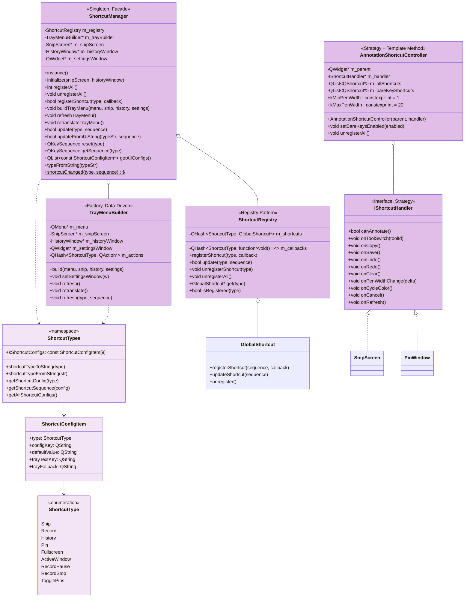
```mermaid
classDiagram
    direction TB

    class ShortcutManager {
        <<Singleton, Facade>>
        -ShortcutRegistry m_registry
        -TrayMenuBuilder* m_trayBuilder
        -SnipScreen* m_snipScreen
        -HistoryWindow* m_historyWindow
        -QWidget* m_settingsWindow
        +instance()$
        +initialize(snipScreen, historyWindow)
        +int registerAll()
        +void unregisterAll()
        +bool registerShortcut(type, callback)
        +void buildTrayMenu(menu, snip, history, settings)
        +void refreshTrayMenu()
        +void retranslateTrayMenu()
        +bool update(type, sequence)
        +bool updateFromUiString(typeStr, sequence)
        +QKeySequence reset(type)
        +QKeySequence getSequence(type)
        +QList~const ShortcutConfigItem*~ getAllConfigs()
        +typeFromString(typeStr)$
        +shortcutChanged(type, sequence)$$
    }

    class ShortcutRegistry {
        <<Registry Pattern>>
        -QHash~ShortcutType, GlobalShortcut*~ m_shortcuts
        -QHash~ShortcutType, function~void()~~ m_callbacks
        +registerShortcut(type, callback)
        +bool update(type, sequence)
        +void unregisterShortcut(type)
        +void unregisterAll()
        +GlobalShortcut* get(type)
        +bool isRegistered(type)
    }

    class TrayMenuBuilder {
        <<Factory, Data-Driven>>
        -QMenu* m_menu
        -SnipScreen* m_snipScreen
        -HistoryWindow* m_historyWindow
        -QWidget* m_settingsWindow
        -QHash~ShortcutType, QAction*~ m_actions
        +build(menu, snip, history, settings)
        +void setSettingsWindow(w)
        +void refresh()
        +void retranslate()
        +void refresh(type, sequence)
    }

    class ShortcutType {
        <<enumeration>>
        Snip
        Record
        History
        Pin
        Fullscreen
        ActiveWindow
        RecordPause
        RecordStop
        TogglePins
    }

    class ShortcutConfigItem {
        +type: ShortcutType
        +configKey: QString
        +defaultValue: QString
        +trayTextKey: QString
        +trayFallback: QString
    }

    class ShortcutTypes {
        <<namespace>>
        +kShortcutConfigs: const ShortcutConfigItem[9]
        +shortcutTypeToString(type)
        +shortcutTypeFromString(str)
        +getShortcutConfig(type)
        +getShortcutSequence(config)
        +getAllShortcutConfigs()
    }

    class AnnotationShortcutController {
        <<Strategy + Template Method>>
        -QWidget* m_parent
        -IShortcutHandler* m_handler
        -QList~QShortcut*~ m_allShortcuts
        -QList~QShortcut*~ m_bareKeyShortcuts
        +kMinPenWidth : constexpr int = 1
        +kMaxPenWidth : constexpr int = 20
        +AnnotationShortcutController(parent, handler)
        +void setBareKeysEnabled(enabled)
        +void unregisterAll()
    }

    class IShortcutHandler {
        <<Interface, Strategy>>
        +bool canAnnotate()
        +void onToolSwitch(toolId)
        +void onCopy()
        +void onSave()
        +void onUndo()
        +void onRedo()
        +void onClear()
        +void onPenWidthChange(delta)
        +void onCycleColor()
        +void onCancel()
        +void onRefresh()
    }

    class GlobalShortcut {
        +registerShortcut(sequence, callback)
        +updateShortcut(sequence)
        +unregister()
    }

    ShortcutManager o-- ShortcutRegistry
    ShortcutManager o-- TrayMenuBuilder
    ShortcutRegistry o-- GlobalShortcut
    ShortcutManager ..> ShortcutTypes
    TrayMenuBuilder ..> ShortcutTypes
    ShortcutTypes ..> ShortcutConfigItem
    ShortcutConfigItem ..> ShortcutType
    AnnotationShortcutController o-- IShortcutHandler
    IShortcutHandler <|.. SnipScreen
    IShortcutHandler <|.. PinWindow

    style ShortcutManager fill:#e1bee7
    style ShortcutRegistry fill:#e1bee7
    style TrayMenuBuilder fill:#e1bee7
    style ShortcutTypes fill:#f3e5f5
    style ShortcutType fill:#f3e5f5
    style ShortcutConfigItem fill:#f3e5f5
    style AnnotationShortcutController fill:#e1bee7
    style IShortcutHandler fill:#e1bee7
```

> **快捷键系统说明**：
> - 新增 9 个快捷键仅需修改 3 处：`ShortcutTypes.h` 数据表加 1 项、`ShortcutManager::registerAll()` 绑定回调、`main.cpp` switch 分发改名；新增标注快捷键仅需 `AnnotationShortcutController::registerAll()` 增加 1 行注册。
> - ShortcutManager 使用**外观模式**提供统一 API，内部协调 ShortcutRegistry（注册表模式管理 GlobalShortcut 生命周期）和 TrayMenuBuilder（数据驱动构建托盘菜单）。
> - ShortcutConfigItem 数据表为**单一事实源**：一份配置同时服务于注册、设置 UI、托盘菜单、默认值读取，修改一处全部生效。
> - AnnotationShortcutController 基于**策略模式**，持有 IShortcutHandler 接口（SnipScreen / PinWindow 分别实现），统一用 QShortcut + setEnabled 机制管理标注快捷键。

---

## 4. 核心流程

### 4.1 截图主流程图

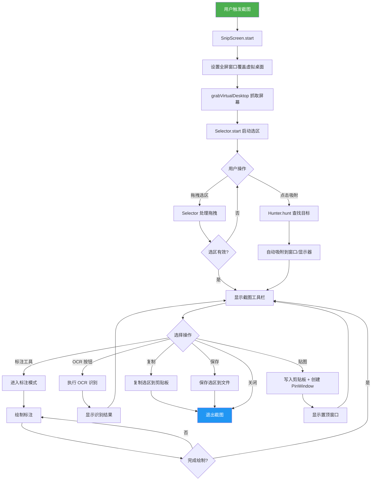
```mermaid
flowchart TD
    A[用户触发截图] --> B[SnipScreen.start]
    B --> C[设置全屏窗口覆盖虚拟桌面]
    C --> D[grabVirtualDesktop 抓取屏幕]
    D --> E[Selector.start 启动选区]
    E --> F{用户操作}
    
    F -->|拖拽选区| G[Selector 处理拖拽]
    G --> H{选区有效?}
    H -->|否| F
    H -->|是| I[显示截图工具栏]
    
    F -->|点击吸附| J[Hunter.hunt 查找目标]
    J --> K[自动吸附到窗口/显示器]
    K --> I
    
    I --> L{选择操作}
    
    L -->|标注工具| M[进入标注模式]
    M --> N[绘制标注]
    N --> O{完成绘制?}
    O -->|否| N
    O -->|是| I
    
    L -->|OCR 按钮| P[执行 OCR 识别]
    P --> Q[显示识别结果]
    Q --> I
    
    L -->|复制| R[复制选区到剪贴板]
    R --> S[退出截图]
    
    L -->|保存| T[保存选区到文件]
    T --> S
    
    L -->|贴图| U[写入剪贴板 + 创建 PinWindow]
    U --> V[显示置顶窗口]
    V --> I
    
    L -->|关闭| S

    style A fill:#4caf50,color:#fff
    style S fill:#2196f3,color:#fff
```

### 4.2 录屏主流程图

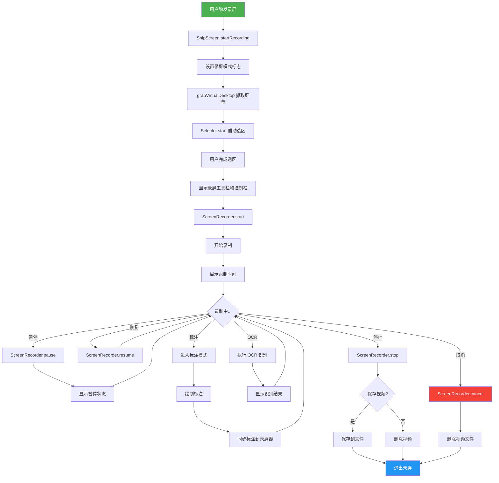
```mermaid
flowchart TD
    A[用户触发录屏] --> B[SnipScreen.startRecording]
    B --> C[设置录屏模式标志]
    C --> D[grabVirtualDesktop 抓取屏幕]
    D --> E[Selector.start 启动选区]
    E --> F[用户完成选区]
    F --> G[显示录屏工具栏和控制栏]
    G --> H[ScreenRecorder.start]
    H --> I[开始录制]
    I --> J[显示录制时间]
    J --> K{录制中...}
    
    K -->|暂停| L[ScreenRecorder.pause]
    L --> M[显示暂停状态]
    M --> K
    
    K -->|恢复| N[ScreenRecorder.resume]
    N --> K
    
    K -->|标注| O[进入标注模式]
    O --> P[绘制标注]
    P --> Q[同步标注到录屏器]
    Q --> K
    
    K -->|OCR| R[执行 OCR 识别]
    R --> S[显示识别结果]
    S --> K
    
    K -->|停止| T[ScreenRecorder.stop]
    T --> U{保存视频?}
    U -->|是| V[保存到文件]
    U -->|否| W[删除视频]
    V --> X[退出录屏]
    W --> X
    
    K -->|取消| Y[ScreenRecorder.cancel]
    Y --> Z[删除视频文件]
    Z --> X

    style A fill:#4caf50,color:#fff
    style X fill:#2196f3,color:#fff
    style Y fill:#f44336,color:#fff
```

### 4.3 选区交互流程图

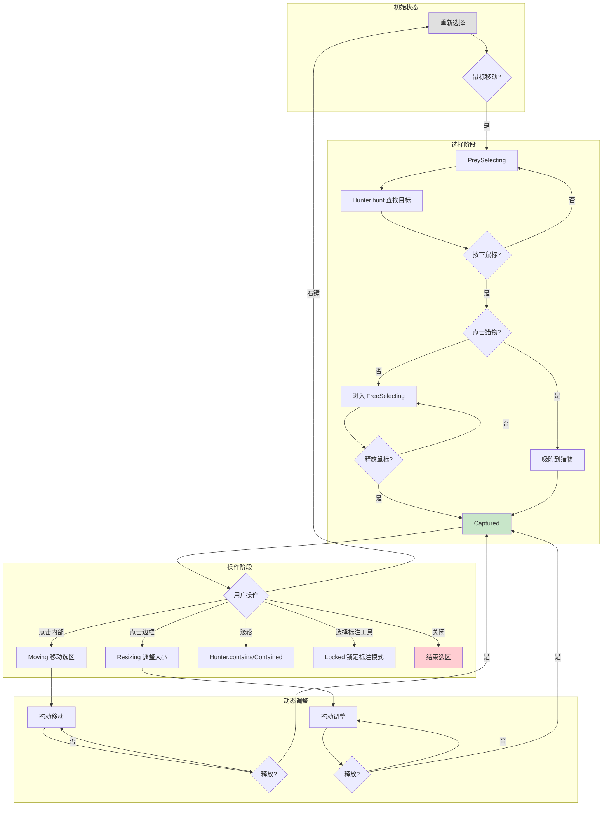
```mermaid
flowchart TD
    subgraph 初始状态
        A[Selector Ready] --> B{鼠标移动?}
    end

    subgraph 选择阶段
        B -->|是| C[PreySelecting]
        C --> D[Hunter.hunt 查找目标]
        D --> E{按下鼠标?}
        E -->|否| C
        E -->|是| F{点击猎物?}
        F -->|是| G[吸附到猎物]
        F -->|否| H[进入 FreeSelecting]
        H --> I{释放鼠标?}
        I -->|否| H
        I -->|是| J[Captured]
        G --> J
    end

    subgraph 操作阶段
        J --> K{用户操作}
        K -->|点击内部| L[Moving 移动选区]
        K -->|点击边框| M[Resizing 调整大小]
        K -->|滚轮| N[Hunter.contains/Contained]
        K -->|右键| A[重新选择]
        K -->|选择标注工具| O[Locked 锁定标注模式]
        K -->|关闭| P[结束选区]
    end

    subgraph 动态调整
        L --> L1[拖动移动]
        L1 --> L2{释放?}
        L2 -->|否| L1
        L2 -->|是| J
        
        M --> M1[拖动调整]
        M1 --> M2{释放?}
        M2 -->|否| M1
        M2 -->|是| J
    end

    style A fill:#e0e0e0
    style J fill:#c8e6c9
    style P fill:#ffcdd2
```

### 4.4 标注工具流程图

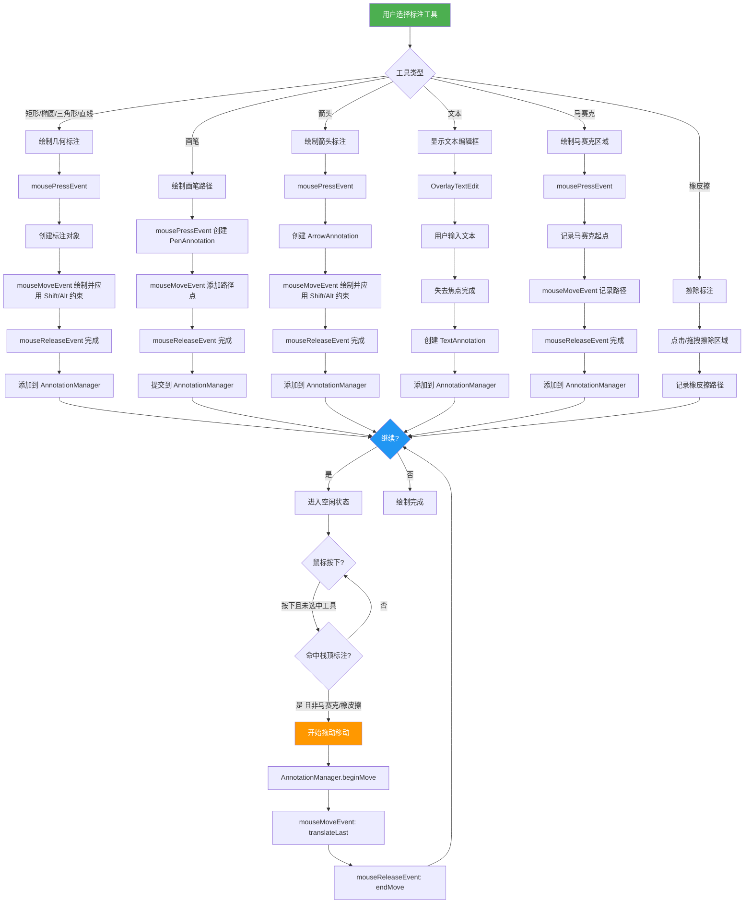
```mermaid
flowchart TD
    A[用户选择标注工具] --> B{工具类型}
    
    B -->|矩形/椭圆/三角形/直线| C[绘制几何标注]
    C --> C1[mousePressEvent]
    C1 --> C2[创建标注对象]
    C2 --> C3[mouseMoveEvent 绘制并应用 Shift/Alt 约束]
    C3 --> C4[mouseReleaseEvent 完成]
    C4 --> C5[添加到 AnnotationManager]
    
    B -->|画笔| P[绘制画笔路径]
    P --> P1[mousePressEvent 创建 PenAnnotation]
    P1 --> P2[mouseMoveEvent 添加路径点]
    P2 --> P3[mouseReleaseEvent 完成]
    P3 --> P4[提交到 AnnotationManager]
    
    B -->|箭头| D[绘制箭头标注]
    D --> D1[mousePressEvent]
    D1 --> D2[创建 ArrowAnnotation]
    D2 --> D3[mouseMoveEvent 绘制并应用 Shift/Alt 约束]
    D3 --> D4[mouseReleaseEvent 完成]
    D4 --> D5[添加到 AnnotationManager]
    
    B -->|文本| E[显示文本编辑框]
    E --> E1[OverlayTextEdit]
    E1 --> E2[用户输入文本]
    E2 --> E3[失去焦点完成]
    E3 --> E4[创建 TextAnnotation]
    E4 --> E5[添加到 AnnotationManager]
    
    B -->|马赛克| F[绘制马赛克区域]
    F --> F1[mousePressEvent]
    F1 --> F2[记录马赛克起点]
    F2 --> F3[mouseMoveEvent 记录路径]
    F3 --> F4[mouseReleaseEvent 完成]
    F4 --> F5[添加到 AnnotationManager]
    
    B -->|橡皮擦| G[擦除标注]
    G --> G1[点击/拖拽擦除区域]
    G1 --> G2[记录橡皮擦路径]
    
    C5 --> H{继续?}
    P4 --> H
    D5 --> H
    E5 --> H
    F5 --> H
    G2 --> H
    H -->|是| J[进入空闲状态]
    H -->|否| I[绘制完成]

    J --> K{鼠标按下?}
    K -->|按下且未选中工具| L{命中栈顶标注?}
    L -->|是 且非马赛克/橡皮擦| M[开始拖动移动]
    M --> M1[AnnotationManager.beginMove]
    M1 --> M2[mouseMoveEvent: translateLast]
    M2 --> M3[mouseReleaseEvent: endMove]
    M3 --> H
    L -->|否| K

    style A fill:#4caf50,color:#fff
    style H fill:#2196f3,color:#fff
    style M fill:#ff9800,color:#fff
```

> **标注拖动移动说明**：用户完成绘制后进入空闲状态，鼠标悬停在栈顶标注上时光标变化为可拖动状态。按下鼠标命中检测通过时（非马赛克/橡皮擦标注），调用 `AnnotationManager.beginMove()` 保存原始位置，拖动过程中实时调用 `translateLast(offset)` 平移标注，释放时调用 `endMove()` 提交。移动操作支持撤销/重做，`undo()` 优先撤销移动，`redo()` 优先重做移动。移动范围限制在选区内。

### 4.5 工具栏定位流程图

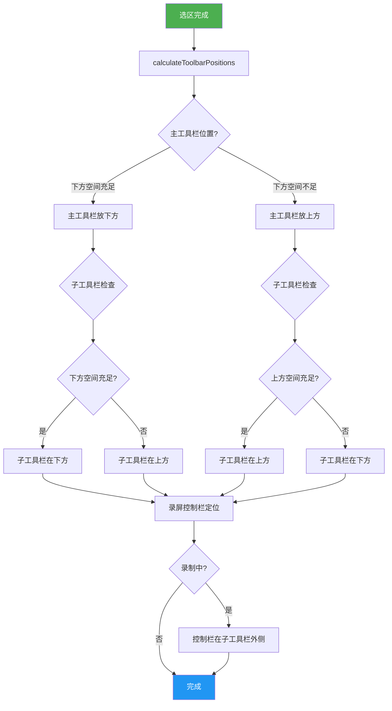
```mermaid
flowchart TD
    A[选区完成] --> B[calculateToolbarPositions]
    B --> C{主工具栏位置?}
    C -->|下方空间充足| D[主工具栏放下方]
    C -->|下方空间不足| E[主工具栏放上方]
    D --> F{子工具栏检查}
    E --> G{子工具栏检查}
    F --> H{下方空间充足?}
    G --> I{上方空间充足?}
    H -->|是| J[子工具栏在下方]
    H -->|否| K[子工具栏在上方]
    I -->|是| L[子工具栏在上方]
    I -->|否| M[子工具栏在下方]
    J --> N[录屏控制栏定位]
    K --> N
    L --> N
    M --> N
    N --> O{录制中?}
    O -->|是| P[控制栏在子工具栏外侧]
    O -->|否| Q[完成]
    P --> Q

    style A fill:#4caf50,color:#fff
    style Q fill:#2196f3,color:#fff
```

---

## 5. 时序图

### 5.1 截图操作时序

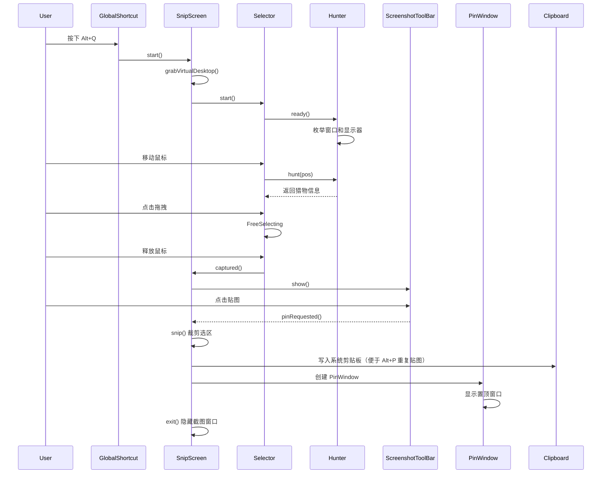
```mermaid
sequenceDiagram
    participant User
    participant GlobalShortcut
    participant SnipScreen
    participant Selector
    participant Hunter
    participant ScreenshotToolBar
    participant PinWindow

    User->>GlobalShortcut: 按下 Alt+Q
    GlobalShortcut->>SnipScreen: start()
    SnipScreen->>SnipScreen: grabVirtualDesktop()
    SnipScreen->>Selector: start()
    Selector->>Hunter: ready()
    Hunter->>Hunter: 枚举窗口和显示器
    
    User->>Selector: 移动鼠标
    Selector->>Hunter: hunt(pos)
    Hunter-->>Selector: 返回猎物信息
    
    User->>Selector: 点击拖拽
    Selector->>Selector: FreeSelecting
    User->>Selector: 释放鼠标
    Selector->>SnipScreen: captured()
    SnipScreen->>ScreenshotToolBar: show()
    
    User->>ScreenshotToolBar: 点击贴图
    ScreenshotToolBar-->>SnipScreen: pinRequested()
    SnipScreen->>SnipScreen: snip() 裁剪选区
    SnipScreen->>Clipboard: 写入系统剪贴板（便于 Alt+P 重复贴图）
    SnipScreen->>PinWindow: 创建 PinWindow
    PinWindow->>PinWindow: 显示置顶窗口
    SnipScreen->>SnipScreen: exit() 隐藏截图窗口
```

### 5.2 录屏操作时序

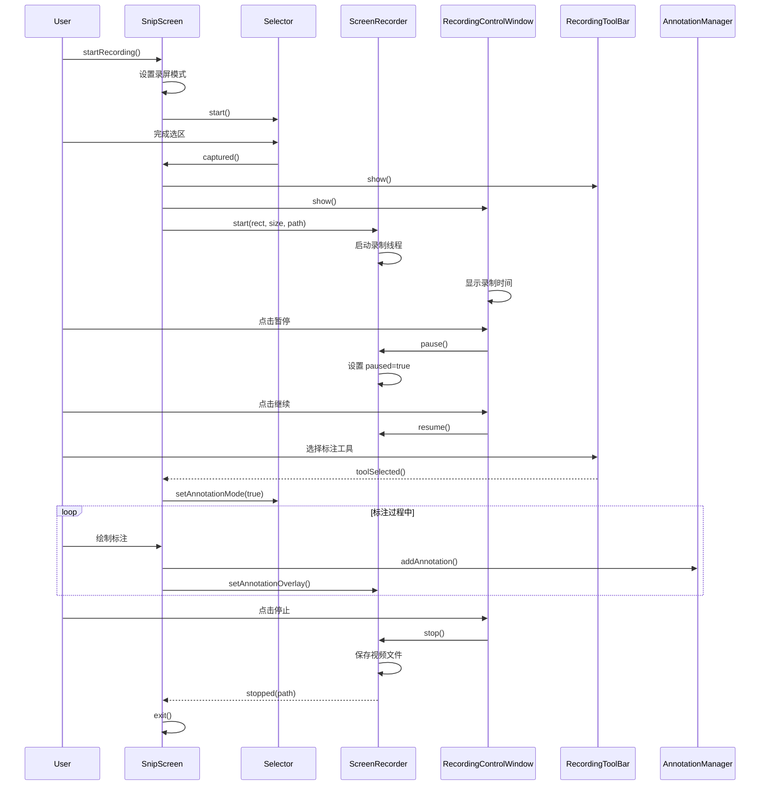
```mermaid
sequenceDiagram
    participant User
    participant SnipScreen
    participant Selector
    participant ScreenRecorder
    participant RecordingControlWindow
    participant RecordingToolBar
    participant AnnotationManager

    User->>SnipScreen: startRecording()
    SnipScreen->>SnipScreen: 设置录屏模式
    SnipScreen->>Selector: start()
    
    User->>Selector: 完成选区
    Selector->>SnipScreen: captured()
    SnipScreen->>RecordingToolBar: show()
    SnipScreen->>RecordingControlWindow: show()
    SnipScreen->>ScreenRecorder: start(rect, size, path)
    ScreenRecorder->>ScreenRecorder: 启动录制线程
    RecordingControlWindow->>RecordingControlWindow: 显示录制时间
    
    User->>RecordingControlWindow: 点击暂停
    RecordingControlWindow->>ScreenRecorder: pause()
    ScreenRecorder->>ScreenRecorder: 设置 paused=true
    
    User->>RecordingControlWindow: 点击继续
    RecordingControlWindow->>ScreenRecorder: resume()
    
    User->>RecordingToolBar: 选择标注工具
    RecordingToolBar-->>SnipScreen: toolSelected()
    SnipScreen->>Selector: setAnnotationMode(true)
    
    loop 标注过程中
        User->>SnipScreen: 绘制标注
        SnipScreen->>AnnotationManager: addAnnotation()
        SnipScreen->>ScreenRecorder: setAnnotationOverlay()
    end
    
    User->>RecordingControlWindow: 点击停止
    RecordingControlWindow->>ScreenRecorder: stop()
    ScreenRecorder->>ScreenRecorder: 保存视频文件
    ScreenRecorder-->>SnipScreen: stopped(path)
    SnipScreen->>SnipScreen: exit()
```

### 5.3 标注创建时序

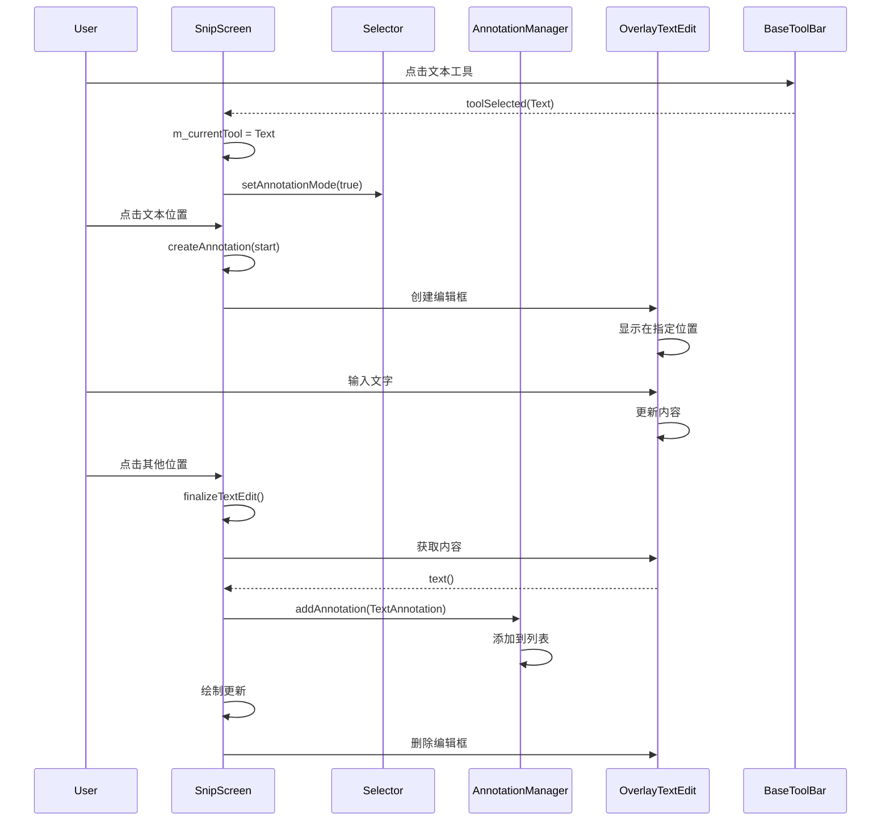
```mermaid
sequenceDiagram
    participant User
    participant SnipScreen
    participant Selector
    participant AnnotationManager
    participant OverlayTextEdit
    participant BaseToolBar

    User->>BaseToolBar: 点击文本工具
    BaseToolBar-->>SnipScreen: toolSelected(Text)
    SnipScreen->>SnipScreen: m_currentTool = Text
    SnipScreen->>Selector: setAnnotationMode(true)
    
    User->>SnipScreen: 点击文本位置
    SnipScreen->>SnipScreen: createAnnotation(start)
    SnipScreen->>OverlayTextEdit: 创建编辑框
    OverlayTextEdit->>OverlayTextEdit: 显示在指定位置
    
    User->>OverlayTextEdit: 输入文字
    OverlayTextEdit->>OverlayTextEdit: 更新内容
    
    User->>SnipScreen: 点击其他位置
    SnipScreen->>SnipScreen: finalizeTextEdit()
    SnipScreen->>OverlayTextEdit: 获取内容
    OverlayTextEdit-->>SnipScreen: text()
    SnipScreen->>AnnotationManager: addAnnotation(TextAnnotation)
    AnnotationManager->>AnnotationManager: 添加到列表
    SnipScreen->>SnipScreen: 绘制更新
    SnipScreen->>OverlayTextEdit: 删除编辑框
```

### 5.4 多语言切换时序

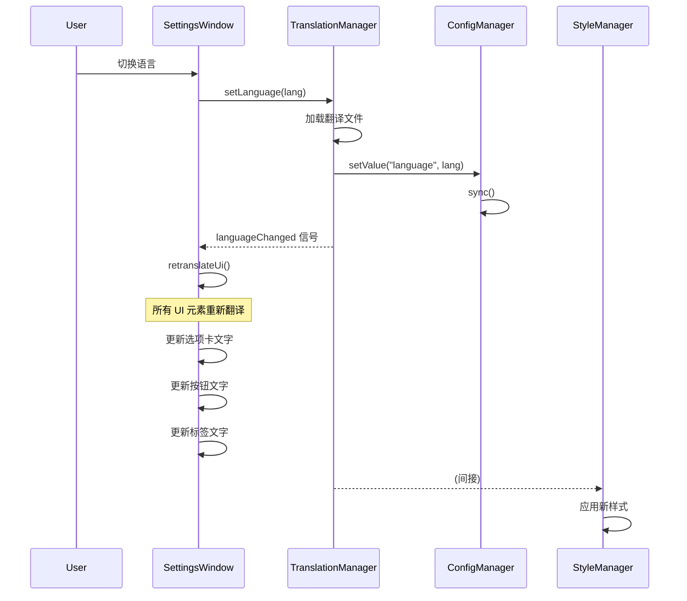
```mermaid
sequenceDiagram
    participant User
    participant SettingsWindow
    participant TranslationManager
    participant ConfigManager
    participant StyleManager

    User->>SettingsWindow: 切换语言
    SettingsWindow->>TranslationManager: setLanguage(lang)
    TranslationManager->>TranslationManager: 加载翻译文件
    TranslationManager->>ConfigManager: setValue("language", lang)
    ConfigManager->>ConfigManager: sync()
    
    TranslationManager-->>SettingsWindow: languageChanged 信号
    SettingsWindow->>SettingsWindow: retranslateUi()
    
    Note over SettingsWindow: 所有 UI 元素重新翻译
    SettingsWindow->>SettingsWindow: 更新选项卡文字
    SettingsWindow->>SettingsWindow: 更新按钮文字
    SettingsWindow->>SettingsWindow: 更新标签文字
    
    TranslationManager-->>StyleManager: (间接)
    StyleManager->>StyleManager: 应用新样式
```

### 5.5 工具栏动态定位时序

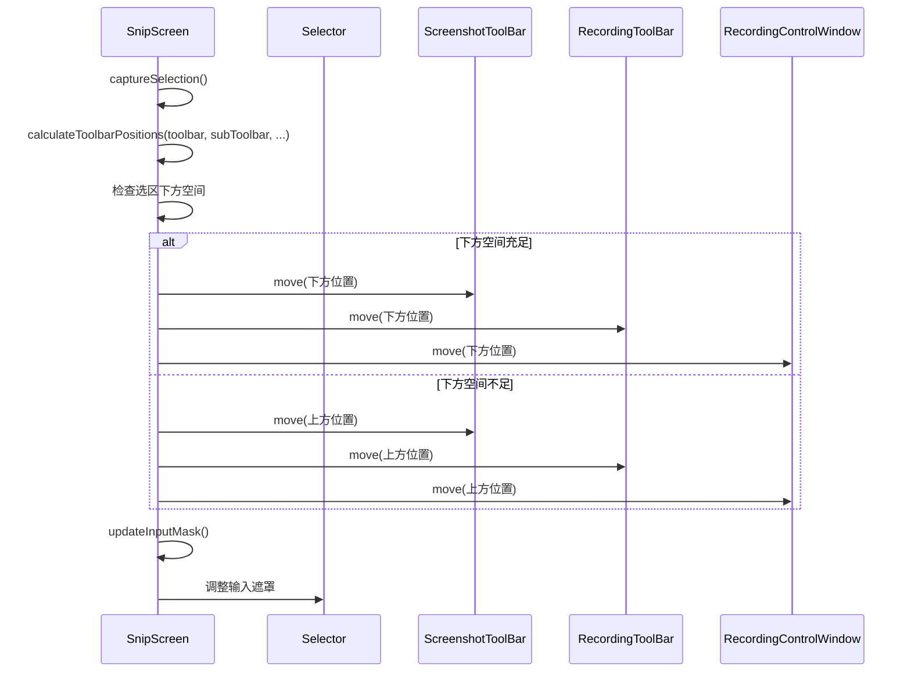
```mermaid
sequenceDiagram
    participant SnipScreen
    participant Selector
    participant ScreenshotToolBar
    participant RecordingToolBar
    participant RecordingControlWindow

    SnipScreen->>SnipScreen: captureSelection()
    SnipScreen->>SnipScreen: calculateToolbarPositions(toolbar, subToolbar, ...)
    
    SnipScreen->>SnipScreen: 检查选区下方空间
    alt 下方空间充足
        SnipScreen->>ScreenshotToolBar: move(下方位置)
        SnipScreen->>RecordingToolBar: move(下方位置)
        SnipScreen->>RecordingControlWindow: move(下方位置)
    else 下方空间不足
        SnipScreen->>ScreenshotToolBar: move(上方位置)
        SnipScreen->>RecordingToolBar: move(上方位置)
        SnipScreen->>RecordingControlWindow: move(上方位置)
    end
    
    SnipScreen->>SnipScreen: updateInputMask()
    SnipScreen->>Selector: 调整输入遮罩
```

---

## 6. 关键设计决策

### 6.1 虚拟桌面坐标系

QuickShot 使用虚拟桌面全局坐标系（Windows/Linux）：
- 窗口 geometry = 虚拟桌面并集
- 截图和选区使用同一坐标系
- 无需多显示器坐标转换
- 支持跨显示器截图和录屏

```
虚拟桌面坐标系示意：
+-------------------+
| 显示器 1 (主)      |
| 1920 x 1080       |
+--------+----------+
|显示器2 |          |
|1280x720|  重叠区  |
+--------+----------+

虚拟桌面 = 所有显示器的并集
坐标范围：x [-1280, 1920], y [0, 1080] (示例)
```

**macOS 单屏窗口模式**：

macOS（尤其是 Sidecar/AirPlay 副屏）不支持跨多屏的透明窗口，因此采用单屏窗口 + 动态跨屏切换策略：
- 窗口只覆盖鼠标所在的当前屏（`QGuiApplication::screenAt(QCursor::pos())`）
- 截图背景只抓当前屏（`QScreen::grabWindow(0)` + `setDevicePixelRatio(dpr)`）
- PreySelecting 状态下通过 30ms 定时器轮询鼠标位置，跨屏时自动切换窗口、重抓背景、更新选区坐标系
- 通过 `objc_msgSend` 将 NSWindow 级别设为 `NSPopUpMenuWindowLevel`（101），使窗口覆盖菜单栏区域，避免系统将窗口推到菜单栏下方导致背景偏移

### 6.2 窗口吸附机制

选区自动吸附到窗口边界：
- 使用 Hunter 命名空间实现窗口检测
- 支持多级吸附：矩形 → 窗口 → 显示器 → 桌面
- 滚轮快速切换吸附层级
- 提升截图效率和精准度

### 6.3 单例模式

多个管理器采用单例模式：
- `ConfigManager`：全局唯一配置实例，QSettings 持久化封装（Facade），负责配置默认值播种
- `StyleManager`：集中管理 UI 样式和颜色主题
- `TranslationManager`：统一多语言管理（注意：本类负责 UI 界面文案翻译，与文本翻译服务区分）
- `OcrEngine`：唯一 OCR 引擎实例
- `HistoryManager`：唯一历史记录管理器实例，管理 SQLite 数据库和自动清理
- `TranslateService`：唯一文本翻译服务实例，管理多引擎切换与批量翻译状态机
- `Logger`：全局日志记录器

### 6.4 工具栏动态定位

工具栏位置根据选区和屏幕空间动态计算：
- 一级工具栏 → 子工具栏 → 录屏控制栏
- 优先放置在选区下方
- 空间不足时翻转到上方
- 全屏时从底部向上排列
- 子工具栏和控制栏跟随主工具栏位置

### 6.5 截图与录屏模式统一

SnipScreen 同时支持截图和录屏：
- 共享同一选区组件（Selector）
- 切换工具栏类型（ScreenshotToolBar / RecordingToolBar）
- 录屏模式额外显示控制栏（RecordingControlWindow）
- 统一的状态管理和事件处理

### 6.6 异步 OCR 识别

使用 QtConcurrent 执行 OCR：
- 识别在后台线程执行
- 主线程保持响应
- 通过 QFutureWatcher 返回结果
- 显示加载状态提示
- 支持识别完成后自动释放模型

### 6.7 平台适配

屏幕捕获采用平台特定实现：
- Windows：GDI API 抓取屏幕 + Media Foundation 视频编码 + WASAPI 音频捕获
- macOS：ScreenCaptureKit 屏幕捕获 + AVAssetWriter H.264 编码 + AVCaptureSession 麦克风
- Linux：X11 屏幕捕获 + FFmpeg 编码
- 通过条件编译隔离平台代码（`Q_OS_WIN`、`Q_OS_MACOS`、`Q_OS_LINUX`）
- macOS 录屏要求 13+（Ventura），权限检测支持 macOS 14+ 的 `CGPreflightScreenCaptureAccess`
- macOS 使用 ScreenCaptureKit `SCContentFilter` 区分窗口录制与区域录制模式
- macOS Retina 屏支持 DPR 转换，Qt 逻辑坐标 × DPR = 实际像素输出
- macOS 截图采用单屏窗口模式（非虚拟桌面），`SnipScreen` 构造函数中 macOS 分支去掉 `BypassWindowManagerHint` 和 `WA_TranslucentBackground`，使用不透明背景 + `drawPixmap` 覆盖整个 widget
- macOS 通过 `raiseWindowAboveMenuBar()`（`objc_msgSend` 调用 `[NSWindow setLevel:]` 设为 `NSPopUpMenuWindowLevel`）确保窗口覆盖菜单栏
- macOS 跨屏切换：`checkScreenSwitch()` 30ms 定时器轮询鼠标位置，跨屏时重新 `grabVirtualDesktop()` + `move/resize` + `raiseWindowAboveMenuBar()` + `Selector::switchScreen()`

### 6.8 标注交互逻辑统一（AnnotationInteractionHandler）

截屏（SnipScreen）、录屏（SnipScreen m_isRecordingMode=true）和贴图（PinWindow）三处共享同一套标注交互逻辑，由 **AnnotationInteractionHandler** + **Host 回调策略**统一承载：

**复用方式**：
```
Host回调（窗口差异注入）
├── clampPos()           坐标限制（SnipScreen→选区，PinWindow→窗口）
├── isInSelection()      是否选区内
├── isInToolBar()        是否在工具栏上（PinWindow独立顶层工具栏恒false）
├── selectionRect()      选区矩形（用于Shift/Alt约束）
├── requestUpdate()      刷新update()
├── syncOverlay()        录屏标注同步（SnipScreen→pushAnnotationOverlay，PinWindow空）
├── updateToolBarState() 工具栏undo/redo按钮联动
├── createTextEdit()     创建文本框（宿主负责坐标转换）
├── finalizeTextEdit()   文本编辑完成
├── activeTextEdit()     当前活动文本框
├── setCursor()          设置光标样式
└── setBareKeysEnabled() 文本框冲突禁用裸键快捷键
```

**关键修正**：
- 鼠标事件交互优先级统一：工具栏 → 文本框外部完成 → 橡皮擦 → 马赛克 → 控制点拖拽 → 文本工具 → 标注整体拖动 → 创建新标注
- 标注绘制中调用 `m_host.syncOverlay()` 确保录屏过程中的标注痕迹（不仅仅是最终结果）在视频中可见
- `canDragCurrentTool()` 统一限制：马赛克/橡皮擦涂抹工具不支持拖动已提交标注

### 6.9 快捷键系统

快捷键系统分为全局热键子系统和标注快捷键子系统两部分，分别由不同的组件管理：

**6.9.1 全局热键子系统（ShortcutManager + ShortcutRegistry + TrayMenuBuilder）**
- **ShortcutType 枚举**：9 种全局热键类型的强类型枚举，避免字符串类型拼写错误
- **ShortcutConfigItem 数据表**（kShortcutConfigs[9]）：单一事实源，同时服务于注册回调、设置 UI 快捷键行、托盘菜单项、默认值读取；新增快捷键仅需添加 1 行
- **ShortcutRegistry（注册表模式）**：集中管理 9 个 GlobalShortcut* 的生命周期和回调
- **ShortcutManager（外观模式）**：对外统一 API（initialize/registerAll/buildTrayMenu/update/reset/getAllConfigs），内部协调 Registry 和 TrayMenuBuilder；`shortcutChanged(ShortcutType, QKeySequence)` 枚举信号驱动 SettingsWindow 重连、托盘菜单增量刷新、日志输出
- **TrayMenuBuilder（工厂方法 + 数据驱动）**：遍历 ShortcutConfigItem 数据表逐项创建 QAction，自动拼接"文案 + (快捷键)"；监听 shortcutChanged 信号自动刷新显示；ShortcutConfigItem.trayTextKey 为 nullptr 的类型不生成托盘菜单项

**6.9.2 标注快捷键子系统（AnnotationShortcutController + IShortcutHandler）**
- **IShortcutHandler（策略接口）**：定义 10 个标注动作命令（canAnnotate/onToolSwitch/onCopy/onSave/onUndo/onRedo/onClear/onPenWidthChange/onCycleColor/onCancel/onRefresh），SnipScreen 与 PinWindow 各自实现
- **AnnotationShortcutController（策略持有）**：统一使用 `QShortcut + Qt::WindowShortcut + setEnabled(true/false)` 机制管理标注快捷键的注册与启用状态
- **文本编辑冲突管理**：OverlayTextEdit 获取焦点时，`setBareKeysEnabled(false)` 批量禁用数字键/[/]/Tab/Delete/Backspace/Ctrl+C 等裸键，让按键正常交给文本框输入；失焦时恢复
- **canAnnotate() 前置检查**：控制器在调用具体 action 前统一判断，SnipScreen 要求选区状态 Captured/Locked，PinWindow 要求处于标注模式

### 6.10 实时标注叠加（录屏合成）

录屏时支持实时标注，关键要点：
1. **标注重叠防护**：SnipScreen 是 WA_TranslucentBackground 的 layered 窗口，`BitBlt(CAPTUREBLT)` 会把透明窗口中已绘制的标注也捕获，造成录屏结果既有屏幕合成的标注，又有 overlay 合成的标注（重影）。处理方式：录屏开始前调用 `SetWindowDisplayAffinity(WDA_EXCLUDEFROMCAPTURE)` 将 SnipScreen 排除出捕获，停止录屏时恢复。
2. **overlay 坐标基准对齐**：`renderAnnotationOverlay()` 中的捕获基准 cap 必须与 ScreenRecorder 实际使用的 captureRect 严格一致（= Selector::selected 去掉边框），保证标注位置无偏移。
3. **绘制过程可见**：handleMouseMove 中所有操作分支（控制点拖拽、标注拖动、橡皮擦、马赛克、矩形/椭圆/箭头/直线/画笔绘制）都调用 `m_host.syncOverlay()`，确保录制过程中拖拽的中间帧也被合成到视频，而不仅仅是最终结果。

- UI 线程在标注变化时调用 `setAnnotationOverlay()`
- 录制线程每帧合成标注到帧缓冲
- 使用 QMutex 保护并发访问
- 支持录制中继续标注操作

### 6.11 全局马赛克算法与橡皮擦联动

马赛克使用全局预处理 + QRegion 裁剪的算法实现（`AnnotationManager::drawMosaicRects`）：
1. 对整张背景做**一次全局预处理**：缩放到 1/scale（Qt::SmoothTransformation 邻域平均色）→ 放大回原尺寸（Qt::FastTransformation 保留硬方块感），得到与背景像素 1:1 对齐的全局马赛克纹理
2. 将所有笔迹矩形合并为一个 QRegion（并集）作为裁剪区
3. 一次性绘制整张全局马赛克图，仅笔迹覆盖区域被 clip 裁剪显示，避免逐块缩放的接缝错位

**画笔粗细联动**：
- 橡皮擦半径 = m_currentPenWidth × 2
- 马赛克涂抹半径 = m_currentPenWidth × 2
- 马赛克块大小常量 `kDefaultMosaicBlockSize` = 7（全局统一，一处修改所有场景生效）

### 6.12 标注控制点光标样式

为提升调节时的交互直观性，根据控制点位置设置不同 Qt 光标：

| 标注类型 | 控制点位置 | 光标样式 |
|---------|-----------|---------|
| 矩形/三角形 | TL（左上）、BR（右下） | Qt::SizeFDiagCursor ↘ |
| 矩形/三角形 | TR（右上）、BL（左下） | Qt::SizeBDiagCursor ↙ |
| 矩形/三角形 | 上边中点 / 下边中点 | Qt::SizeVerCursor ↕ |
| 矩形/三角形 | 左边中点 / 右边中点 | Qt::SizeHorCursor ↔ |
| 椭圆 | 左/右点 | Qt::SizeHorCursor ↔ |
| 椭圆 | 上/下点 | Qt::SizeVerCursor ↕ |
| 直线/箭头/三角形控制点 | 任意端点 | Qt::SizeAllCursor ✥ |

绘制过程中（鼠标按下已按住）光标保持按下时的样式不变。拖拽前悬停阶段根据 controlPointCursorAt() 返回实时反馈。

### 6.13 工具栏子工具栏防闪烁

工具栏切换工具时子工具栏保持平滑显示、无闪烁与内容压缩，采用双重防护：

**Qt 层面（所有工具栏共用）**：`BaseToolBar::clearSubToolbarLayout()` 使用同步 `delete` 删除旧控件，确保立即移除并释放布局空间；`showSubTools()` 在删除旧控件后创建新控件前调用 `setUpdatesEnabled(false)`，全部完成后再 `setUpdatesEnabled(true)` 阻塞中间态绘制。

**系统层面（PinWindow 独立顶层窗口）**：子工具栏窗口设置 `WA_NoSystemBackground` 属性，阻止窗口尺寸变化时系统自动清除背景。

### 6.14 Alt+P 贴图剪贴板历史分页

Alt+P 快捷键触发 `SnipScreen::pinClipboard()`，基于 HistoryManager 实现历史截图浏览：
- 首次按下（无活动 PinWindow）：重置 m_pinHistoryIndex=0，取 HistoryManager 中最新的一条截图记录，窗口居中于鼠标所在屏幕位置，位置计算为 `QCursor::pos() - QPoint(w/2, h/2)`
- 后续按下（存在活动 PinWindow）：m_pinHistoryIndex++ 取模 historyCount，位置继承前一个窗口加偏移 (24,24)，使用 `qBound` 夹到屏幕边界；多个窗口可同时显示
- 到达最旧记录后自动循环回最新一条
- `m_lastPinHistoryWindow = QPointer<PinWindow>` 安全跟踪活动窗口，PinWindow 设置 WA_DeleteOnClose 确保关闭后指针自动置空
- 所有截图生成路径（copy/save/pin/grabFullscreen/grabActiveWindow/snapshotRequested）均调用 `HistoryManager::addScreenshotPixmap()` 记录，保证 Alt+P 历史完整

### 6.15 DPI 适配机制

由于项目通过 `QT_ENABLE_HIGHDPI_SCALING=0` 禁用了 Qt 的高 DPI 自动缩放，全局 qss 中的 `pt`（字体）和 `em`（控件尺寸）单位在 DPI 变化时不会自动更新，因此 `SettingsWindow` 与 `HistoryWindow` 需要手动监听 DPI 变化并重新计算尺寸。

#### 6.15.1 全局策略

- **单位规范**：UI 元素统一使用 `em`/`pt` 单位（DPI 自适应），禁止硬编码 `px`。
- **全局 qss 重新应用**：DPI 变化时调用 `StyleManager::reapplyGlobalStyleSheet()` 重新加载 `src/resources/stylesheets/app.qss`，让 `pt` 按新 `logicalDotsPerInch` 重新换算像素、`em` 基于新字体重新计算。
- **信号监听**：窗口 `showEvent` 中绑定当前屏幕的 `QScreen::logicalDotsPerInchChanged` 信号到 `onDpiChanged()` 槽，并在窗口移动到其他屏幕时（`showEvent` 再次触发）重新绑定，避免旧信号失效。

#### 6.15.2 SettingsWindow 适配

- **窗口宽度**：`calculateDpiScaledWidth()` 以 96 DPI（100% 缩放）= 500px 为基准，按 `logicalDotsPerInch` 线性放大，范围限制 500~1000。`updateDpiScaledWidth()` 重新计算并更新 `setMinimumWidth/setMaximumWidth` 约束。
- **控件宽度**：`updateControlWidths()` 依次调用 `updateGeneralControlWidths()`（标签固定宽度、下拉框最小宽度）、`updateHistoryComboWidth()`（保留天数/最大记录数下拉框统一宽度）、`updateTranslateComboWidth()`（翻译引擎/目标语言下拉框统一宽度）。
- **高度适配**：`onTabChanged()` 对非滚动选项卡（通用/关于）调用 `setFixedHeightWithAnimation()` 强制高度贴合内容；对含 `QScrollArea` 的选项卡（快捷键/样式/历史记录）保持窗口高度不变让内容滚动。`showEvent` 中用 `QTimer::singleShot(0, ...)` 延迟触发初始高度适配，确保布局完成。
- **样式选项卡颜色行**：颜色按钮统一使用 `#settingColorButton` QSS 选择器，`createColorRow()` 封装创建逻辑，`updateColorButton()` 仅更新 `background-color`，尺寸由全局 qss 管理。
- **颜色配置数据驱动表（单一数据源）**：颜色配置元数据收敛为 **core 层 `StyleManager::colorSettingTable()`**（21 项，与 `kShortcutConfigs` 同一数据驱动惯用法）。每项含 `StyleColorId`、联动分类（Border/Toolbar/TabButton/TabWidgetBg）、关联信号（仅 `TabWidgetBg` 有订阅者）、QSettings 键、翻译键、默认色（引用 `StyleManager::DEFAULT_*`）以及 StyleManager getter/setter 函数指针。`ConfigManager` 播种默认值、`StyleManager::initFromConfig` 启动恢复、`SettingsWindow` 构建设置 UI 三方均遍历此表。
- **改色处理**：`applyColorChange(StyleManager::StyleColorId)` 统一处理颜色变更（弹对话框→set→save→联动→emit），`applyColorPostUpdate(StyleColorCategory, QColor)` 按分类刷新控件，仅 `tabWidgetBgColorChanged` 存活（其余 10 个无订阅者颜色信号与 15 个 `onXxxColorChanged` 槽已删除）。颜色按钮/标签用 `m_colorButtons`/`m_colorLabels` 数组管理（按 `StyleColorId` 索引）。
- **启动自初始化**：main.cpp 在 `ConfigManager::setInstance` 后、任何窗口创建前调用 `StyleManager::initFromConfig(cm)` 从持久化恢复样式，与窗口构造顺序解耦；`loadStyleSettings` 不再读 QSettings，仅把 StyleManager 已恢复的值同步到设置页 UI。

#### 6.15.3 HistoryWindow 适配

- **窗口初始尺寸**：`calculateDpiScaledSize()` 以 96 DPI = 1000×720 为基准线性放大，构造函数与 DPI 变化时调用 `resize(calculateDpiScaledSize())`。与 `SettingsWindow` 不同，`HistoryWindow` 允许用户拖拽改变大小，不锁定宽高。
- **控件尺寸**：`updateControlSizes()` 基于当前字体重新计算搜索框、按钮、下拉框高度与列表图标大小。所有按钮（搜索/加载更多/复制/保存/删除/清空）统一使用默认 QPushButton 样式，高度取搜索框 sizeHint，无 primary 按钮分类。
- **背景同步**：`updateWindowColors()` 从 `StyleManager` 读取选项卡背景色，同步刷新窗口、顶部工具栏、列表区、底部操作栏容器背景。

#### 6.15.4 DPI 变化处理流程

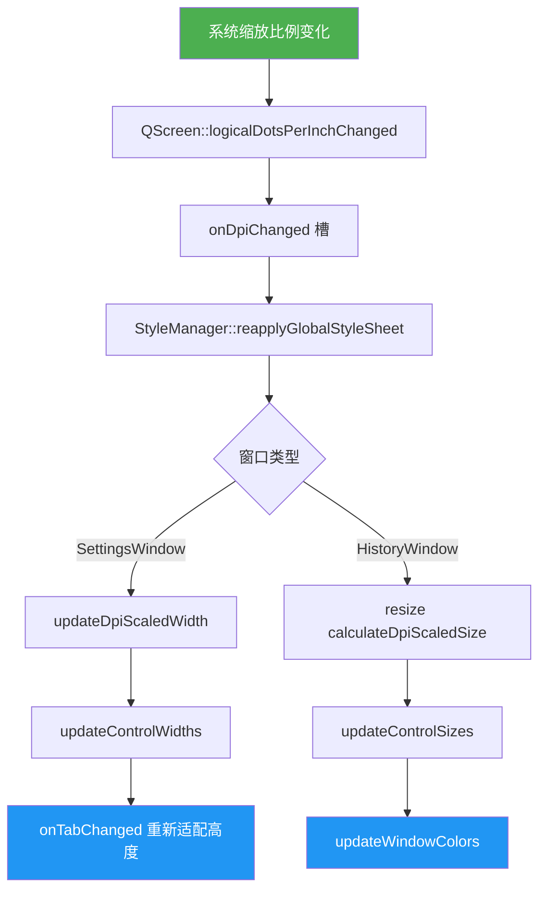
```mermaid
flowchart TD
    A[系统缩放比例变化] --> B[QScreen::logicalDotsPerInchChanged]
    B --> C[onDpiChanged 槽]
    C --> D[StyleManager::reapplyGlobalStyleSheet]
    D --> E{窗口类型}
    E -->|SettingsWindow| F[updateDpiScaledWidth]
    F --> G[updateControlWidths]
    G --> H[onTabChanged 重新适配高度]
    E -->|HistoryWindow| I[resize calculateDpiScaledSize]
    I --> J[updateControlSizes]
    J --> K[updateWindowColors]

    style A fill:#4caf50,color:#fff
    style H fill:#2196f3,color:#fff
    style K fill:#2196f3,color:#fff
```

### 6.16 翻译 Overlay 交互优化

**6.16.1 翻译完成后退出截图框**
- `TranslateOverlayWindow::translateAndShow` 新增可选 `onOverlayShown` 回调参数（`std::function<void()>`）
- SnipScreen 翻译成功显示 Overlay 后调用 `exit()` 退出截图框和工具栏，与贴图完成后销毁截图框的行为一致
- PinWindow 不传回调，翻译后保持贴图窗口继续显示
- Overlay 是无 parent 的独立窗口（`WA_DeleteOnClose`），`exit()` 关闭 SnipScreen 不影响 Overlay

**6.16.2 选字模式右键菜单**
- 进入选字模式后创建覆盖窗口的只读 QTextEdit（m_selectEditor），用户可跨段拖选文字
- QTextEdit 继承自 QAbstractScrollArea，右键事件发送给 `viewport()` 而非控件本身，事件过滤器需安装在 `viewport()` 上
- `eventFilter` 拦截 `QEvent::ContextMenu`，基于 `createStandardContextMenu()` 保留原生 Copy/Select All（可复制用户选中的文字），按快捷键（Ctrl+C/Ctrl+A）识别这两项并替换为本地化文本
- 追加"文字选择模式"勾选项（取消勾选退出选字模式回到 Overlay 绘制界面）和"取消"项（退出选字模式并关闭 Overlay 窗口）

### 6.17 自动更新机制

QuickShot 内置自动更新功能，支持多渠道回退、SHA256 校验、解压安装与失败回滚。目前仅支持 Windows 平台的自动安装替换。

#### 6.17.1 更新流程

```
检查更新 → 下载 zip → SHA256 校验 → 解压 → 查找 exe → 生成 update.bat → 退出主程序 → 安装替换 → 启动新版本
```

#### 6.17.2 多渠道回退

UpdateManager 按 GitHub → Gitee → 官方网站顺序依次尝试，每个渠道独立超时（15 秒）。某渠道失败后自动切换到下一个渠道，全部失败后报错。

支持环境变量 `QUICKSHOT_UPDATE_URL` 覆盖版本检查地址，用于本地模拟更新测试（详见 update-test/README.md）。

#### 6.17.3 下载与校验

- 基于 QNetworkAccessManager 实现 HTTP/HTTPS 下载，支持进度回调和取消
- 30 秒无数据超时保护
- 下载完成后进行 SHA256 校验，与 version.json 中的 checksum 比对
- 文件名从 downloadUrl 路径推断扩展名

#### 6.17.4 安装替换（Windows）

安装流程由 UpdateManager::installUpdate() 动态生成 update.bat 批处理脚本执行：

1. **解压**：直接启动 `powershell.exe`（绕过 cmd /c 中间层避免引号解析问题），调用 `Expand-Archive` 解压到 `_update_temp/`，超时 600 秒
2. **查找 exe**：优先在临时目录根层查找，找不到则遍历子目录（兼容 zip 包含顶层目录的情况）
3. **等待退出**：使用 `findstr` 精确匹配 PID 等待主程序退出（每秒轮询）
4. **备份**：使用 `robocopy /E /XD _update_temp backup /XF update.bat` 备份旧版本（排除临时目录和脚本自身）
5. **替换**：使用 `robocopy` 替换文件，退出码 `< 8` 视为成功
6. **回滚**：替换失败时从 backup 目录 robocopy 回滚，启动旧版本
7. **启动**：启动安装目录中的新 exe（而非临时目录）

#### 6.17.5 版本号管理

- 版本号由 [CMakeLists.txt](file:///e:/develop/Code/github_new/quick-shot/CMakeLists.txt#L2) 的 `project(QuickShot VERSION x.y.z)` 统一管理
- 通过 `add_compile_definitions(QUICKSHOT_VERSION="${PROJECT_VERSION}")` 注入为编译宏
- 源码中使用 `QUICKSHOT_VERSION` 宏或 `qApp->applicationVersion()` 获取版本号
- 打包脚本 deploy.ps1 自动从 CMakeLists.txt 解析版本号，生成 `QuickShot-{Config}-{Version}-Windows-x64` 格式的包名

#### 6.17.6 打包与版本清单

- **打包**：`deploy/win/deploy.ps1` 自动编译、windeployqt 部署依赖、生成 zip 包
- **版本清单**：`update-test/server/make-version-json.ps1` 计算 SHA256 和文件大小，生成 version.json
- **文件命名约定**：`QuickShot-Release-{version}-Windows-x64.zip`（GitHub/Gitee 下载 URL 与此对齐）

---

## 7. 配置项

### 7.1 通用配置

| 配置键 | 类型 | 默认值 | 说明 |
|--------|------|--------|------|
| `language` | String | `zh_CN` | 界面语言 |
| `log_print_enabled` | Bool | `false` | 是否启用日志打印 |
| `shortcut_snip` | String | `Alt+Q` | 截图快捷键 |
| `shortcut_record` | String | `Alt+S` | 录屏快捷键 |
| `shortcut_history` | String | `Alt+H` | 历史记录快捷键 |
| `shortcut_pin` | String | `Alt+P` | 贴图剪贴板快捷键 |
| `shortcut_fullscreen` | String | `Alt+Shift+F` | 全屏截图快捷键 |
| `shortcut_activewindow` | String | `Alt+Shift+W` | 活动窗口截图快捷键 |
| `shortcut_recordpause` | String | `Alt+Shift+S` | 录屏暂停/恢复快捷键 |
| `shortcut_recordstop` | String | `Alt+Shift+Q` | 录屏停止快捷键 |
| `shortcut_togglepins` | String | `Alt+Shift+P` | 隐藏/显示所有贴图快捷键 |
| `capture/saveDir` | String | 系统图片目录 | 截图保存目录，记住上次使用的目录 |

### 7.2 OCR 配置

| 配置键 | 类型 | 默认值 | 说明 |
|--------|------|--------|------|
| `ocr/language` | String | `ch_en` | OCR 识别语言 |
| `ocr/modelPath` | String | 应用目录/models/ocr | 模型目录 |
| `ocr/useGpu` | Bool | `false` | GPU 加速 |

### 7.3 录屏配置

| 配置键 | 类型 | 默认值 | 说明 |
|--------|------|--------|------|
| `record/outputPath` | String | 用户目录 | 输出路径 |
| `record/defaultFps` | Int | `30` | 默认帧率 |
| `record/audioEnabled` | Bool | `false` | 音频录制 |
| `record/microphoneEnabled` | Bool | `false` | 麦克风录制 |

### 7.4 历史记录配置

| 配置键 | 类型 | 默认值 | 说明 |
|--------|------|--------|------|
| `history/enableScreenshot` | Bool | `true` | 是否记录截图历史 |
| `history/enableClipboard` | Bool | `true` | 是否记录剪贴板历史 |
| `history/maxItems` | Int | `1000` | 最大记录数（超出时删除最旧记录） |
| `history/retentionDays` | Int | `7` | 保留天数（超出自动清理） |
| `history/shortcut` | String | `Alt+H` | 打开历史记录窗口的快捷键 |
| `history/thumbnailSize` | Int | `200` | 缩略图尺寸（像素） |

> **自动清理**：软件启动时 `HistoryManager` 构造函数自动调用 `cleanupExpired()`，根据 `retentionDays` 和 `maxItems` 清理过期和超额记录。

### 7.5 翻译配置

统一前缀 `translate/`，详见 [翻译功能技术文档](translation-design.md)。

| 配置键 | 类型 | 默认值 | 说明 |
|--------|------|--------|------|
| `translate/enabled` | Bool | `true` | 是否启用翻译功能 |
| `translate/engine` | String | `mymemory` | 当前引擎：mymemory/baidu/deepl/libretranslate |
| `translate/targetLang` | String | `en` | 目标语言代码 |
| `translate/sourceLang` | String | `auto` | 源语言，auto 为自动检测 |
| `translate/mymemoryEmail` | String | `` | MyMemory 邮箱（可选，提升免费额度至 50000 词/天） |
| `translate/baiduAppId` | String | `` | 百度翻译 App ID |
| `translate/baiduKey` | String | `` | 百度翻译密钥 |
| `translate/deeplKey` | String | `` | DeepL API Key |
| `translate/libreUrl` | String | `` | LibreTranslate 服务地址 |
| `translate/showPrivacyWarning` | Bool | `true` | 首次翻译隐私提示开关 |

> **隐私提示**：首次使用翻译时弹窗说明文本将发送到第三方服务，可勾选「不再提示」。所有 API Key / URL 由用户在设置页填写，**软件不预置任何凭证**，符合开源约束。

### 7.6 样式配置

| 配置键 | 类型 | 默认值 | 说明 |
|--------|------|--------|------|
| `style/captureBorderColor` | String | `#4da6ff` | 截图边框色 |
| `style/recordBorderColor` | String | `#4CAF50` | 录屏边框色 |
| `style/toolbarBgColor` | String | `#cfcfcf` | 工具栏背景色 |
| `style/subToolbarBgColor` | String | `#cfcfcf` | 子工具栏背景色 |
| `style/recordControlBgColor` | String | `#cfcfcf` | 录屏控制栏背景色 |
| `style/toolbarBtnColor` | String | `#e0e0e0` | 工具栏按钮色 |
| `style/toolbarTextColor` | String | `#000` | 工具栏文字色 |
| `style/toolbarButtonHoverColor` | String | `#fff` | 按钮悬停色 |
| `style/toolbarButtonDisabledColor` | String | `#d1d1d1` | 按钮禁用色 |
| `style/toolbarButtonCheckedColor` | String | `#0078d7` | 按钮选中色 |
| `style/closeButtonBgColor` | String | `#cc0000` | 关闭按钮背景色 |
| `style/closeButtonHoverColor` | String | `#ff3333` | 关闭按钮悬停色 |
| `style/settingButtonBgColor` | String | `#e0e0e0` | 设置按钮背景色（无 UI 行，仅 save/load） |
| `style/settingButtonTextColor` | String | `#000000` | 设置按钮文字色（无 UI 行，仅 save/load） |
| `style/tabWidgetBgColor` | String | `#ffffff` | 选项卡背景色 |
| `style/tabButtonBgColor` | String | `#e0e0e0` | 选项卡按钮背景色 |
| `style/tabButtonTextColor` | String | `#000000` | 选项卡按钮文字色 |
| `style/tabButtonSelectedBgColor` | String | `#ffffff` | 选项卡按钮选中背景色 |
| `style/tabButtonSelectedTextColor` | String | `#000000` | 选项卡按钮选中文字色 |
| `style/handleCircleColor` | String | `#2563EB` | 角手柄圆形颜色（无 UI 行，仅 save/load） |
| `style/handleCloseColor` | String | `#DC2626` | 角手柄关闭按钮颜色（无 UI 行，仅 save/load） |
| `style/defaultPenWidth` | Int | `5` | 画笔默认粗细 |
| `style/defaultFontSize` | Int | `28` | 文本默认字号 |
| `style/defaultEraserWidth` | Int | `5` | 橡皮擦默认粗细 |
| `style/defaultMosaicSize` | Int | `5` | 马赛克默认大小 |
| `style/toolbarButtonStyle` | String | `text` | 按钮样式（text/icon） |

> **单一数据源**：以上默认值全部来自 `StyleManager::DEFAULT_*` 常量，由 `StyleManager::colorSettingTable()` 元数据表驱动；`ConfigManager` 播种、`StyleManager::initFromConfig` 启动恢复、`SettingsWindow` 设置页三者共用此表（与快捷键 `kShortcutConfigs` 同一数据驱动惯用法）。

### 7.7 支持的语言

| 语言代码 | 语言名称 | 翻译文件 |
|----------|----------|----------|
| `zh_CN` | 简体中文 | `zh_CN.json` |
| `zh_TW` | 繁體中文 | `zh_TW.json` |
| `zh_HK` | 粵語 | `zh_HK.json` |
| `en_US` | English | `en_US.json` |
| `ja_JP` | 日本語 | `ja_JP.json` |
| `ko_KR` | 한국어 | `ko_KR.json` |

---

## 8. 性能优化

### 8.1 屏幕捕获优化

- 直接使用 Win32 API 抓取屏幕，避免中间转换
- 物理像素坐标，避免 DPI 缩放
- 一次性抓取虚拟桌面，无需多次采集（Windows/Linux）
- 使用 `BitBlt` 高效截图
- 活动窗口截图使用屏幕 DC（`GetDC(NULL)`）替代窗口 DC（`GetWindowDC`），从 DWM 合成后的画面裁剪窗口范围，避免 DirectX/Chromium/UWP 等硬件加速应用黑屏
- macOS 单屏截图：`QScreen::grabWindow(0)` 只抓当前屏，配合 `setDevicePixelRatio(dpr)` 保证 Retina 屏清晰度；跨屏时按需重抓，避免一次性抓取整个虚拟桌面的性能开销

### 8.2 渲染优化

- 按需绘制，避免重绘
- 使用 QPixmap 缓存背景
- 标注增量更新
- 工具栏位置计算缓存
- 使用 `setMask` 减少不必要的绘制

### 8.3 录屏优化

- 使用独立工作线程录制
- 帧缓冲复用，减少内存分配
- 标注叠加实时合成
- 可配置帧率（默认 30fps）
- 使用原子变量进行线程间通信
- macOS：ScreenCaptureKit 硬件加速编解码，SCStreamConfiguration 队列深度优化
- macOS：DPR 自适应输出，Retina 屏清晰录制

### 8.4 内存管理

- 截图完成后释放背景图
- PinWindow 自动删除
- OCR 模型识别后释放
- 及时清理临时资源
- ConfigManager 惰性创建 QSettings，仅在访问时读写

---

## 9. 扩展方向

### 9.1 功能扩展

1. **截图增强**
   - 滚动截图
   - 延时截图
   - 截图后自动标注

2. **录屏增强**
   - GIF 录制
   - 实时滤镜
   - 水印支持
   - 视频剪辑

3. **OCR 增强**
   - 实时 OCR（边录边识别）
   - 多页批量识别
   - 文本翻译
   - 关键词高亮

4. **协作功能**
   - 局域网分享
   - 云端存储
   - 团队协作

### 9.2 架构扩展

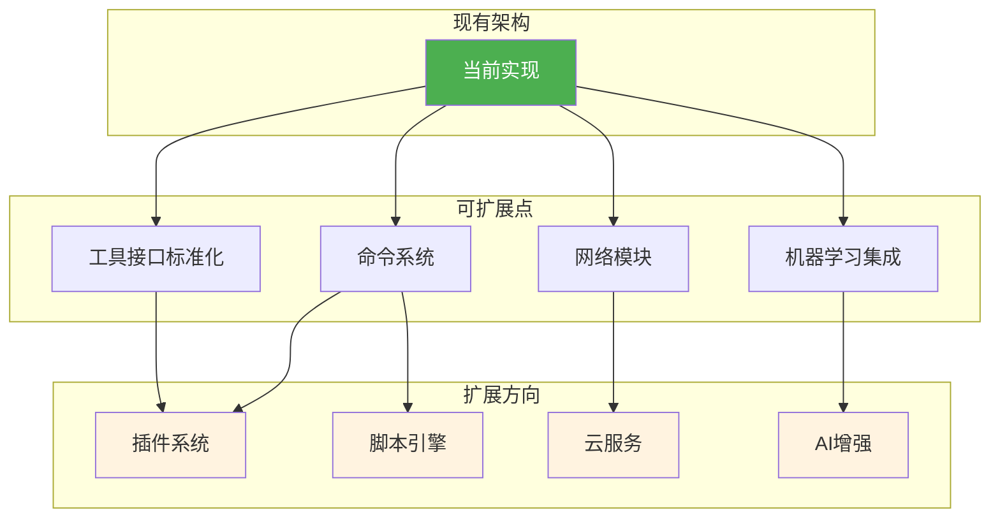
```mermaid
graph TB
    subgraph 现有架构
        A[当前实现]
    end

    subgraph 扩展方向
        B[插件系统]
        C[脚本引擎]
        D[云服务]
        E[AI增强]
    end

    subgraph 可扩展点
        F[工具接口标准化]
        G[命令系统]
        H[网络模块]
        I[机器学习集成]
    end

    A --> F
    A --> G
    A --> H
    A --> I

    F --> B
    G --> B
    G --> C
    H --> D
    I --> E

    style A fill:#4caf50,color:#fff
    style B fill:#fff3e0
    style C fill:#fff3e0
    style D fill:#fff3e0
    style E fill:#fff3e0
```

---


## 10. 设计模式分析

### 10.1 架构分层图

```mermaid
graph TB
    subgraph 应用层
        direction LR
        A1[SnipScreen]
        A2[PinWindow]
        A3[SettingsWindow]
        A4[OcrResultDialog]
        A5[HistoryWindow]
        A6[RecordingControlWindow]
        A7[TranslateOverlayWindow]
    end

    subgraph 快捷键系统层
        direction LR
        B1[ShortcutManager]
        B2[ShortcutRegistry]
        B3[TrayMenuBuilder]
        B4[AnnotationShortcutController]
        B5[GlobalShortcut]
    end

    subgraph 业务逻辑层
        direction LR
        C1[Selector]
        C2[AnnotationInteractionHandler]
        C3[AnnotationManager]
        C4[Hunter]
        C5[ClipboardMonitor]
    end

    subgraph 引擎服务层
        direction LR
        D1[OcrEngine]
        D2[TranslateService]
        D3[ScreenRecorder]
        D4[HistoryManager]
    end

    subgraph 核心服务层
        direction LR
        E1[ConfigManager]
        E2[StyleManager]
        E3[TranslationManager]
        E4[Logger]
        E5[Utils]
    end

    subgraph 基础设施层
        direction LR
        F1[Qt Framework]
        F2[ONNX Runtime]
        F3[DirectML / CoreML]
        F4[SQLite]
        F5[FFmpeg]
        F6[Platform API]
    end

    应用层 --> 快捷键系统层
    应用层 --> 业务逻辑层
    应用层 --> 引擎服务层
    应用层 --> 核心服务层
    快捷键系统层 --> 核心服务层
    业务逻辑层 --> 引擎服务层
    引擎服务层 --> 核心服务层
    核心服务层 --> 基础设施层

    style 应用层 fill:#ede9fe,stroke:#7c3aed
    style 快捷键系统层 fill:#fce7f3,stroke:#db2777
    style 业务逻辑层 fill:#fef3c7,stroke:#f59e0b
    style 引擎服务层 fill:#d1fae5,stroke:#10b981
    style 核心服务层 fill:#dbeafe,stroke:#2563eb
    style 基础设施层 fill:#f3f4f6,stroke:#6b7280
```

### 10.2 设计模式汇总

```mermaid
mindmap
  root((QuickShot 设计模式))
    单例模式
      ConfigManager
      StyleManager
      TranslationManager
      Logger
      HistoryManager
      OcrEngine
      ShortcutManager
    策略模式
      IShortcutHandler
      TranslateEngine
      Annotation体系
    状态机模式
      Selector状态机
      7种状态有序流转
    模板方法
      BaseToolBar
      setupUi方法
      updateButtonStyles方法
    注册表模式
      ShortcutRegistry
      QHash KeyHandler
    命令模式
      AnnotationManager
      UndoStack RedoStack
      MoveRecord拖动原子操作
    桥接模式
      ScreenRecorder
      多平台实现
    数据驱动
      kShortcutConfigs
      colorSettingTable
      单一数据源
    外观模式
      ShortcutManager
      统一API
    工厂模式
      TrayMenuBuilder
      数据驱动创建菜单
    观察者模式
      Qt Signal Slot
      configLoaded
      languageChanged
    动态加载
      OcrEngine GPU
      DirectML CoreML
```

### 10.3 各设计模式详解

#### 10.3.1 Singleton 单例模式

**应用场景**：确保全局唯一实例，提供统一访问入口。采用 Qt 风格单例（QObject 派生 + instance() 静态方法 + s_instance 指针），支持信号/槽机制。

**涉及类**：

| 类名 | 文件位置 | 说明 |
|------|----------|------|
| ConfigManager | src/core/ConfigManager.h | QSettings 封装，配置文件读写 + 默认值播种（Facade） |
| StyleManager | src/core/StyleManager.h | 集中管理 QSS 样式表和颜色主题 |
| TranslationManager | src/core/TranslationManager.h | i18n 翻译管理，语言切换 |
| Logger | src/log/Logger.h | 分级日志（DEBUG/INFO/WARN/ERROR） |
| HistoryManager | src/history/HistoryManager.h | SQLite 历史记录管理 |
| OcrEngine | src/ocr/OcrEngine.h | ONNX Runtime OCR 引擎 |
| ShortcutManager | src/shortcut/ShortcutManager.h | 全局热键管理器 |

**实现特点**：
- 使用 QObject 基类，支持信号/槽
- instance() 方法返回指针，首次调用时创建实例
- 提供 destroy() 方法在应用退出时清理

---

#### 10.3.2 Strategy 策略模式

**应用场景**：封装可替换的算法族，运行时选择实现。接口统一、实现可替换。

**策略接口与实现**：

```mermaid
classDiagram
    class IShortcutHandler {
        <<interface>>
        +bool canAnnotate()
        +void onToolSwitch(toolId)
        +void onCopy()
        +void onSave()
        +void onUndo()
        +void onRedo()
        +void onClear()
    }
    
    class SnipScreen {
        +bool canAnnotate()
        +void onToolSwitch(toolId)
    }
    
    class PinWindow {
        +bool canAnnotate()
        +void onToolSwitch(toolId)
    }
    
    class TranslateEngine {
        <<interface>>
        +void translate(text, sourceLang, targetLang)
    }
    
    class MyMemoryEngine
    class BaiduTranslateEngine
    class DeepLEngine
    class LibreTranslateEngine
    
    class Annotation {
        <<abstract>>
        +void draw(painter)
        +bool hitTest(pos)
        +void translate(offset)
    }
    
    class RectAnnotation
    class EllipseAnnotation
    class ArrowAnnotation
    class LineAnnotation
    class PenAnnotation
    class TextAnnotation
    class MosaicAnnotation
    class TriangleAnnotation

    IShortcutHandler <|.. SnipScreen
    IShortcutHandler <|.. PinWindow
    TranslateEngine <|-- MyMemoryEngine
    TranslateEngine <|-- BaiduTranslateEngine
    TranslateEngine <|-- DeepLEngine
    TranslateEngine <|-- LibreTranslateEngine
    Annotation <|-- RectAnnotation
    Annotation <|-- EllipseAnnotation
    Annotation <|-- ArrowAnnotation
    Annotation <|-- LineAnnotation
    Annotation <|-- PenAnnotation
    Annotation <|-- TextAnnotation
    Annotation <|-- MosaicAnnotation
    Annotation <|-- TriangleAnnotation
```

**三组策略模式应用**：

1. **IShortcutHandler 策略接口**
   - SnipScreen 和 PinWindow 分别实现
   - AnnotationShortcutController 持有策略引用
   - 同一套快捷键逻辑在不同窗口复用

2. **TranslateEngine 翻译引擎**
   - MyMemoryEngine / BaiduTranslateEngine / DeepLEngine / LibreTranslateEngine
   - 用户可在设置中切换引擎
   - TranslateService 统一调度

3. **Annotation 多态体系**
   - 8 种标注类型（矩形/椭圆/三角/箭头/直线/画笔/文本/马赛克）
   - 统一接口：draw() / hitTest() / 	ranslate()
   - AnnotationManager 无需关心具体类型

---

#### 10.3.3 State Machine 状态机模式

**应用场景**：显式状态枚举 + 转移逻辑，确保交互有序。

**Selector 状态转换**：

```mermaid
stateDiagram-v2
    [*] --> Ready : 初始状态
    Ready --> PreySelecting : 鼠标进入
    PreySelecting --> FreeSelecting : 按下并拖拽
    PreySelecting --> Captured : 按下后释放（吸附）
    FreeSelecting --> Captured : 释放鼠标
    Captured --> Moving : 点击内部
    Captured --> Resizing : 点击边框
    Captured --> Locked : 选择标注工具
    Captured --> Ready : 右键重新选择
    Moving --> Captured : 释放鼠标
    Resizing --> Captured : 释放鼠标
    Locked --> Captured : 完成标注
```

**7 个状态**：Ready → PreySelecting → FreeSelecting → Captured → Moving/Resizing/Locked

**代码位置**：src/capture/Selector.h

---

#### 10.3.4 Template Method 模板方法

**应用场景**：基类定义算法骨架，子类重写可变步骤。

**BaseToolBar 模板方法结构**：

```mermaid
graph TD
    subgraph 基类 BaseToolBar
        A[setupUi] --> B[createAnnotationTools]
        A --> C[addColorPalette]
        A --> D[addSeparator]
        B --> E[updateButtonStyles]
        C --> E
        D --> E
    end

    subgraph 子类 ScreenshotToolBar
        S1[重写 setupUi]
        S2[重写 updateButtonStyles]
    end

    subgraph 子类 RecordingToolBar
        R1[重写 setupUi]
        R2[重写 updateButtonStyles]
    end

    E --> S1
    E --> R1
```

**关键方法**：
- setupUi() ← 子类实现（创建特定按钮）
- updateButtonStyles() ← 子类实现（纯虚）
- createAnnotationTools() ← 基类共享实现
- updateState() ← 基类实现

**代码位置**：src/widgets/BaseToolBar.h

---

#### 10.3.5 Registry 注册表模式

**应用场景**：集中管理全局热键生命周期，类型安全的 Key→Handler 映射。

**ShortcutRegistry 结构**：

```mermaid
graph LR
    subgraph ShortcutRegistry
        direction TB
        H1[QHash ShortcutType → GlobalShortcut*]
        H2[QHash ShortcutType → Callback]
    end

    subgraph ShortcutType枚举
        direction TB
        T1[Snip]
        T2[Record]
        T3[History]
        T4[Pin]
        T5[Fullscreen]
        T6[ActiveWindow]
        T7[RecordPause]
        T8[RecordStop]
        T9[TogglePins]
    end

    H1 --> T1
    H1 --> T2
    H1 --> T3
    H1 --> T4
    H1 --> T5
    H1 --> T6
    H1 --> T7
    H1 --> T8
    H1 --> T9
```

**核心方法**：
- 
egisterShortcut(type, callback)：注册热键
- update(type, sequence)：更新按键序列
- unregisterShortcut(type)：注销单个
- unregisterAll()：全部注销

**代码位置**：src/shortcut/ShortcutRegistry.h

---

#### 10.3.6 Command 命令模式 (Undo/Redo)

**应用场景**：AnnotationManager 基于栈的撤销/重做系统。

**Undo/Redo 流程**：

```mermaid
flowchart LR
    subgraph AnnotationManager
        direction TB
        U[Undo Stack]
        R[Redo Stack]
        M[MoveRecord]
    end

    subgraph 操作
        direction TB
        A[添加标注]
        B[删除标注]
        C[拖动标注]
    end

    A -->|push| U
    B -->|push| U
    C -->|beginMove| M
    M -->|endMove| U

    U -->|undo| R
    R -->|redo| U
```

**MoveRecord 结构**：
`cpp
struct MoveRecord {
    bool valid;
    QPoint start;      // 原始位置
    QPoint end;        // 目标位置
    QVector<QPoint> points;  // 画笔路径点
};
`

**关键方法**：
- eginMove() → 	ranslateLast() → endMove() 三段式拖动 API
- undo() 优先撤销移动操作
- 
edo() 优先重做移动操作

**代码位置**：src/capture/AnnotationManager.h

---

#### 10.3.7 Bridge 桥接模式

**应用场景**：ScreenRecorder 抽象接口 + 多平台实现，编译时选择，运行时统一调用。

**平台实现结构**：

```mermaid
graph TB
    subgraph 统一接口
        A[ScreenRecorder]
        A1[start / pause / resume / stop]
        A2[isRecording / isPaused]
    end

    subgraph Windows实现
        W1[ScreenRecorder_win.cpp]
        W2[GDI + Media Foundation + WASAPI]
    end

    subgraph macOS实现
        M1[ScreenRecorder_mac.cpp]
        M2[ScreenCaptureKit + AVAssetWriter]
    end

    subgraph Linux实现
        L1[ScreenRecorder_linux.cpp]
        L2[X11 + FFmpeg]
    end

    A --> W1
    A --> M1
    A --> L1
    W1 --> W2
    M1 --> M2
    L1 --> L2
```

**编译宏控制**：
`cpp
#ifdef Q_OS_WIN
    #include " ScreenRecorder_win.cpp\
#elif defined(Q_OS_MAC)
 #include \ScreenRecorder_mac.cpp\
#elif defined(Q_OS_LINUX)
 #include \ScreenRecorder_linux.cpp\
#endif
`

**代码位置**：src/recording/

---

#### 10.3.8 Data-Driven 数据驱动

**应用场景**：单一数据源驱动注册/UI/翻译/托盘菜单。

**快捷键配置数据表**：

```mermaid
graph TD
 subgraph "kShortcutConfigs 单一数据源"
 direction TB
 C1[Snip: Alt+Q]
 C2[Record: Alt+S]
 C3[History: Alt+H]
 C4[Pin: Alt+P]
 C5[Fullscreen: Alt+Shift+F]
 C6[ActiveWindow: Alt+Shift+W]
 C7[RecordPause: Alt+Shift+S]
 C8[RecordStop: Alt+Shift+Q]
 C9[TogglePins: Alt+Shift+P]
 end

 subgraph 消费方
 direction LR
 R1[ShortcutRegistry 热键注册]
 R2[SettingsWindow 设置UI]
 R3[TrayMenuBuilder 托盘菜单]
 R4[ConfigManager 默认值]
 end

 C1 --> R1
 C1 --> R2
 C1 --> R3
 C1 --> R4
 C2 --> R1
 C2 --> R2
 C2 --> R3
 C2 --> R4
```

**优势**：新增快捷键仅需修改 ShortcutTypes.h 数据表，无需修改注册、UI、菜单等多处代码。

**代码位置**：src/shortcut/ShortcutTypes.h

**颜色配置元数据表（colorSettingTable）**：

样式/颜色配置采用同一"数据驱动"惯用法：`StyleManager::colorSettingTable()`（core 层，21 项）作为颜色配置唯一来源。`ConfigManager::ensureDefaultValues`/`createDefaultConfig` 遍历它播种默认值；`StyleManager::initFromConfig` 遍历它从持久化恢复；`SettingsWindow` 遍历它构建设置 UI 并处理颜色变更。新增/修改颜色配置只需改 StyleManager.cpp 表项（及 DEFAULT_* 常量），无需改动播种、恢复、UI 三处代码。

```mermaid
graph TD
 subgraph "colorSettingTable 单一数据源 (StyleManager)"
 direction TB
 C1[21 项 StyleColorSetting]
 C2[settingsKey + defaultColor]
 C3[getter/setter 函数指针]
 C4[category / signalId / translationKey]
 end

 subgraph 消费方
 direction LR
 R1[ConfigManager 播种默认值]
 R2[StyleManager initFromConfig 启动恢复]
 R3[SettingsWindow 构建设置 UI]
 R4[SettingsWindow applyColorChange 改色]
 end

 C1 --> R1
 C1 --> R2
 C1 --> R3
 C1 --> R4
```

**代码位置**：src/core/StyleManager.cpp（colorSettingTable）/ src/core/StyleManager.h

---

#### 10.3.9 Facade 外观模式

**应用场景**：ShortcutManager 对外暴露统一 API，内部协调多个子系统。

**ShortcutManager 外观结构**：

```mermaid
graph LR
 subgraph 外部调用方
 U1[main.cpp]
 U2[SettingsWindow]
 U3[SnipScreen]
 end

 subgraph ShortcutManager 外观
 S1[initialize]
 S2[registerAll]
 S3[buildTrayMenu]
 S4[update / reset]
 end

 subgraph 内部子系统
 direction TB
 R[ShortcutRegistry]
 T[TrayMenuBuilder]
 end

 U1 --> S1
 U1 --> S2
 U1 --> S3
 U2 --> S4
 U3 --> S4

 S2 --> R
 S3 --> T
 S4 --> R
```

**统一 API**：initialize() / 
egisterAll() / uildTrayMenu() / update() / 
eset() / getSequence()

**代码位置**：src/shortcut/ShortcutManager.h

---

#### 10.3.10 Factory 工厂模式

**应用场景**：TrayMenuBuilder 数据驱动地创建托盘菜单项。

**菜单构建流程**：

```mermaid
flowchart TD
 A[遍历 kShortcutConfigs] --> B{trayTextKey 是否为 nullptr}
 B -->|是| C[跳过，不生成菜单项]
 B -->|否| D[创建 QAction]
 D --> E[拼接 文案 + 快捷键]
 E --> F[添加到菜单]
 F --> G[建立 ShortcutType → QAction 映射]
```

**优势**：新增快捷键仅需在 kShortcutConfigs 加一行，菜单自动生成。

**代码位置**：src/shortcut/TrayMenuBuilder.h

---

#### 10.3.11 Observer 观察者模式

**应用场景**：Qt Signal/Slot 机制实现松耦合通信。

**信号/槽关系**：

```mermaid
graph TB
 subgraph 信号发送方
 S1[ConfigManager configLoaded / configSaved / configPathChanged]
 S2[TranslationManager languageChanged]
 S3[SettingsWindow tabWidgetBgColorChanged / default*Changed / toolbarButtonStyleChanged / shortcutChanged]
 end

 subgraph 信号接收方
 R1[SettingsWindow onConfigChanged / onConfigPathChanged / retranslateUi]
 R2[HistoryWindow retranslateUi / updateWindowColors]
 R3[SnipScreen refreshAnnotationToolDefaults]
 R4[ShortcutManager updateFromUiString / retranslateTrayMenu]
 R5[StyleManager setToolbarButtonStyle]
 end

 S1 --> R1
 S2 --> R1
 S2 --> R2
 S3 --> R2
 S3 --> R3
 S3 --> R4
 S3 --> R5
```

**关键信号**：
- configLoaded / configSaved / configPathChanged：配置变更通知
- languageChanged：多语言界面刷新
- tabWidgetBgColorChanged：选项卡背景同步 HistoryWindow
- defaultPenWidth/FontSize/EraserWidth/MosaicSizeChanged：标注默认值同步工具栏
- toolbarButtonStyleChanged：按钮样式实时更新
- shortcutChanged(type, sequence)：快捷键变更

---

#### 10.3.12 Dynamic Loading 动态加载

**应用场景**：GPU 推理运行时加载而非编译时链接。

**GPU 动态加载流程**：

```mermaid
flowchart TD
 A[OcrEngine::initialize] --> B{ocr/useGpu 配置}
 B -->|false| C[CPU 推理]
 B -->|true| D{平台判断}
 
 D -->|Windows| E[LoadLibrary DirectML.dll]
 E --> F{加载成功}
 F -->|否| C
 F -->|是| G[GetProcAddress 获取函数]
 G --> H{获取成功}
 H -->|否| C
 H -->|是| I[配置 DirectML 执行提供者]
 
 D -->|macOS| J[dlsym CoreML 符号]
 J --> K{查找成功}
 K -->|否| C
 K -->|是| L[尝试 GPU_ONLY flags=2]
 L --> M{初始化成功}
 M -->|是| N[配置 CoreML 执行提供者]
 M -->|否| O[回退 AUTO flags=0]
 O --> P{初始化成功}
 P -->|否| C
 P -->|是| N
 
 I --> Q[GPU 推理]
 N --> Q
```

**关键实现**：
- Windows: LoadLibrary(DirectML.dll) → GetProcAddress
- macOS: dlsym(RTLD_DEFAULT, OrtSessionOptionsAppendExecutionProvider_CoreML)
- 失败自动回退 CPU，不影响核心功能

**代码位置**：src/ocr/OcrEngine.cpp

---

### 10.4 设计模式协作关系图

```mermaid
graph TD
    subgraph 创建型
        F[Factory 工厂模式<br/>TrayMenuBuilder]
    end

    subgraph 结构型
        B[Bridge 桥接模式<br/>ScreenRecorder]
        Fa[Facade 外观模式<br/>ShortcutManager]
        R[Registry 注册表模式<br/>ShortcutRegistry]
        D[Data-Driven 数据驱动<br/>kShortcutConfigs]
    end

    subgraph 行为型
        S[Strategy 策略模式<br/>IShortcutHandler / TranslateEngine]
        SM[State Machine 状态机<br/>Selector]
        TM[Template Method 模板方法<br/>BaseToolBar]
        C[Command 命令模式<br/>AnnotationManager]
        O[Observer 观察者模式<br/>Qt Signal/Slot]
    end

    subgraph 单例
        Sig[Singleton 单例模式<br/>7 个全局管理器]
    end

    subgraph 运行时
        DL[Dynamic Loading 动态加载<br/>OcrEngine GPU]
    end

    Fa --> R
    Fa --> F
    Fa --> D
    S --> SM
    TM --> S
    C --> SM
    O --> Sig
    DL --> S

    style Sig fill:#dbeafe,stroke:#2563eb
    style B fill:#d1fae5,stroke:#10b981
    style Fa fill:#fce7f3,stroke:#db2777
    style R fill:#fef3c7,stroke:#f59e0b
    style D fill:#fef3c7,stroke:#f59e0b
    style S fill:#ede9fe,stroke:#7c3aed
    style SM fill:#ede9fe,stroke:#7c3aed
    style TM fill:#ede9fe,stroke:#7c3aed
    style C fill:#ede9fe,stroke:#7c3aed
    style O fill:#ede9fe,stroke:#7c3aed
    style F fill:#d1fae5,stroke:#10b981
    style DL fill:#fee2e2,stroke:#dc2626
```

### 10.5 架构优势总结

| 优势 | 说明 |
|------|------|
| **高内聚低耦合** | AnnotationInteractionHandler 封装标注交互，SnipScreen 与 PinWindow 完全复用 |
| **平台解耦** | ScreenRecorder 通过编译宏选择平台实现，业务层零感知 |
| **安全降级** | GPU/CPU 动态判断、翻译引擎缺失回退、OCR 可选编译 |
| **可扩展性** | 新增翻译引擎/标注类型/快捷键均实现接口即可 |
| **数据驱动** | 单一数据源驱动注册/UI/菜单，降低维护成本 |
| **跨平台一致** | Windows/macOS/Linux 三平台支持，编译宏 + 运行时判断 |


## 附录

### A. 目录结构

```
src/
├── capture/              # 截图核心
│   ├── Annotation.h      # 标注类定义（矩形/椭圆/三角形/画笔/箭头/直线/文本/马赛克）
│   ├── AnnotationManager.h/cpp  # 标注管理器（撤销/重做/清除/橡皮擦/马赛克）
│   ├── AnnotationInteractionHandler.h/cpp  # 标注交互处理器（SnipScreen/PinWindow复用，Host回调策略模式）
│   ├── Resizer.h         # 选区尺寸管理
│   ├── Selector.h/cpp    # 选区组件（状态机、交互逻辑）
│   └── SnipScreen.h/cpp  # 主窗口（协调所有功能）
├── core/                 # 核心服务
│   ├── ConfigManager.h/cpp      # 配置管理（单例、QSettings 持久化封装）
│   ├── DisplayInfo.h/cpp # 显示器信息（平台相关）
│   ├── Hunter.h/cpp      # 窗口捕捉（窗口/显示器枚举与吸附）
│   ├── StyleManager.h/cpp       # 样式管理（颜色主题、QSS样式）
│   └── TranslationManager.h/cpp # 翻译管理（UI多语言，区别于文本翻译服务）
├── history/              # 历史记录功能
│   ├── HistoryItem.h             # 历史记录数据结构（截图/剪贴板文本）
│   ├── HistoryManager.h/cpp      # 历史记录管理器（单例、SQLite、自动清理）
│   ├── HistoryWindow.h/cpp       # 历史记录查看窗口（多选、搜索、批量删除）
│   └── ClipboardMonitor.h/cpp    # 剪贴板监听器（捕获复制/剪切）
├── languages/            # 语言文件
│   ├── zh_CN.json        # 简体中文
│   ├── en_US.json        # 英文
│   ├── ja_JP.json        # 日文
│   ├── ko_KR.json        # 韩文
│   ├── zh_TW.json        # 繁体中文
│   └── zh_HK.json        # 粤语
├── log/                  # 日志系统
│   └── Logger.h/cpp      # 日志记录器（单例）
├── ocr/                  # OCR 功能
│   ├── OcrEngine.h/cpp           # OCR 引擎（单例、模型管理）
│   ├── OcrPreprocess.h/cpp       # 预处理（图像缩放、归一化）
│   ├── OcrDetPostprocess.h/cpp   # 检测后处理（二值化、轮廓检测）
│   ├── OcrRecPostprocess.h/cpp   # 识别后处理（CTC解码）
│   └── OcrResultDialog.h/cpp     # 结果弹窗（支持拖拽、调整大小）
├── recording/            # 录屏功能
│   ├── ScreenRecorder.h/cpp             # 录屏器（录制线程、状态管理、实时标注合成）
│   ├── RecordingControlWindow.h/cpp     # 录制控制栏（暂停/继续/停止）
│   └── platform/                        # 平台特定实现
│       ├── ScreenRecorder_win.cpp       # Windows 实现（GDI + Media Foundation + WASAPI）
│       ├── ScreenRecorder_mac.cpp      # macOS 实现（ScreenCaptureKit + AVAssetWriter）
│       ├── ScreenRecorder_mac_helper.h  # macOS 辅助头文件
│       ├── ScreenRecorder_mac_helper.mm # macOS 辅助实现（ObjC++）
│       └── ScreenRecorder_linux.cpp     # Linux 实现（X11 + FFmpeg）
├── shortcut/             # 快捷键系统（重构：ShortcutManager外观+Registry注册表+TrayMenuBuilder数据驱动）
│   ├── ShortcutTypes.h            # ShortcutType枚举+ShortcutConfigItem数据表（单一事实源）
│   ├── ShortcutManager.h/cpp      # 快捷键管理器（单例，外观模式）
│   ├── ShortcutRegistry.h/cpp     # 全局热键注册表（注册表模式，管理GlobalShortcut生命周期）
│   ├── TrayMenuBuilder.h/cpp      # 托盘菜单构建器（工厂方法+数据驱动遍历配置表）
│   ├── GlobalShortcut.h/cpp       # 全局热键底层实现（跨平台原生事件过滤）
│   ├── AnnotationShortcutController.h/cpp  # 标注快捷键控制器（QShortcut+策略模式）
│   └── IShortcutHandler.h         # 标注快捷键处理策略接口（SnipScreen/PinWindow实现）
├── translate/            # 翻译功能
│   ├── TranslateEngine.h/cpp            # 翻译引擎抽象接口 + TranslateError 错误码枚举
│   ├── MyMemoryEngine.h/cpp             # MyMemory 引擎（默认，免注册，国内可直连）
│   ├── BaiduTranslateEngine.h/cpp       # 百度翻译引擎（用户自填 AppId+Key）
│   ├── DeepLEngine.h/cpp                # DeepL 引擎（用户自填 Key）
│   ├── LibreTranslateEngine.h/cpp       # LibreTranslate 引擎（自托管 URL，完全离线）
│   └── TranslateService.h/cpp           # 翻译服务单例（多引擎管理、批量翻译、隐私检查、错误消息本地化）
├── update/              # 自动更新功能
│   ├── UpdateManager.h/cpp             # 更新管理器（多渠道回退、下载校验、安装替换，Windows 平台）
├── utils/                # 工具函数
│   └── Utils.h/cpp       # 通用工具（savePixmapToFile、桌面路径等）
├── widgets/              # 通用组件
│   ├── BaseToolBar.h/cpp  # 基础工具栏（布局、子工具栏防闪烁：同步delete+setUpdatesEnabled+WA_NoSystemBackground）
│   ├── OverlayTextEdit.h/cpp  # 文本编辑框（浮动输入、拖拽缩放、边界限制、焦点冲突管理）
│   ├── PinWindow.h/cpp    # 贴图窗口（置顶、拖拽、调整大小、标注模式、Alt+P分页、WA_DeleteOnClose）
│   ├── PinAnnotationToolBar.h/cpp  # 贴图窗口标注工具栏
│   ├── PrecisionSlider.h/cpp  # 精度滑块（画笔/字号）
│   ├── RecordingToolBar.h/cpp   # 录屏工具栏（计时、快照按钮）
│   ├── ScreenshotToolBar.h/cpp  # 截图工具栏
│   ├── SettingsWindow.h/cpp   # 设置窗口（拖拽移动、6个选项卡、DPI适配、19种颜色数据驱动配置）
│   ├── HistoryWindow.h/cpp    # 历史记录窗口（截图+剪贴板分类、多选批量、搜索、实时刷新）
│   ├── MessageBox.h/cpp       # 自定义消息框（统一样式：QMessageBox替代，自动翻译按钮+居中定位+Yes/No便捷方法）
│   └── TranslateOverlayWindow.h/cpp  # 译文叠加窗口（OCR多边形位置渲染、原文/译文/对照三态视图、文字选择、复制、保存图片、翻译完成退出截图框）
├── resources/            # 资源目录
│   └── stylesheets/
│       └── app.qss       # 全局QSS样式表（DPI变化时通过reapplyGlobalStyleSheet重新加载）
├── main.cpp              # 应用入口（初始化单例、ShortcutManager注册、托盘构建、事件循环）
└── resources.qrc         # Qt 资源文件
```

### B. 关键源文件索引

| 文件路径 | 说明 |
|----------|------|
| `src/main.cpp` | 应用入口、全局初始化、ShortcutManager 注册、托盘菜单构建 |
| `src/capture/SnipScreen.h` | 主窗口类定义（截图/录屏统一入口） |
| `src/capture/SnipScreen.cpp` | 主窗口实现（截图/录屏/标注协调、Alt+P分页、录屏排除捕获） |
| `src/capture/AnnotationInteractionHandler.h` | 标注交互处理器（SnipScreen/PinWindow 复用，Host 回调策略模式） |
| `src/capture/AnnotationInteractionHandler.cpp` | 标注交互实现（鼠标事件优先级、控制点光标、录屏同步overlay） |
| `src/capture/Selector.h` | 选区组件（状态机、几何管理、Resizer 控制点） |
| `src/capture/Selector.cpp` | 选区实现（交互逻辑、绘制、滚轮吸附层级） |
| `src/capture/Annotation.h` | 标注系统（矩形/椭圆/三角形/箭头/直线/画笔/文本/马赛克 8 种类型+scale缩放） |
| `src/capture/AnnotationManager.h` | 标注管理器（撤销/重做、橡皮擦、全局马赛克算法、move拖动、scaleAll缩放） |
| `src/capture/Resizer.h` | 选区尺寸管理（8 个控制点 + 光标样式适配） |
| `src/shortcut/ShortcutTypes.h` | 快捷键类型枚举 + ShortcutConfigItem 数据表（单一事实源，9 项） |
| `src/shortcut/ShortcutManager.h` | 快捷键管理器（单例+外观模式，initialize/registerAll/buildTrayMenu） |
| `src/shortcut/ShortcutManager.cpp` | 管理器实现（update/reset/getSequence/shortcutChanged 枚举信号） |
| `src/shortcut/ShortcutRegistry.h` | 全局热键注册表（注册表模式，管理 GlobalShortcut 生命周期） |
| `src/shortcut/TrayMenuBuilder.h` | 托盘菜单构建器（工厂方法+数据驱动遍历配置表、refresh/retranslate） |
| `src/shortcut/AnnotationShortcutController.h` | 标注快捷键控制器（QShortcut + setBareKeysEnabled 文本冲突） |
| `src/shortcut/IShortcutHandler.h` | 标注快捷键处理策略接口（SnipScreen/PinWindow 实现 10 个动作命令） |
| `src/shortcut/GlobalShortcut.h` | 全局热键底层实现（Win32 热键 / macOS 事件监听） |
| `src/core/Hunter.h` | 窗口捕捉（窗口/显示器枚举、contains/Contained 层级） |
| `src/core/Hunter.cpp` | 窗口捕捉实现 |
| `src/core/DisplayInfo.h` | 显示器信息（平台相关，虚拟桌面/单屏坐标） |
| `src/core/DisplayInfo.cpp` | 显示器信息实现 |
| `src/core/ConfigManager.h` | 配置管理（单例、QSettings 持久化封装、默认值播种） |
| `src/core/StyleManager.h` | 样式管理（颜色主题、QSS 样式、DPI 重新加载全局样式表） |
| `src/core/TranslationManager.h` | UI 界面多语言（JSON 翻译文件、tm->get() 统一入口，区别于文本翻译服务） |
| `src/utils/Utils.h` | 工具类（savePixmapToFile、桌面路径等） |
| `src/widgets/BaseToolBar.h` | 基础工具栏（布局、子工具栏防闪烁、信号统一定义） |
| `src/widgets/ScreenshotToolBar.h` | 截图工具栏（copy/save/pin/close 自有信号） |
| `src/widgets/RecordingToolBar.h` | 录屏工具栏（计时控制、快照按钮、showControlRequested） |
| `src/widgets/PinWindow.h` | 贴图窗口（置顶、滚轮缩放、标注模式、Alt+P 历史分页、WA_DeleteOnClose） |
| `src/widgets/PinAnnotationToolBar.h` | 贴图窗口独立标注工具栏（copy/save/cancel 自有信号） |
| `src/widgets/SettingsWindow.h` | 设置窗口（6 个选项卡、拖拽移动、19 种颜色数据驱动配置、DPI 手动适配） |
| `src/widgets/HistoryWindow.h` | 历史记录窗口（截图+剪贴板分类、多选批量操作、搜索、实时刷新） |
| `src/widgets/OverlayTextEdit.h` | 文本编辑框（浮动输入、拖拽缩放、边界限制、焦点冲突管理） |
| `src/widgets/MessageBox.h` | 自定义消息框（统一样式替代 QMessageBox，自动翻译按钮、居中定位、静态便捷方法） |
| `src/recording/ScreenRecorder.h` | 录屏器（线程、状态管理、实时标注 overlay 合成、音频设备枚举） |
| `src/recording/RecordingControlWindow.h` | 录制控制栏（暂停/恢复/停止、系统音频+麦克风开关） |
| `src/history/HistoryItem.h` | 历史记录数据结构（截图/剪贴板文本） |
| `src/history/HistoryManager.h` | 历史记录管理器（单例、SQLite、启动清理过期、addScreenshotPixmap Alt+P入库） |
| `src/history/ClipboardMonitor.h` | 剪贴板监听器（捕获复制/剪切文本入库） |
| `src/translate/TranslateEngine.h` | 翻译引擎抽象接口 + TranslateError 错误码枚举 |
| `src/translate/TranslateService.h` | 翻译服务单例（多引擎切换、批量翻译状态机、checkEnabledAndPrivacy、错误消息本地化） |
| `src/widgets/TranslateOverlayWindow.h` | 译文叠加窗口（OCR 多边形位置渲染、三态视图、文字选择复制、保存图片、翻译完成退出截图框） |
| `src/translate/MyMemoryEngine.h` | MyMemory 引擎（默认免注册、国内直连、50000 词/天 email 提额） |
| `src/translate/BaiduTranslateEngine.h` | 百度翻译引擎（用户自填 AppId + Key，200 万字符/月免费） |
| `src/translate/DeepLEngine.h` | DeepL 引擎（用户自填 Key、高质量翻译） |
| `src/translate/LibreTranslateEngine.h` | LibreTranslate 引擎（自托管 URL、完全离线） |
| `src/update/UpdateManager.h` | 更新管理器（多渠道回退、下载校验、安装替换，Windows 平台） |
| `src/update/UpdateManager.cpp` | 更新实现（版本检查、下载、SHA256 校验、解压、robocopy 替换+回滚） |
| `src/log/Logger.h` | 日志系统（单例、LOG_INFO/LOG_WARN/LOG_ERROR 宏） |

### C. 构建配置

```cmake
# CMakeLists.txt 关键选项
cmake_minimum_required(VERSION 3.20)
project(QuickShot VERSION 1.0.0)

# 版本号注入为编译宏，源码中使用 QUICKSHOT_VERSION 或 qApp->applicationVersion()
add_compile_definitions(QUICKSHOT_VERSION="${PROJECT_VERSION}")

# C++ 标准
set(CMAKE_CXX_STANDARD 17)

# Qt 组件
find_package(Qt6 REQUIRED COMPONENTS Core Gui Widgets)

# 可选模块
option(ENABLE_OCR "启用 OCR 功能" ON)
option(ENABLE_OCR_GPU_ACCELERATION "启用 GPU 加速" OFF)
option(ENABLE_AUDIO_RECORDING "启用音频录制" ON)

# 平台检测
if(WIN32)
    add_definitions(-DWIN32)
    # Windows 特定源文件
    set(PLATFORM_SOURCES
        src/recording/platform/ScreenRecorder_win.cpp
    )
elseif(APPLE)
    add_definitions(-DMACOS)
    # macOS 特定源文件
    set(PLATFORM_SOURCES
        src/recording/platform/ScreenRecorder_mac.cpp
        src/recording/platform/ScreenRecorder_mac_helper.mm
    )
elseif(UNIX)
    add_definitions(-DLINUX)
    # Linux 特定源文件
    set(PLATFORM_SOURCES
        src/recording/platform/ScreenRecorder_linux.cpp
    )
endif()

# 源文件
file(GLOB_RECURSE SOURCES
    "src/*.cpp"
    "src/*.h"
)

# 添加可执行文件
add_executable(QuickShot ${SOURCES} ${PLATFORM_SOURCES})

# 条件编译 OCR
if(ENABLE_OCR)
    target_compile_definitions(QuickShot PRIVATE ENABLE_OCR)
    # 添加 ONNX Runtime 等依赖
endif()
```

### D. 状态机转换表

#### Selector 状态转换

| 当前状态 | 触发事件 | 目标状态 | 说明 |
|----------|----------|----------|------|
| Ready | 鼠标进入 | PreySelecting | 开始吸附检测 |
| PreySelecting | 按下并拖拽 | FreeSelecting | 自由选区 |
| PreySelecting | 按下后释放 | Captured | 吸附完成 |
| FreeSelecting | 释放鼠标 | Captured | 选区完成 |
| Captured | 点击内部 | Moving | 移动选区 |
| Captured | 点击边框 | Resizing | 调整大小 |
| Captured | 选择标注工具 | Locked | 锁定模式 |
| Captured | 右键 | Ready | 重新选择 |
| Moving | 释放鼠标 | Captured | 完成移动 |
| Resizing | 释放鼠标 | Captured | 完成调整 |
| 任意状态 | 关闭选区 | - | 退出选区 |

---


*文档版本: 1.9*
*最后更新: 2026-08-11*
*作者: QuickShot Team - chiangyang*
---
