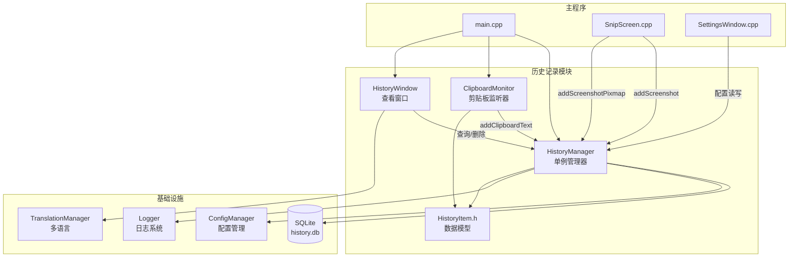
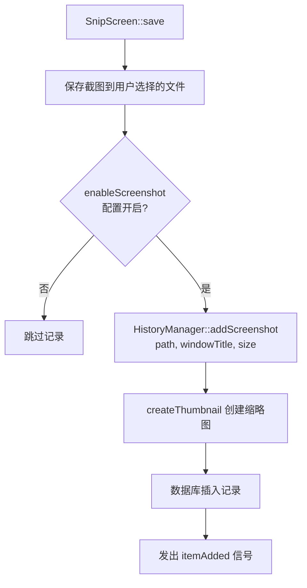
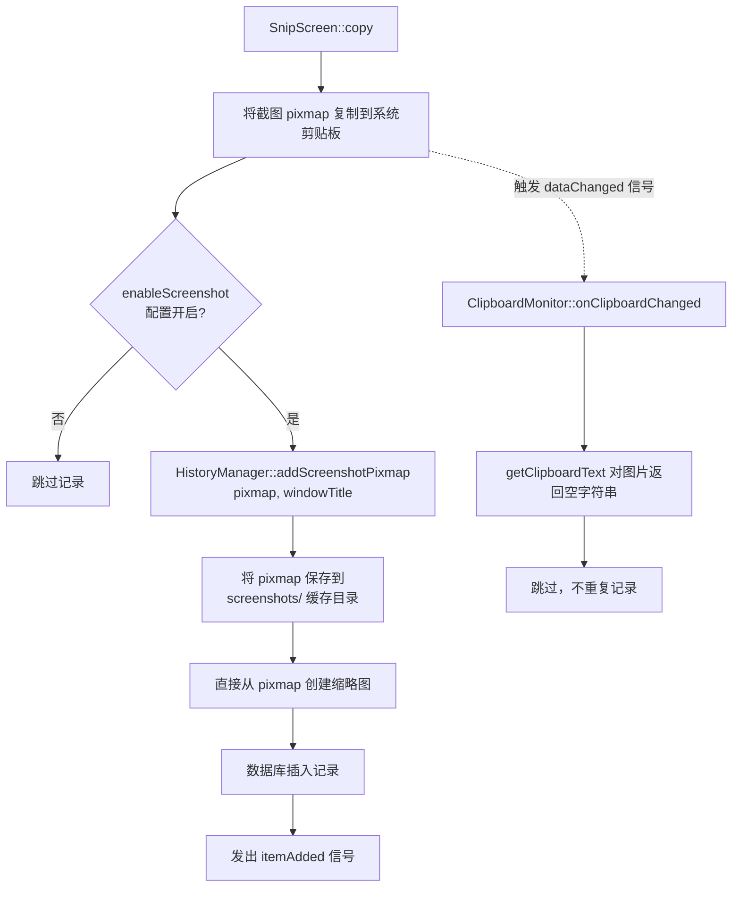
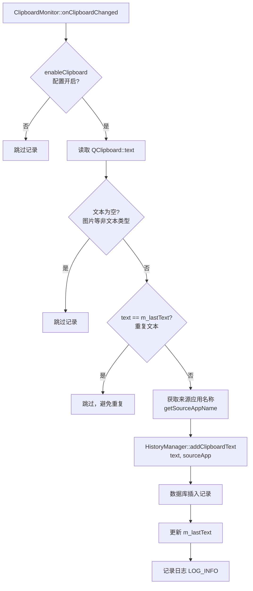
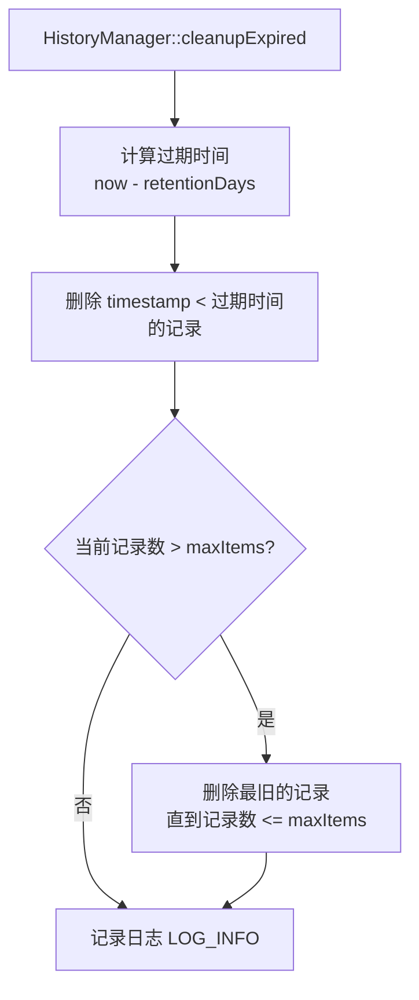
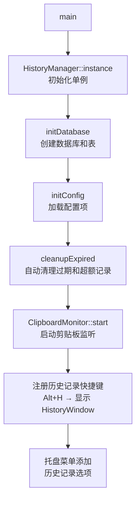

# 历史记录功能设计文档

## 一、需求概述

### 1.1 原始需求

基于 QuickShot 截图软件开发历史记录功能，实现以下具体需求：

#### 需求点 1：历史记录内容收集
- 实现截图历史记录功能，保存所有用户截取的图片
- 实现剪贴板内容记录功能，捕获用户通过 Ctrl+C（复制）和 Ctrl+X（剪切）操作的文本内容

#### 需求点 2：设置界面扩展
- 在现有设置选项卡中新增"历史记录"选项卡
- 在历史记录选项卡中添加两个独立的开关控制：
  - "记录截图历史"开关 - 控制是否保存截图历史
  - "记录剪贴板历史"开关 - 控制是否保存复制/剪切的文本内容
- 开关逻辑：两个开关独立工作，可单独开启/关闭，同时关闭则不记录任何历史

#### 需求点 3：托盘区功能扩展
- 在现有托盘区的"截图"、"录屏"、"设置"三个选项上方，新增"历史记录"选项，使托盘区共显示四个功能选项
- 点击"历史记录"选项应立即打开历史记录查看界面

#### 需求点 4：快捷键设置
- 添加一个可自定义的快捷键，用于快速打开历史记录查看界面
- 确保快捷键可在设置中进行修改，避免与系统或其他软件冲突

#### 需求点 5：历史记录界面设计与功能
- 设计直观的历史记录浏览界面，同时展示截图和文本记录
- 实现分类查看功能，可分别查看截图历史和文本历史，或查看混合列表
- 为文本记录显示内容预览、复制时间和来源应用信息
- 为截图记录显示缩略图、截取时间和窗口信息
- 实现搜索和筛选功能，可按时间、类型或内容关键词查找历史记录
- 添加操作功能：复制文本、保存截图、删除单条记录、清空历史等
- 实现历史记录的分页或无限滚动加载机制

#### 需求点 6：数据存储与管理
- 设计合理的本地数据库结构，存储截图文件路径和文本内容
- 实现历史记录的自动清理机制，可设置保留时间或最大存储容量
- 确保数据安全，避免敏感信息泄露

---

## 二、技术选型

| 需求点 | 技术方案 | 理由 |
|--------|----------|------|
| 数据存储 | SQLite（Qt 自带） | 轻量级、无需额外依赖、支持查询/索引、Qt 原生支持 `QSqlDatabase` |
| 剪贴板监听 | `QClipboard::dataChanged` 信号 | Qt 原生 API，可监听系统剪贴板变化 |
| 截图存储 | 缩略图 + 原图路径 | 缩略图加快加载速度，保留原图路径供用户查看 |
| UI 框架 | 纯 Qt Widgets | 保持与现有代码风格一致 |
| 线程安全 | `QRecursiveMutex` | 递归互斥锁，支持嵌套加锁场景（如 `removeItem` 内部调用 `getItemById`） |

### 2.1 依赖库

Qt 6 模块：
- `Qt6::Sql` - 数据库操作
- `Qt6::Gui` - 剪贴板操作

### 2.2 CMake 配置

在 `CMakeLists.txt` 中已添加：

```cmake
find_package(Qt6 COMPONENTS
        ...
        Sql          # 新增
        REQUIRED)

target_link_libraries(QuickShot
        ...
        Qt::Sql      # 新增
)
```

同时添加了 Qt SQL 驱动插件（`qsqlite.dll`）的部署逻辑，确保运行时能正确加载 SQLite 驱动。

---

## 三、模块划分

在 `src/` 下新增 `history/` 模块：

```
src/history/
├── HistoryItem.h         // 历史记录数据结构
├── HistoryManager.h      // 历史记录管理器（单例）
├── HistoryManager.cpp
├── HistoryWindow.h       // 历史记录查看窗口
├── HistoryWindow.cpp
├── ClipboardMonitor.h    // 剪贴板监听器
└── ClipboardMonitor.cpp
```

### 3.1 模块职责

| 文件 | 职责 |
|------|------|
| `HistoryItem.h` | 定义历史记录数据模型，包括截图记录和剪贴板文本记录 |
| `HistoryManager.h/cpp` | 核心管理类，负责数据库操作、记录增删改查、配置管理、自动清理、缩略图生成 |
| `HistoryWindow.h/cpp` | 历史记录查看界面，提供浏览、搜索、筛选、操作功能 |
| `ClipboardMonitor.h/cpp` | 剪贴板变化监听器，捕获系统剪贴板变化事件 |

### 3.2 模块架构图



### 3.3 集成点

| 文件 | 修改内容 |
|------|----------|
| `src/capture/SnipScreen.cpp` | 截图保存后调用 `addScreenshot()` 记录历史；复制操作调用 `addScreenshotPixmap()` |
| `src/widgets/SettingsWindow.h/cpp` | 新增"历史记录"选项卡（记录开关、存储设置、数据管理、统计信息） |
| `src/widgets/SettingsWindow.cpp` | 快捷键选项卡新增历史记录快捷键设置行 |
| `src/main.cpp` | 初始化 HistoryManager、启动 ClipboardMonitor、注册快捷键、添加托盘菜单项 |
| `CMakeLists.txt` | 添加 Sql 模块依赖、新增源文件、部署 SQL 驱动插件 |
| `src/languages/*.json` | 6 种语言文件添加历史记录相关翻译条目 |

---

## 四、数据结构设计

### 4.1 HistoryItem 数据模型

```cpp
/**
 * @brief 历史记录类型枚举
 *
 * 区分不同类型的历史记录，用于分类显示和筛选
 */
enum class HistoryType {
    All = -1,          ///< 全部类型（用于筛选时不过滤）
    Screenshot = 0,    ///< 截图记录
    ClipboardText = 1  ///< 剪贴板文本
};

/**
 * @brief 历史记录数据结构
 *
 * 描述一条历史记录的完整信息，包括截图和剪贴板文本两种类型。
 */
struct HistoryItem {
    qint64 id = 0;              ///< 自增 ID
    HistoryType type = HistoryType::Screenshot; ///< 类型（截图或剪贴板文本）
    QString content;            ///< 文本内容或截图文件路径
    QString thumbnailPath;      ///< 缩略图路径（仅截图类型）
    QString sourceApp;          ///< 来源应用名称（仅剪贴板类型）
    QString windowTitle;        ///< 窗口标题（仅截图类型）
    QDateTime timestamp;        ///< 记录时间戳
    QSize imageSize;            ///< 图片尺寸（仅截图类型）

    bool isScreenshot() const;     ///< 判断是否为截图类型
    bool isClipboardText() const;  ///< 判断是否为剪贴板文本类型
    QString typeName() const;      ///< 获取类型名称
};

using HistoryItemList = QList<HistoryItem>;
```

### 4.2 SQLite 数据库表结构

**history_items 表：**

```sql
CREATE TABLE IF NOT EXISTS history_items (
    id INTEGER PRIMARY KEY AUTOINCREMENT,
    type INTEGER NOT NULL,                -- 0 = 截图, 1 = 剪贴板文本
    content TEXT NOT NULL,                -- 文本内容或截图文件路径
    thumbnail_path TEXT,                  -- 缩略图路径（截图类型）
    source_app TEXT,                      -- 来源应用（剪贴板类型）
    window_title TEXT,                    -- 窗口标题（截图类型）
    timestamp DATETIME NOT NULL,          -- 记录时间
    image_width INTEGER,                  -- 图片宽度（截图类型）
    image_height INTEGER                  -- 图片高度（截图类型）
);

-- 创建索引以优化查询性能
CREATE INDEX IF NOT EXISTS idx_history_timestamp 
    ON history_items(timestamp DESC);
CREATE INDEX IF NOT EXISTS idx_history_type 
    ON history_items(type);
CREATE INDEX IF NOT EXISTS idx_history_content 
    ON history_items(content);
```

### 4.3 配置项设计

在 `QSettings` 中新增以下配置项：

| 配置键 | 默认值 | 说明 |
|--------|--------|------|
| `history/enableScreenshot` | `true` | 是否记录截图历史 |
| `history/enableClipboard` | `true` | 是否记录剪贴板历史 |
| `history/maxItems` | `1000` | 最大记录数 |
| `history/retentionDays` | `7` | 保留天数 |
| `history/shortcut` | `Alt+H` | 打开历史记录快捷键 |
| `history/thumbnailSize` | `200` | 缩略图尺寸（像素） |

### 4.4 数据存储路径

数据库文件存储在用户数据目录下：

```
{QStandardPaths::AppDataLocation}/history/
├── history.db              # SQLite 数据库文件
├── thumbnails/             # 缩略图目录
│   └── thumb_{timestamp_ms}.png
└── screenshots/            # 截图缓存目录（复制操作时保存）
    └── QuickShot_{timestamp}.png
```

| 平台 | 实际路径 |
|------|------|
| Windows | `C:\Users\<用户名>\AppData\Local\QuickShot\QuickShot\history\` |
| macOS | `~/Library/Application Support/QuickShot/history/` |
| Linux | `~/.local/share/QuickShot/history/` |

---

## 五、核心类设计

### 5.1 HistoryManager（单例模式）

```cpp
/**
 * @brief 历史记录管理器类
 *
 * 负责历史记录的增删改查、数据库操作、配置管理和自动清理。
 * 采用单例模式，全局唯一实例。
 * 使用 QRecursiveMutex 保证线程安全，支持嵌套加锁。
 */
class HistoryManager : public QObject {
    Q_OBJECT

public:
    static HistoryManager* instance();   ///< 获取单例实例
    static void destroy();                ///< 销毁单例实例

    // 记录添加
    qint64 addScreenshot(const QString &filePath, const QString &windowTitle, const QSize &imageSize);
    qint64 addScreenshotPixmap(const QPixmap &pixmap, const QString &windowTitle);
    qint64 addClipboardText(const QString &text, const QString &sourceApp);

    // 记录查询
    QList<HistoryItem> getItems(HistoryType type, int page, int pageSize);
    QList<HistoryItem> searchItems(const QString &keyword, HistoryType type);
    int getItemCount(HistoryType type);
    HistoryItem getItemById(qint64 id);

    // 记录删除
    bool removeItem(qint64 id);
    void clearAll();
    void clearByType(HistoryType type);

    // 配置管理
    void setScreenshotEnabled(bool enabled);
    void setClipboardEnabled(bool enabled);
    bool isScreenshotEnabled() const;
    bool isClipboardEnabled() const;
    void setRetentionDays(int days);
    int retentionDays() const;
    void setMaxItems(int count);
    int maxItems() const;

    // 维护
    void cleanupExpired();      ///< 执行自动清理（启动时自动调用 + 手动触发）
    qint64 getStorageSize();    ///< 获取存储占用大小

signals:
    void itemAdded(const HistoryItem &item);   ///< 新记录添加信号
    void itemRemoved(qint64 id);                ///< 记录删除信号
    void cleared();                             ///< 清空历史信号

private:
    explicit HistoryManager(QObject *parent = nullptr);
    ~HistoryManager();

    void initDatabase();                                              ///< 初始化数据库
    void initConfig();                                                ///< 初始化配置项
    void createThumbnail(const QString &sourcePath, const QString &targetPath); ///< 创建缩略图
    void ensureDirectoryExists(const QString &path);                  ///< 确保目录存在
    QSqlDatabase getDatabase();                                       ///< 获取数据库连接
    QString databasePath() const;                                     ///< 数据库文件路径
    QString thumbnailDirPath() const;                                 ///< 缩略图目录路径
    QString historyDirPath() const;                                   ///< 历史记录根目录路径
    static int typeToInt(HistoryType type);                           ///< 类型转整数
    static HistoryType intToType(int value);                          ///< 整数转类型

    static HistoryManager* s_instance;      ///< 单例实例
    mutable QRecursiveMutex m_mutex;        ///< 递归互斥锁（支持嵌套加锁）
    QSqlDatabase m_database;                ///< 数据库连接
    bool m_screenshotEnabled;               ///< 是否启用截图历史记录
    bool m_clipboardEnabled;                ///< 是否启用剪贴板历史记录
    int m_retentionDays;                    ///< 保留天数
    int m_maxItems;                         ///< 最大记录数
    int m_thumbnailSize;                    ///< 缩略图尺寸
};
```

#### 关键方法说明

| 方法 | 说明 |
|------|------|
| `addScreenshot` | 从文件路径添加截图记录，自动创建缩略图 |
| `addScreenshotPixmap` | 直接从 QPixmap 添加截图记录，用于"复制到剪贴板"操作。将 pixmap 保存到 `screenshots/` 缓存目录 |
| `addClipboardText` | 添加剪贴板文本记录，包含来源应用信息 |
| `cleanupExpired` | 根据保留天数删除过期记录，根据最大记录数删除超额的最旧记录。**软件启动时在构造函数中自动调用一次**，同时也可通过设置界面"清理过期记录"按钮手动触发 |

> **自动清理机制**：`HistoryManager` 构造函数在 `initDatabase()` 和 `initConfig()` 之后调用 `cleanupExpired()`，确保软件启动时使用用户配置的保留天数和最大记录数自动清理过期和超额记录，无需用户手动操作。

### 5.2 ClipboardMonitor

```cpp
/**
 * @brief 剪贴板监听器类
 *
 * 监听系统剪贴板变化，捕获用户的复制/剪切操作。
 * 通过 QClipboard::dataChanged 信号实现。
 * 仅记录文本类型，忽略图片等其他类型。
 */
class ClipboardMonitor : public QObject {
    Q_OBJECT

public:
    explicit ClipboardMonitor(QObject *parent = nullptr);
    void start();                 ///< 启动剪贴板监听
    void stop();                  ///< 停止剪贴板监听
    bool isActive() const;        ///< 获取当前监听状态

private slots:
    void onClipboardChanged();    ///< 剪贴板变化处理槽函数

private:
    QString getClipboardText();   ///< 获取剪贴板文本内容
    QString getSourceAppName();   ///< 获取来源应用名称

    QClipboard *m_clipboard;      ///< 系统剪贴板对象
    QString m_lastText;           ///< 上次记录的文本，用于去重
    bool m_isActive;              ///< 是否正在监听
};
```

### 5.3 HistoryWindow

```cpp
/**
 * @brief 历史记录查看窗口类
 *
 * 提供历史记录的浏览、搜索、筛选和操作功能。
 * 支持截图预览、文本查看、复制、保存、删除等操作。
 * 支持鼠标拖拽框选多选、Ctrl/Shift+点击多选，以及批量删除。
 * 窗口标题栏使用软件默认图标，语言切换时实时翻译界面文本。
 * 历史记录新增时通过 itemAdded 信号触发 300ms 延迟刷新（仅窗口可见时）。
 * 系统缩放比例变化时通过 QScreen::logicalDotsPerInchChanged 信号触发
 * 重新计算窗口尺寸、控件尺寸与背景色，保持 DPI 自适应。
 */
class HistoryWindow : public QWidget {
    Q_OBJECT

public:
    explicit HistoryWindow(QWidget *parent = nullptr);
    void refreshItems();          ///< 刷新历史记录列表
    void retranslateUi();         ///< 重新翻译界面文本（语言切换时调用）

protected:
    void showEvent(QShowEvent *event) override;  ///< 窗口显示事件，绑定 DPI 变化信号

private slots:
    void onTabChanged(int index);                     ///< 选项卡切换
    void onSearchClicked();                            ///< 搜索按钮点击
    void onSearchReturnPressed();                      ///< 搜索框回车
    void onItemDoubleClicked(QListWidgetItem *item);   ///< 列表项双击
    void onItemSelectionChanged();                     ///< 列表选择变化（含框选、Ctrl/Shift+点击）
    void onCopyText();                                 ///< 复制文本/截图到剪贴板
    void onSaveScreenshot();                           ///< 保存截图（复用主程序 Utils::savePixmapToFile）
    void onDeleteItem();                               ///< 删除记录（支持单条和批量删除）
    void onClearAll();                                 ///< 清空历史
    void onLoadMore();                                 ///< 加载更多数据
    void onCustomContextMenu(const QPoint &pos);       ///< 右键菜单（支持多选场景）
    void onDpiChanged();                               ///< DPI 变化槽函数，重新计算尺寸与背景

private:
    void setupUi();                                    ///< 初始化 UI
    void setupToolBar();                               ///< 设置顶部工具栏
    void setupListWidget();                            ///< 设置列表控件
    void loadItems(HistoryType type, bool reset = false); ///< 加载历史记录列表
    void updateItemCount();                            ///< 更新记录统计信息
    qint64 getSelectedItemId() const;                  ///< 获取首个选中记录的 ID
    QList<qint64> getSelectedItemIds() const;          ///< 获取所有选中记录的 ID 列表
    HistoryType currentType() const;                   ///< 获取当前选项卡对应的记录类型
    QListWidgetItem* createScreenshotItem(const HistoryItem &item); ///< 创建截图列表项
    QListWidgetItem* createTextItem(const HistoryItem &item);       ///< 创建文本列表项
    void updateButtonStates();                         ///< 根据选中项数量和类型更新按钮状态
    void updateWindowColors();                         ///< 更新窗口及各容器背景色（与 SettingsWindow 一致）
    void updateControlSizes();                         ///< DPI 变化时重新计算控件尺寸（高度/图标大小）
    QSize calculateDpiScaledSize() const;              ///< 根据屏幕 DPI 计算窗口初始尺寸（基准 1000×720 @ 96DPI）

    QWidget *m_toolbarContainer;   ///< 顶部工具栏容器（搜索/筛选）
    QWidget *m_listContainer;      ///< 列表区容器（列表 + 加载更多按钮）
    QWidget *m_bottomContainer;    ///< 底部操作栏容器（复制/保存/删除/清空）

    QTabWidget *m_tabWidget;      ///< 选项卡控件（全部/截图/文本）
    QLineEdit *m_searchEdit;      ///< 搜索输入框
    QLabel *m_searchLabel;        ///< 搜索标签
    QPushButton *m_searchBtn;     ///< 搜索按钮
    QLabel *m_filterLabel;        ///< 筛选标签
    QComboBox *m_filterCombo;     ///< 时间筛选下拉框
    QListWidget *m_listWidget;    ///< 历史记录列表（ExtendedSelection 多选模式）
    QPushButton *m_copyBtn;       ///< 复制按钮
    QPushButton *m_saveBtn;       ///< 保存按钮
    QPushButton *m_deleteBtn;     ///< 删除按钮
    QPushButton *m_clearBtn;      ///< 清空历史按钮
    QPushButton *m_loadMoreBtn;   ///< 加载更多按钮（无更多数据时隐藏）
    QLabel *m_countLabel;         ///< 记录统计标签

    int m_currentPage;            ///< 当前页码
    int m_pageSize;               ///< 每页数量
    bool m_isLoading;             ///< 是否正在加载（防止重复触发）
    QString m_currentSearch;      ///< 当前搜索关键词
    QTimer *m_refreshTimer;       ///< 延迟刷新定时器（300ms 防抖）
};
```

#### 关键设计点

| 设计点 | 说明 |
|--------|------|
| **多选模式** | 列表控件使用 `QAbstractItemView::ExtendedSelection`，支持鼠标拖拽框选、Ctrl+点击追加、Shift+点击范围选 |
| **按钮状态联动** | 通过 `itemSelectionChanged` 信号触发 `updateButtonStates()`，根据选中数量（0/1/多）和类型更新按钮启用状态 |
| **批量删除** | `onDeleteItem()` 支持单条和批量删除，根据选中数量显示不同的确认提示文案 |
| **右键菜单多选适配** | 右键点击已选中项时保持多选状态显示批量删除；右键点击未选中项时清空选中并仅选中该项 |
| **菜单样式统一** | 右键菜单使用 `StyleManager::getMenuStyle()` 设置样式，与 PinWindow 右键菜单保持一致 |
| **保存路径统一** | `onSaveScreenshot()` 复用 `Utils::savePixmapToFile()`，保存路径与主程序一致（默认系统图片目录，记忆用户选择） |
| **窗口图标** | 构造函数中通过 `StyleManager::loadAppIcon()` 设置窗口图标，与软件主图标一致 |
| **实时翻译** | 连接 `TranslationManager::languageChanged` 信号，语言切换时调用 `retranslateUi()` 更新所有界面文本 |
| **实时刷新** | 连接 `HistoryManager::itemAdded` 信号，新增记录时通过 300ms 防抖定时器触发刷新（仅窗口可见时） |
| **加载更多按钮** | 没有更多数据时隐藏按钮（而非仅禁用），避免误导用户 |
| **确认对话框翻译** | 删除/清空确认对话框使用 `tm->get("yes")/tm->get("no")` 翻译按钮，避免未翻译的 Yes/No |

---

## 六、UI/UX 设计

### 6.1 设置界面 - 历史记录选项卡

在 `SettingsWindow` 中新增 `setupHistoryTab()` 方法，使用 `QScrollArea` 包裹内容实现可滚动：

```
┌─────────────────────────────────────────────────────────────┐
│  历史记录设置                                                │
├─────────────────────────────────────────────────────────────┤
│                                                             │
│  ┌─ 记录设置 ──────────────────────────────────────────────┐ │
│  │  ☑ 记录截图历史                                         │ │
│  │  ☑ 记录剪贴板历史                                       │ │
│  └────────────────────────────────────────────────────────┘ │
│                                                             │
│  ┌─ 存储设置 ──────────────────────────────────────────────┐ │
│  │  保留时间:        [ 7 天 ▼ ]                            │ │
│  │  最大记录数:      [ 1000 ▼ ]                            │ │
│  └────────────────────────────────────────────────────────┘ │
│                                                             │
│  ┌─ 数据管理 ──────────────────────────────────────────────┐ │
│  │  [清理过期记录]    [清空所有历史]                       │ │
│  └────────────────────────────────────────────────────────┘ │
│                                                             │
│  ┌─ 统计信息 ──────────────────────────────────────────────┐ │
│  │  截图记录: 128 条                                       │ │
│  │  文本记录: 356 条                                       │ │
│  │  存储占用: 12.5 MB                                      │ │
│  └────────────────────────────────────────────────────────┘ │
│                                                             │
└─────────────────────────────────────────────────────────────┘
```

> **注意**：历史记录快捷键设置已移至"快捷键"选项卡中，与截图、录屏快捷键并列，样式保持一致（包含取消、确定、恢复默认三个按钮）。

### 6.2 快捷键选项卡

历史记录快捷键已集成到快捷键选项卡中：

```
┌─────────────────────────────────────────────────────────────┐
│  截图快捷键：    [ Alt+Q ]     [取消] [确定] [恢复默认]     │
│  录屏：          [ Alt+S ]     [取消] [确定] [恢复默认]     │
│  历史记录：      [ Alt+H ]     [取消] [确定] [恢复默认]     │
└─────────────────────────────────────────────────────────────┘
```

### 6.3 历史记录查看界面

```
┌─────────────────────────────────────────────────────────────────┐
│  搜索: [搜索关键词...              ] [搜索]  筛选: [全部时间▼]  │
├─────────────────────────────────────────────────────────────────┤
│  [全部] [截图] [文本]                                           │
├─────────────────────────────────────────────────────────────────┤
│ ┌───────────────┐  ┌───────────────┐  ┌─────────────────────┐ │
│ │               │  │               │  │                     │ │
│ │   📷 缩略图    │  │   📷 缩略图    │  │  📝 文本内容预览     │ │
│ │               │  │               │  │                     │ │
│ │  2026-07-30   │  │  2026-07-30   │  │  2026-07-29         │ │
│ │  窗口标题      │  │  窗口标题      │  │  来源应用            │ │
│ └───────────────┘  └───────────────┘  └─────────────────────┘ │
│                                                                 │
│                        [加载更多]                               │
├─────────────────────────────────────────────────────────────────┤
│ [复制] [保存] [删除] [清空历史]              共 484 条          │
└─────────────────────────────────────────────────────────────────┘
```

**右键菜单**：在列表项上右键可弹出上下文菜单，包含复制、保存截图（仅截图类型）、删除选项。菜单样式使用 `StyleManager::getMenuStyle()`，与 PinWindow 右键菜单保持一致。

**多选操作**：
- **鼠标拖拽框选**：按住鼠标左键拖动，框选范围内的所有项被选中
- **Ctrl + 点击**：追加选中/取消选中单个项
- **Shift + 点击**：范围选中（从上次选中项到当前项）
- **批量删除**：多选时点击删除按钮或右键菜单的"删除选中"选项，可一次性删除多条记录
- **按钮状态联动**：未选中时所有操作按钮禁用；选中单个时复制可用、保存仅在截图类型可用；选中多个时仅删除可用

### 6.4 托盘菜单扩展

```
┌─────────────────────────┐
│  📋 历史记录 (Alt+H)    │  ← 新增选项
├─────────────────────────┤
│  📸 截图 (Alt+Q)        │
│  ⏺ 录屏 (Alt+S)        │
├─────────────────────────┤
│  ⚙ 设置                 │
├─────────────────────────┤
│  ✕ 退出                 │
└─────────────────────────┘
```

---

## 七、关键实现流程

### 7.1 截图历史记录流程

**保存截图时**（`SnipScreen::save()`）：



**复制截图时**（`SnipScreen::copy()`）：



> **注意**：复制截图时虽然会触发 `QClipboard::dataChanged` 信号，但 `ClipboardMonitor::getClipboardText()` 对图片类型返回空字符串，不会重复记录。

### 7.2 剪贴板记录流程



### 7.3 自动清理机制



**触发时机**：
1. **软件启动时自动触发**：`HistoryManager` 构造函数在 `initDatabase()` 和 `initConfig()` 之后自动调用 `cleanupExpired()`，使用用户配置的保留天数和最大记录数清理过期和超额记录
2. **手动触发**：用户在设置界面"历史记录"选项卡中点击"清理过期记录"按钮手动触发

> **与"清空所有历史"的区别**：`cleanupExpired()` 仅删除过期和超额记录，保留有效记录；`clearAll()` 删除所有记录。

### 7.4 应用启动初始化流程



---

## 八、翻译条目

在各语言文件（`src/languages/*.json`）中新增以下翻译条目：

| 翻译键 | 中文 | 英文 |
|--------|------|------|
| `history.tabName` | 历史记录 | History |
| `history.recordSettings` | 记录设置 | Record Settings |
| `history.enableScreenshot` | 记录截图历史 | Record Screenshot History |
| `history.enableClipboard` | 记录剪贴板历史 | Record Clipboard History |
| `history.shortcut.label` | 历史记录快捷键 | History Shortcut |
| `history.storage.title` | 存储设置 | Storage Settings |
| `history.storage.retentionDays` | 保留时间 | Retention Period |
| `history.storage.maxItems` | 最大记录数 | Max Records |
| `history.storage.days7` | 7 天 | 7 days |
| `history.storage.days30` | 30 天 | 30 days |
| `history.storage.days90` | 90 天 | 90 days |
| `history.storage.days180` | 180 天 | 180 days |
| `history.storage.days365` | 365 天 | 365 days |
| `history.dataManagement.title` | 数据管理 | Data Management |
| `history.dataManagement.cleanExpired` | 清理过期记录 | Clean Expired Records |
| `history.dataManagement.clearAll` | 清空所有历史 | Clear All History |
| `history.stats.title` | 统计信息 | Statistics |
| `history.stats.screenshots` | 截图记录 | Screenshots |
| `history.stats.texts` | 文本记录 | Texts |
| `history.stats.storage` | 存储占用 | Storage Used |
| `history.stats.items` | 条 | items |
| `history.window.title` | 历史记录 | History |
| `history.window.tabAll` | 全部 | All |
| `history.window.tabScreenshots` | 截图 | Screenshots |
| `history.window.tabTexts` | 文本 | Texts |
| `history.window.searchPlaceholder` | 搜索关键词... | Search keywords... |
| `history.window.search` | 搜索 | Search |
| `history.window.filter` | 筛选 | Filter |
| `history.window.loadMore` | 加载更多 | Load More |
| `history.window.actions.copy` | 复制 | Copy |
| `history.window.actions.save` | 保存 | Save |
| `history.window.actions.delete` | 删除 | Delete |
| `history.window.actions.deleteSelected` | 删除选中（%1） | Delete Selected (%1) |
| `history.window.actions.clear` | 清空历史 | Clear History |
| `history.window.saveScreenshot` | 保存截图 | Save Screenshot |
| `history.window.unknown` | 未知 | Unknown |
| `history.window.error` | 错误 | Error |
| `history.window.fileNotFound` | 源文件未找到 | Source file not found |
| `history.window.saveFailed` | 保存失败 | Save Failed |
| `history.window.confirmDeleteTitle` | 确认删除 | Confirm Delete |
| `history.window.confirmDeleteMsg` | 确定要删除这条记录吗？ | Are you sure you want to delete this record? |
| `history.window.confirmDeleteMultiMsg` | 确定要删除选中的 %1 条记录吗？ | Are you sure you want to delete the selected %1 record(s)? |
| `history.dataManagement.confirmClearTitle` | 确认清空 | Confirm Clear |
| `history.dataManagement.confirmClearMsg` | 确定要清空所有历史吗？此操作不可撤销。 | Are you sure you want to clear all history? This action cannot be undone. |
| `history.window.timeRanges.all` | 全部时间 | All Time |
| `history.window.timeRanges.today` | 今天 | Today |
| `history.window.timeRanges.week` | 最近 7 天 | Last 7 Days |
| `history.window.timeRanges.month` | 最近 30 天 | Last 30 Days |
| `history.window.tooltip.file` | 文件: | File: |
| `history.window.tooltip.size` | 尺寸: | Size: |
| `history.window.tooltip.time` | 时间: | Time: |
| `history.window.tooltip.content` | 内容: | Content: |
| `history.window.tooltip.source` | 来源: | Source: |
| `yes` | 是 | Yes |
| `no` | 否 | No |

> **注意**：`yes` 和 `no` 为全局翻译键，用于所有确认对话框的按钮文字，确保所有弹窗中的 Yes/No 按钮都能正确翻译。

支持的语言：简体中文（zh_CN）、英文（en_US）、日语（ja_JP）、韩语（ko_KR）、繁体中文台湾（zh_TW）、繁体中文香港（zh_HK）。

---

## 九、日志规范

历史记录模块所有日志使用英文，遵循以下级别规范：

| 级别 | 使用场景 | 示例 |
|------|----------|------|
| `LOG_INFO` | 正常操作记录、配置变更、关键流程节点 | `"Screenshot record added: id=1, path=..."` |
| `LOG_WARNING` | 非致命异常（如缩略图保存失败但主流程继续） | `"Failed to save thumbnail: ..."` |
| `LOG_ERROR` | 致命错误（如数据库打开失败、SQL 执行失败） | `"Failed to open history database: ..."` |

> **注意**：本项目日志不使用 `LOG_DEBUG` 级别，所有日志均使用 `LOG_INFO` 及以上级别。

---

## 十、安全与隐私

### 10.1 数据安全措施

1. **本地存储**：所有历史记录仅存储在本地，不会上传到任何服务器
2. **自动清理**：根据用户设置的保留时间自动清理过期记录
3. **用户可控**：用户可随时手动删除单条记录或清空所有历史
4. **敏感信息提醒**：在用户首次开启剪贴板记录功能时，弹出隐私提醒对话框

### 10.2 注意事项

1. **剪贴板监听**：部分应用（如密码管理器）可能禁止剪贴板读取，这是正常行为
2. **性能影响**：缩略图生成和数据库操作在主线程执行，使用互斥锁保证线程安全
3. **存储空间**：建议用户定期清理历史记录，避免占用过多磁盘空间
4. **截图隐私**：提醒用户历史记录可能包含敏感信息，请谨慎使用

---

## 十一、测试要点

### 11.1 功能测试
- [x] 截图保存后历史记录正常
- [x] 截图复制后历史记录正常
- [x] 剪贴板文本记录功能正常
- [x] 两个开关独立工作
- [x] 快捷键可正常触发
- [x] 历史记录查看界面显示正确
- [x] 分类查看功能正常
- [x] 搜索功能正常
- [x] 复制/保存/删除功能正常
- [x] 清空历史功能正常
- [x] 右键菜单功能正常
- [x] 语言切换后历史记录选项卡内容实时翻译
- [x] 软件启动时自动清理过期和超额记录
- [x] 鼠标拖拽框选多选功能正常
- [x] Ctrl+点击追加选中、Shift+点击范围选中
- [x] 批量删除多条记录功能正常
- [x] 历史记录新增时窗口实时刷新（300ms 防抖）
- [x] 保存截图路径与主程序一致（复用 Utils::savePixmapToFile）
- [x] 确认对话框 Yes/No 按钮正确翻译
- [x] 右键菜单样式与 PinWindow 右键菜单一致
- [x] 历史记录窗口标题栏图标使用软件默认图标
- [x] 加载更多按钮在无更多数据时隐藏

### 11.2 边界测试
- [ ] 剪贴板为空时不记录
- [ ] 相同文本重复复制时不重复记录
- [ ] 截图文件路径无效时的错误处理
- [ ] 数据库文件损坏时的恢复处理
- [ ] 磁盘空间不足时的处理

### 11.3 性能测试
- [ ] 大量历史记录时的加载速度
- [ ] 缩略图生成的内存占用
- [ ] 连续复制粘贴时的响应速度
- [ ] 应用长时间运行后的稳定性

### 11.4 兼容性测试
- [x] Windows 10/11 平台测试
- [ ] macOS 平台测试
- [ ] 多显示器环境测试
- [ ] 不同 DPI 缩放设置测试

---

## 附录

### A. 数据库文件位置

| 平台 | 路径 |
|------|------|
| Windows | `%LOCALAPPDATA%\QuickShot\QuickShot\history\history.db` |
| macOS | `~/Library/Application Support/QuickShot/history/history.db` |
| Linux | `~/.local/share/QuickShot/history/history.db` |

> Windows 上可通过资源管理器地址栏输入 `%LOCALAPPDATA%\QuickShot\QuickShot\history` 快速打开。

### B. 文件命名规则

| 文件类型 | 命名规则 | 示例 |
|----------|----------|------|
| 缩略图 | `thumb_{timestamp_ms}.png` | `thumb_1722643200000.png` |
| 截图缓存 | `QuickShot_{yyyy-MM-dd_hhmmss_zzz}.png` | `QuickShot_2026-07-30_143000_123.png` |

### C. 版本历史

| 版本 | 日期 | 修改内容 |
|------|------|----------|
| 1.0.0 | 2026-07-30 | 初始版本，设计文档创建 |
| 1.1.0 | 2026-07-31 | 更新文档以匹配实际实现：新增 `addScreenshotPixmap` 方法、`HistoryType::All` 枚举值、截图缓存目录说明、快捷键移至快捷键选项卡、补全 HistoryWindow 方法列表、修正数据库路径、添加日志规范说明 |
| 1.2.0 | 2026-07-31 | 补充功能完善内容：软件启动时自动清理过期记录、鼠标拖拽框选多选与批量删除、右键菜单样式统一（StyleManager::getMenuStyle）、保存截图路径与主程序一致（复用 Utils::savePixmapToFile）、历史记录窗口图标、实时翻译与实时刷新、加载更多按钮隐藏策略、确认对话框 Yes/No 按钮翻译、补全翻译条目表（timeRanges/tooltip/confirmDelete 等） |
