# QuickShot OCR 功能技术文档

## 1. 概述

QuickShot 的 OCR（光学字符识别）功能基于 **PaddleOCR v4** 模型，使用 **ONNX Runtime** 进行推理，支持中英文、英文、日文、韩文等多种语言的文字识别。整个 OCR 流程采用纯 C++/Qt 实现，不依赖 OpenCV，具有轻量、高效的特点。

### 1.1 技术栈

| 组件 | 技术 | 说明 |
|------|------|------|
| 推理引擎 | ONNX Runtime | 跨平台机器学习推理引擎 |
| OCR 模型 | PP-OCRv4 Mobile | PaddleOCR v4 移动端模型 |
| 图像处理 | Qt QImage | 纯 Qt 实现，无 OpenCV 依赖 |
| 并发执行 | QtConcurrent | 异步执行 OCR 识别任务 |
| 编译条件 | ENABLE_OCR | 编译开关控制 OCR 功能 |

### 1.2 核心特性

- **多语言支持**：中英文、英文、日文、韩文、多语言
- **双模型架构**：检测模型（Det）+ 识别模型（Rec）
- **异步识别**：使用 QFutureWatcher 异步执行，不阻塞 UI
- **自动资源管理**：识别完成后自动释放模型资源
- **模型热切换**：支持运行时切换识别语言
- **无第三方依赖**：仅依赖 Qt 和 ONNX Runtime

---

## 2. 整体架构

### 2.1 架构图

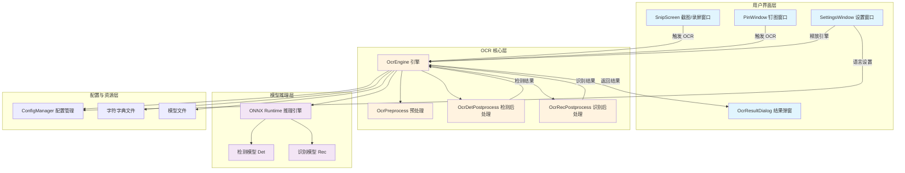

### 2.2 模块依赖关系

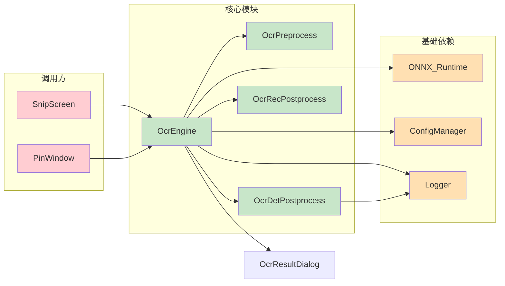

---

## 3. UML 类图

### 3.1 OCR 核心类图

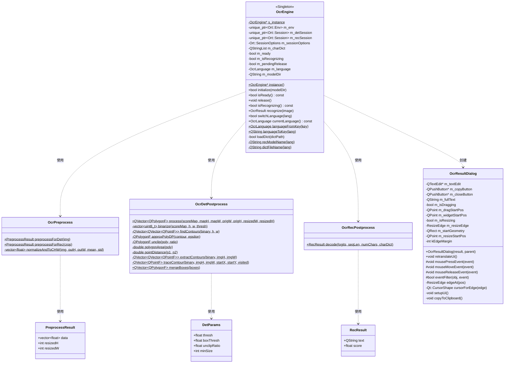

### 3.2 数据结构类图

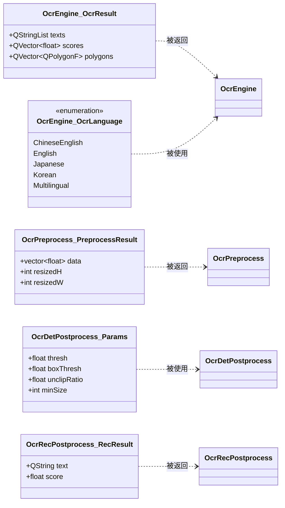

---

## 4. 核心流程

### 4.1 OCR 识别主流程图

```mermaid
flowchart TD
    subgraph 入口
        A[用户触发 OCR] --> B{引擎是否就绪?}
    end

    subgraph 初始化
        B -->|否| C[尝试自动初始化]
        C --> D{初始化成功?}
        D -->|否| E[返回空结果]
        D -->|是| F[设置识别中标志]
        B -->|是| F
    end

    subgraph 预处理阶段
        F --> G[检测模型预处理]
        G --> G1[DetResizeForTest<br/>limitSideLen=1920]
        G1 --> G2[对齐32倍数]
        G2 --> G3[NormalizeImage<br/>ImageNet参数]
        G3 --> G4[HWC→CHW转换]
    end

    subgraph 检测阶段
        G4 --> H[运行检测模型]
        H --> I[获取检测输出]
        I --> J[检测后处理]
        J --> J1[二值化 thresh=0.3]
        J1 --> J2[轮廓检测 BFS]
        J2 --> J3[Douglas-Peucker近似]
        J3 --> J4[置信度过滤 boxThresh=0.5]
        J4 --> J5[多边形膨胀 unclipRatio=2.0]
        J5 --> J6[坐标映射回原图]
        J6 --> J7[合并同行碎片]
    end

    subgraph 识别阶段
        J7 --> K{是否检测到文本?}
        K -->|否| L[返回空结果]
        K -->|是| M[遍历每个检测框]
        M --> N[裁剪文本区域]
        N --> O[识别模型预处理]
        O --> O1[固定高度48<br/>最大宽度640]
        O1 --> O2[NormalizeImage<br/>mean=0.5 std=0.5]
        O2 --> O3[HWC→CHW转换]
        O3 --> P[运行识别模型]
        P --> Q[CTC解码]
        Q --> Q1[Softmax概率计算]
        Q1 --> Q2[Argmax取最大概率]
        Q2 --> Q3[去除Blank和重复]
        Q3 --> Q4[字典映射为字符]
    end

    subgraph 结果阶段
        Q4 --> R{有效识别结果?}
        R -->|否| S[跳过当前框]
        R -->|是| T[添加到结果列表]
        S --> U{还有更多框?}
        T --> U
        U -->|是| M
        U -->|否| V[返回OcrResult]
    end

    subgraph 资源管理
        V --> W[重置识别中标志]
        W --> X{有待释放请求?}
        X -->|是| Y[执行模型释放]
        X -->|否| Z[返回结果]
        Y --> Z
    end

    style A fill:#4caf50,color:#fff
    style E fill:#f44336,color:#fff
    style L fill:#f44336,color:#fff
    style Z fill:#2196f3,color:#fff
```

### 4.2 检测后处理详细流程

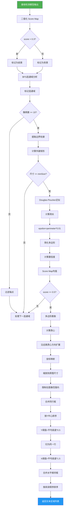

### 4.3 识别后处理 CTC 解码流程

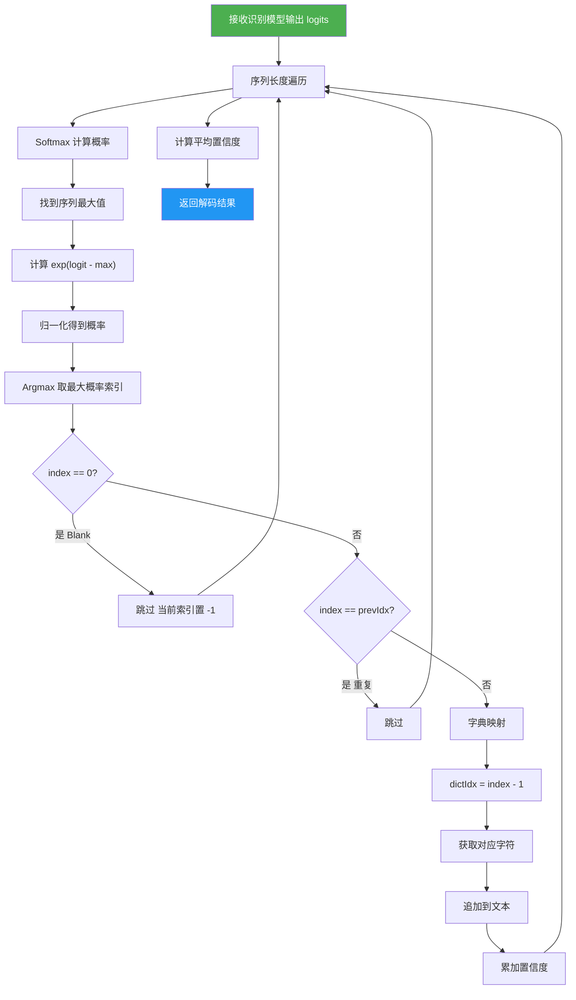

---

## 5. 时序图

### 5.1 SnipScreen 触发 OCR 时序

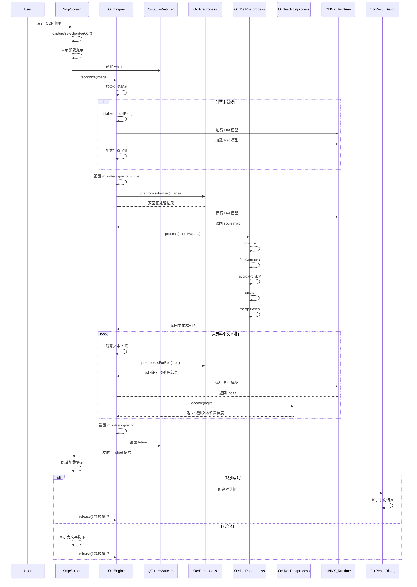

### 5.2 语言切换时序

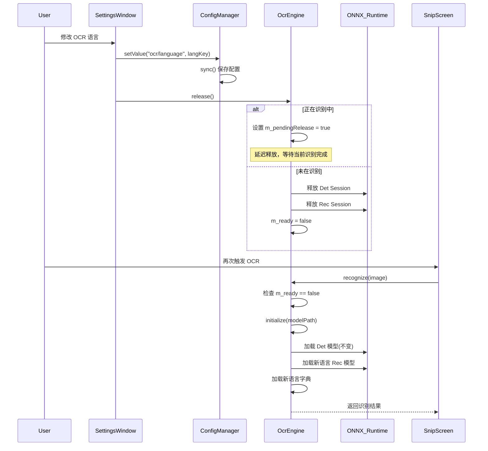

### 5.3 资源释放与延迟释放时序

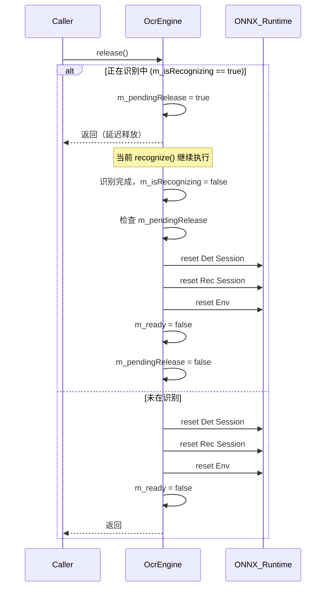

---

## 6. 算法细节

### 6.1 预处理算法

#### 6.1.1 检测模型预处理 (preprocessForDet)

```
输入: 原始图像 (任意尺寸)
步骤:
  1. 长边限制: limitSideLen = 1920
     - 若 max(w,h) > 1920, ratio = 1920 / max(w,h)
     - 否则 ratio = 1.0
  2. 尺寸对齐: newW = floor(w*ratio/32)*32, newH = floor(h*ratio/32)*32
     - 最小尺寸: 32x32
  3. 图像缩放: Qt::SmoothTransformation
  4. 格式转换: RGB888
  5. 归一化 + HWC→CHW:
     - mean = [0.485, 0.456, 0.406] (ImageNet BGR)
     - std = [0.229, 0.224, 0.225]
     - data[ch,y,x] = (pixel - mean[ch]) / std[ch]
     - 通道顺序: BGR
输出: PreprocessResult { data, resizedH, resizedW }
```

#### 6.1.2 识别模型预处理 (preprocessForRec)

```
输入: 裁剪的文本区域图像
步骤:
  1. 固定高度: recH = 48
  2. 按比例计算宽度: recW = w * (48/h)
  3. 宽度限制: min=32, max=640
  4. 图像缩放: Qt::SmoothTransformation
  5. 格式转换: RGB888
  6. 归一化 + HWC→CHW:
     - mean = [0.5, 0.5, 0.5]
     - std = [0.5, 0.5, 0.5]
     - data[ch,y,x] = (pixel - 0.5) / 0.5
     - 通道顺序: BGR
输出: PreprocessResult { data, resizedH=48, resizedW }
```

### 6.2 检测后处理算法

#### 6.2.1 二值化 (binarize)

```
输入: scoreMap (H×W float)
参数: thresh = 0.3
算法:
  for each pixel (i):
    binary[i] = (scoreMap[i] > thresh) ? 1 : 0
输出: binary (H×W uint8)
```

#### 6.2.2 轮廓检测 (findContours)

```
输入: binary (H×W uint8)
算法:
  1. BFS 标记连通域
     - 8 邻域方向
     - 过滤小于 10 像素的连通域
  2. 构建轮廓
     - 按行分组，取每行最左/最右边界点
     - 上边缘: 左→右
     - 下边缘: 右→左
输出: 轮廓列表 (每个轮廓为 QVector<QPointF>)
```

#### 6.2.3 多边形近似 (approxPolyDP)

```
输入: contour (QVector<QPointF>), epsilon
算法 (Douglas-Peucker):
  1. 计算起点到终点的直线
  2. 找到距离该直线最远的点
  3. 若最大距离 > epsilon:
       - 递归处理起点→最远点
       - 递归处理最远点→终点
  4. 否则: 只保留起点和终点
输出: 简化后的多边形
```

#### 6.2.4 多边形膨胀 (unclip)

```
输入: poly (QPolygonF), ratio
算法:
  1. 计算质心 (cx, cy)
  2. 计算各点到质心的平均距离 avgDist
  3. 膨胀距离 expandDist = avgDist * (ratio - 1)
  4. 对每个点沿远离质心方向移动 expandDist
     - nx = (x - cx) / dist
     - newX = x + nx * expandDist
输出: 膨胀后的多边形
```

#### 6.2.5 同行合并 (mergeBoxes)

```
输入: boxes (QVector<QPolygonF>)
算法:
  1. 计算每个框的中心坐标和平均高度 avgHeight
  2. Y 方向阈值: yThresh = avgHeight * 0.5
  3. X 方向阈值: xThresh = avgHeight * 1.5
  4. 按 Y 中心排序
  5. 分行: Y 中心差 < yThresh 的归为同一行
  6. 同行内: 按 X 排序，间距 < xThresh 的合并
  7. 阅读顺序排序: 上→下，左→右
输出: 合并后的行级文本框
```

### 6.3 CTC 解码算法

```
输入: logits (seqLen × numChars), charDict
算法:
  for each time step t:
    1. Argmax: maxIdx = argmax(logits[t])
    2. Softmax: prob = softmax(logits[t])[maxIdx]
    3. CTC 规则:
       - maxIdx == 0 (Blank): 跳过，prevIdx = -1
       - maxIdx == prevIdx (重复): 跳过
       - 否则:
           dictIdx = maxIdx - 1
           text += charDict[dictIdx]
           score += prob
           validCount++
    4. prevIdx = maxIdx
  
  5. score = totalScore / validCount (平均置信度)
输出: RecResult { text, score }
```

---

## 7. 配置项

### 7.1 OCR 相关配置键

| 配置键 | 类型 | 默认值 | 说明 |
|--------|------|--------|------|
| `ocr/language` | String | `ch_en` | OCR 识别语言 |
| `ocr/modelPath` | String | 应用目录/models/ocr | 模型目录路径 |
| `ocr/useGpu` | Bool | `false` | 是否启用 GPU 加速 |

### 7.2 语言配置映射

| 配置键 | 语言枚举 | 识别模型 | 字典文件 |
|--------|----------|----------|----------|
| `ch_en` | ChineseEnglish | ch_PP-OCRv4_mobile_rec.onnx | ppocrv4_dict.txt |
| `en` | English | en_PP-OCRv4_mobile_rec.onnx | en_dict_ppocrv4.txt |
| `ja` | Japanese | japan_PP-OCRv4_mobile_rec.onnx | japan_dict.txt |
| `ko` | Korean | korean_PP-OCRv4_mobile_rec.onnx | korean_dict.txt |
| `multi` | Multilingual | ch_PP-OCRv4_mobile_rec.onnx | ppocrv4_dict.txt |

### 7.3 模型文件结构

```
models/ocr/
├── mobile/
│   ├── det_mobile.onnx              # 检测模型（语言无关）
│   ├── ch_PP-OCRv4_mobile_rec.onnx  # 中英文识别模型
│   ├── en_PP-OCRv4_mobile_rec.onnx  # 英文识别模型
│   ├── japan_PP-OCRv4_mobile_rec.onnx # 日文识别模型
│   ├── korean_PP-OCRv4_mobile_rec.onnx # 韩文识别模型
│   ├── ppocrv4_dict.txt             # 中英文字典
│   ├── en_dict_ppocrv4.txt          # 英文字典
│   ├── japan_dict.txt              # 日文字典
│   └── korean_dict.txt             # 韩文字典
└── server/
    └── ...                          # 服务端模型（备用，之前实现过，性能上不一定划算，所以移除了）
```

---

## 8. 关键设计决策

### 8.1 单例模式

`OcrEngine` 采用单例模式设计，原因：
- ONNX Runtime 环境和会话资源需要全局唯一
- 避免重复加载模型造成内存浪费
- 统一管理模型生命周期

### 8.2 惰性初始化

引擎采用惰性初始化策略：
- 不在应用启动时加载模型
- 首次调用 `recognize()` 时才自动初始化
- 减少启动时间和内存占用

### 8.3 识别后释放

每次识别完成后自动释放模型资源：
- 降低内存占用
- 支持语言热切换
- 下次识别时自动重新初始化

### 8.4 延迟释放机制

当识别过程中请求释放时：
- 设置 `m_pendingRelease` 标志
- 当前识别继续完成
- 完成后立即执行释放
- 避免在识别过程中断，保证结果完整性

### 8.5 异步执行

使用 `QtConcurrent::run` + `QFutureWatcher`：
- 识别在后台线程执行
- 主线程保持响应
- 通过信号/槽返回结果
- 显示加载状态提示

### 8.6 纯 Qt 实现

所有图像处理使用 Qt QImage 完成：
- 避免 OpenCV 依赖
- 减小二进制体积
- 简化编译配置
- 跨平台兼容性更好

---

## 9. 性能优化

### 9.1 模型参数

| 模型 | 输入尺寸 | 输出尺寸 | 参数量 |
|------|----------|----------|--------|
| det_mobile | 3×H×W (对齐32) | 1×1×H×W | ~4.7M |
| rec_mobile | 3×48×W | 1×seqLen×numChars | ~8.5M |

### 9.2 预处理优化

- 长边限制到 1920，避免大图处理
- 识别高度固定 48，宽度限制在 32-640
- 32 对齐方便卷积计算
- 直接 CHW 格式，避免中间转换

### 9.3 后处理优化

- 连通域过滤小于 10 像素的噪点
- 置信度阈值 0.5 过滤低质量检测
- Douglas-Peucker 近似减少多边形点数
- 同行合并减少识别框数量

### 9.4 运行时配置

- ONNX Runtime 配置 4 线程
- 启用全部图优化（ORT_ENABLE_ALL）
- Arena 内存分配器减少分配开销

---

## 10. 扩展方向

### 10.1 可预见的改进

1. **GPU 加速**
   - 已预留 `ENABLE_OCR_GPU_ACCELERATION` 编译开关
   - 可集成 CUDA/OpenVINO 推理后端

2. **模型版本升级**
   - 支持 PP-OCRv5 等更新版本
   - 模型热加载机制已就绪

3. **语言扩展**
   - 架构已支持多语言
   - 只需添加对应模型和字典文件

4. **批量识别**
   - 当前逐框串行识别
   - 可改为批量并行识别提升速度

5. **结果高亮**
   - 在截图上标注识别区域
   - 可点击跳转原文位置

### 10.2 架构扩展性

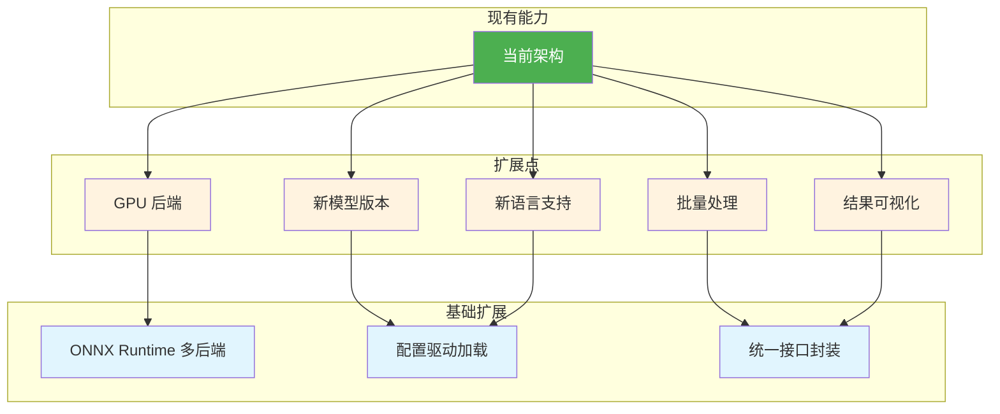

---

## 附录

### A. 关键源文件索引

| 文件路径 | 说明 |
|----------|------|
| `src/ocr/OcrEngine.h` | OCR 引擎头文件 |
| `src/ocr/OcrEngine.cpp` | OCR 引擎实现 |
| `src/ocr/OcrPreprocess.h` | 预处理头文件 |
| `src/ocr/OcrPreprocess.cpp` | 预处理实现 |
| `src/ocr/OcrDetPostprocess.h` | 检测后处理头文件 |
| `src/ocr/OcrDetPostprocess.cpp` | 检测后处理实现 |
| `src/ocr/OcrRecPostprocess.h` | 识别后处理头文件 |
| `src/ocr/OcrRecPostprocess.cpp` | 识别后处理实现 |
| `src/ocr/OcrResultDialog.h` | 结果弹窗头文件 |
| `src/ocr/OcrResultDialog.cpp` | 结果弹窗实现 |
| `src/capture/SnipScreen.cpp` | 截图窗口 OCR 调用 |
| `src/widgets/PinWindow.cpp` | 钉图窗口 OCR 调用 |
| `src/widgets/SettingsWindow.cpp` | OCR 设置界面 |

### B. PaddleOCR 模型信息

- **检测模型**: DB (Differentiable Binarization)
- **识别模型**: CRNN (Convolutional Recurrent Neural Network) + CTC
- **模型版本**: PP-OCRv4
- **框架**: PaddlePaddle → ONNX 导出
- **推理引擎**: ONNX Runtime

### C. 编译配置

OCR 功能通过编译宏控制：

```cmake
# CMakeLists.txt
option(ENABLE_OCR "Enable OCR functionality" ON)
option(ENABLE_OCR_GPU_ACCELERATION "Enable GPU acceleration for OCR" OFF)

# 源文件条件编译
if(ENABLE_OCR)
    add_definitions(-DENABLE_OCR)
    add_definitions(-DENABLE_OCR_GPU_ACCELERATION)
endif()
```

---

*文档版本: 1.0*
*最后更新: 2026-07-26*
*作者: QuickShot Team - chiangyang*
