# QuickShot macOS 录屏技术文档

## 1. 技术栈

| 组件 | 技术 | 说明 |
|------|------|------|
| 视频捕获 | ScreenCaptureKit (`SCStream`) | 系统级屏幕捕获（macOS 12.3+） |
| 视频编码 | AVAssetWriter (H.264) | 硬件加速视频压缩 |
| 系统音频 | ScreenCaptureKit (`SCStreamOutputTypeAudio`) | 系统音频流捕获 |
| 麦克风 | AVCaptureSession + AVCaptureAudioDataOutput | 麦克风实时采集 |
| 音频编码 | AVAssetWriter (AAC) | 双声道音频压缩 |
| 容器格式 | MP4 (AVFileTypeMPEG4) | 视频封装 |
| 线程模型 | dispatch_queue_t + std::thread | 视频/音频独立调度队列 |
| 权限检测 | CGPreflightScreenCaptureAccess / SCShareableContent | 屏幕录制权限验证 |

## 2. 架构设计

### 2.1 分层架构

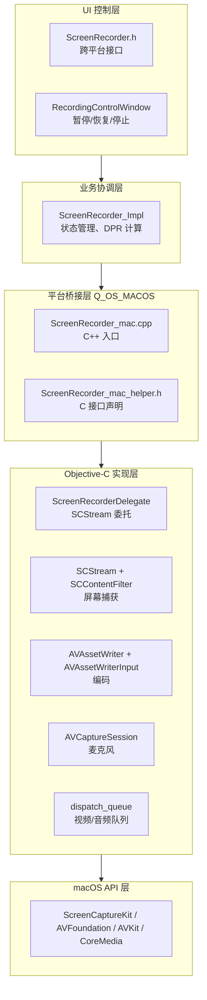

### 2.2 全局状态变量

```objc
// ScreenCaptureKit
static SCStream* g_stream = nil;                    // 捕获流
static SCContentFilter* g_contentFilter = nil;       // 内容过滤器（窗口/显示器）
static SCStreamConfiguration* g_streamConfig = nil;  // 流配置

// AVAssetWriter
static AVAssetWriter* g_assetWriter = nil;           // 媒体写入器
static AVAssetWriterInput* g_videoInput = nil;       // 视频输入 (H.264)
static AVAssetWriterInput* g_sysAudioInput = nil;    // 系统音频输入 (AAC)
static AVAssetWriterInput* g_micAudioInput = nil;    // 麦克风音频输入 (AAC)
static AVAssetWriterInputPixelBufferAdaptor* g_pixelBufferAdaptor; // 像素缓冲适配器

// 麦克风采集
static AVCaptureSession* g_micSession = nil;        // 麦克风会话
static AVCaptureDeviceInput* g_micDeviceInput = nil; // 麦克风设备输入
static AVCaptureAudioDataOutput* g_micOutput = nil;  // 音频数据输出
static dispatch_queue_t g_micQueue = nil;            // 麦克风调度队列

// 录制状态
static bool g_isRecording = false;
static bool g_isPaused = false;
static CMTime g_startTime = kCMTimeInvalid;
static int g_frameWidth = 0;
static int g_frameHeight = 0;
static int g_fps = 30;
```

### 2.3 录制模式

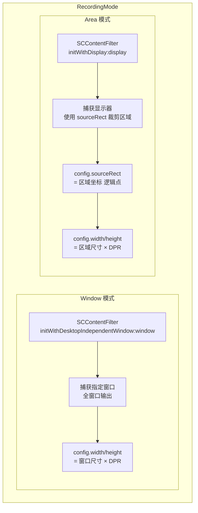

## 3. 视频捕获流程

### 3.1 ScreenCaptureKit 管线

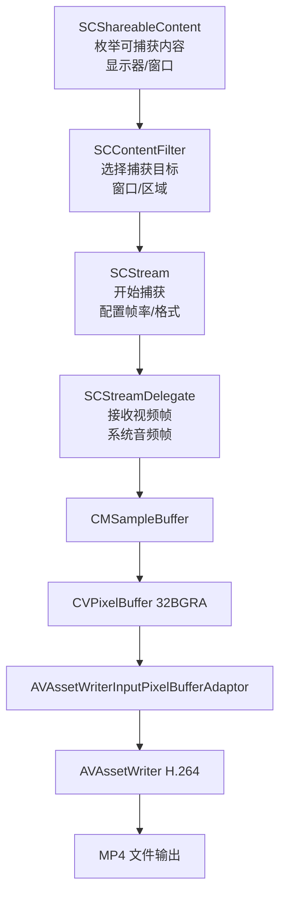

### 3.2 初始化与配置

**1. 获取共享内容（`SCShareableContent`）**

```objc
[SCShareableContent getShareableContentExcludingDesktopWindows:NO
                                              onScreenWindowsOnly:YES
                                                     completionHandler:^(SCShareableContent *content, NSError *error) {
    // content.displays → 可用显示器列表
    // content.windows → 可用窗口列表
}];
```

**2. 创建内容过滤器（`SCContentFilter`）**

- **窗口模式**：`initWithDesktopIndependentWindow:window`
  - 指定 `SCWindow` 对象，捕获整个窗口
- **区域模式**：`initWithDisplay:display excludingApplications:nil exceptingWindows:nil`
  - 指定 `SCDisplay` 对象，通过 `sourceRect` 裁剪区域

**3. 配置流参数（`SCStreamConfiguration`）**

| 参数 | 值 | 说明 |
|------|------|
| `config.width/height` | `outputSizePx` | 输出像素尺寸（已乘 DPR） |
| `config.sourceRect` | `CGRectMake(x, y, w, h)` | 区域模式裁剪（逻辑点坐标） |
| `config.minimumFrameInterval` | `CMTimeMake(1, fps)` | 帧率控制 |
| `config.queueDepth` | 3 | 帧队列深度 |
| `config.showsCursor` | YES | 显示鼠标光标 |
| `config.pixelFormat` | `kCVPixelFormatType_32BGRA` | 像素格式 |
| `config.capturesAudio` | YES | 启用系统音频捕获 |
| `config.excludesCurrentProcessAudio` | YES | 排除当前进程（macOS 13+） |
| `config.sampleRate` | 44100 | 系统音频采样率 |
| `config.channelCount` | 2 | 系统音频声道数 |

**4. 添加流输出**

```objc
// 视频输出（必须）
[g_stream addStreamOutput:g_delegate
                    type:SCStreamOutputTypeScreen
         sampleHandlerQueue:g_videoQueue
                     error:&streamError];

// 系统音频输出（可选）
[g_stream addStreamOutput:g_delegate
                    type:SCStreamOutputTypeAudio
         sampleHandlerQueue:g_audioQueue
                     error:&audioError];
```

### 3.3 录制模式差异

#### 窗口录制模式

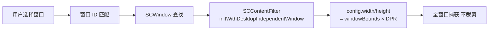

#### 区域录制模式

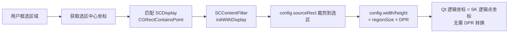

## 4. 音频捕获流程

### 4.1 双源音频架构

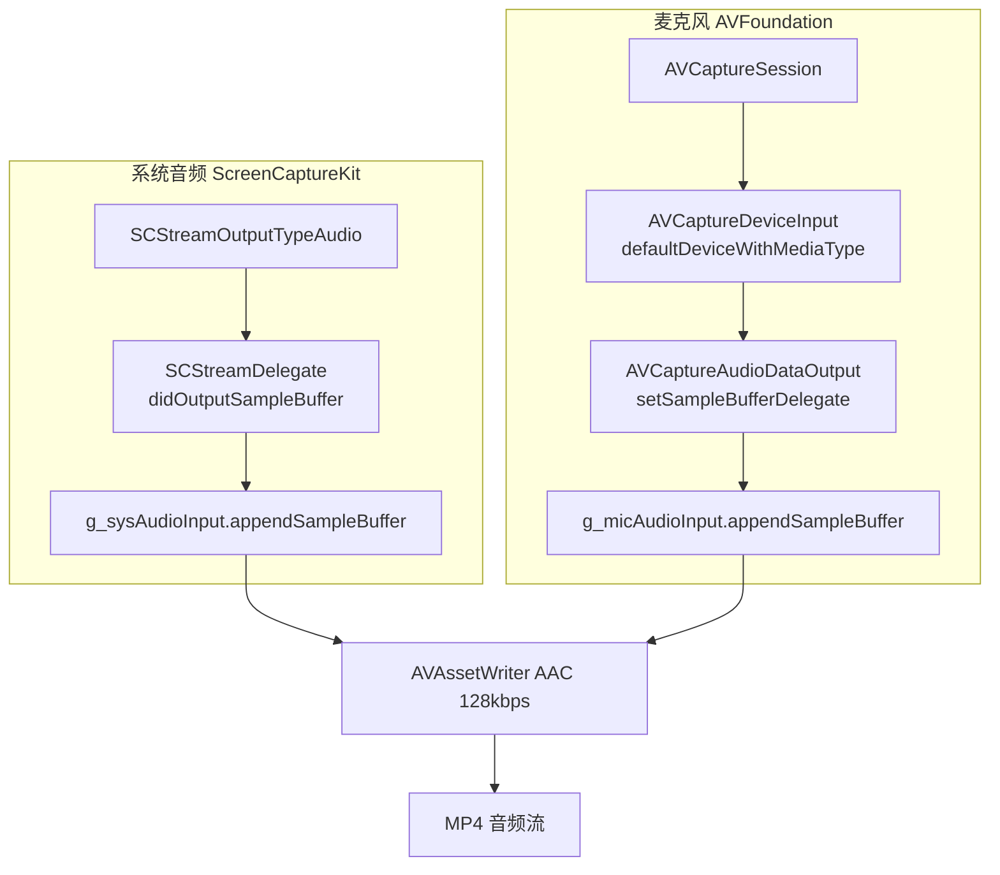

### 4.2 系统音频

- 来源：`SCStream` 的 `SCStreamOutputTypeAudio` 回调
- 编码：通过 AVAssetWriterInput 直接接收 CMSampleBuffer
- 参数：44100Hz / 2声道 / AAC 编码
- 注意：需 `SCStreamConfiguration.capturesAudio = YES`

### 4.3 麦克风采集

```objc
// 初始化麦克风会话
AVCaptureDevice* micDevice = [AVCaptureDevice defaultDeviceWithMediaType:AVMediaTypeAudio];
g_micSession = [[AVCaptureSession alloc] init];
g_micDeviceInput = [AVCaptureDeviceInput deviceInputWithDevice:micDevice error:&error];
[g_micSession addInput:g_micDeviceInput];
g_micOutput = [[AVCaptureAudioDataOutput alloc] init];
[g_micOutput setSampleBufferDelegate:g_delegate queue:g_micQueue];
[g_micSession addOutput:g_micOutput];
[g_micSession startRunning];
```

- 设备：`AVCaptureDevice defaultDeviceWithMediaType:AVMediaTypeAudio`
- 委托：`ScreenRecorderDelegate` 实现 `AVCaptureAudioDataOutputSampleBufferDelegate`
- 队列：独立 `dispatch_queue_t`（`com.quickshot.miccapture`）

### 4.4 音频编码配置

```objc
NSDictionary* settings = @{
    AVFormatIDKey: @(kAudioFormatMPEG4AAC),
    AVSampleRateKey: @(44100),
    AVNumberOfChannelsKey: @(2),
    AVChannelLayoutKey: stereoLayoutData,
    AVEncoderBitRateKey: @(128000)
};
```

- 编码：AAC (MPEG-4)
- 采样率：44100Hz
- 声道：2 声道立体声
- 比特率：128kbps

## 5. DPR 处理逻辑

### 5.1 坐标系统转换

```
Qt 逻辑坐标 (points) × DPR = 实际像素 (pixels)

示例（Retina 2x 屏）：
  选区 1920×1080 (逻辑点)
  DPR = 2.0
  输出 = 3840×2160 (物理像素)
```

**处理流程：**

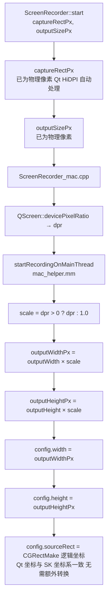

**注意事项：**
- ScreenCaptureKit 的 `sourceRect` 使用逻辑点坐标（与 Qt 坐标系一致）
- 输出分辨率使用物理像素（乘以 DPR）
- 窗口录制：outputWidth × DPR、outputHeight × DPR
- 区域录制：region.width × DPR、region.height × DPR

## 6. 权限检测

### 6.1 Screen Recording 权限

```objc
bool screenRecorderCheckPermission() {
    if (@available(macOS 14.0, *)) {
        // macOS 14+ 专用 API
        return CGPreflightScreenCaptureAccess();
    }
    // macOS 13: 通过尝试获取内容间接检测
    [SCShareableContent getShareableContent... completionHandler:^(...) {
        hasAccess = (content != nil && error == nil);
    }];
}
```

| 系统版本 | 检测方式 |
|----------|----------|
| macOS 14+ (Sonoma) | `CGPreflightScreenCaptureAccess()` |
| macOS 13 (Ventura) | `SCShareableContent` 获取结果 |

### 6.2 可用性判断

```cpp
bool screenRecorderImplIsAvailable() {
    int version = getMacOSVersion();  // sysctl "kern.osproductversion"
    if (version < 13) return false;   // 要求 macOS 13+
    return screenRecorderCheckPermission();
}
```

## 7. 完整录制流程

### 7.1 启动流程

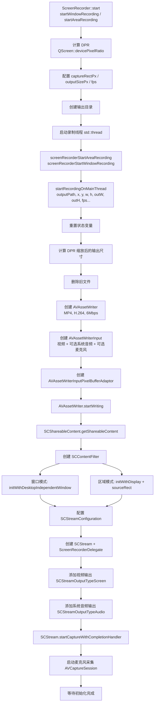

### 7.2 主循环流程

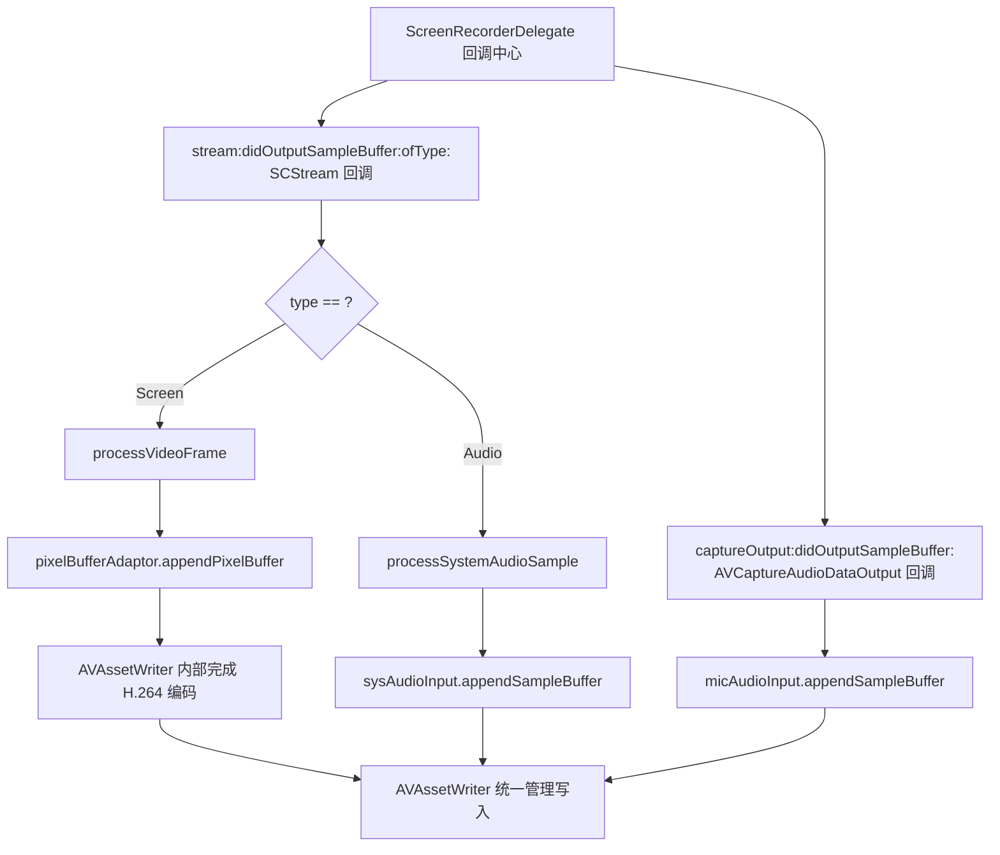

**与 Windows 的区别：**
- macOS 无需手动帧捕获循环，由 `SCStreamDelegate` 驱动
- `AVAssetWriter` 自行管理编码时间戳
- 暂停/恢复通过 `g_isPaused` 标志控制，回调中检查此标志

### 7.3 停止流程

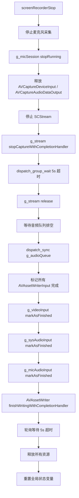

## 8. H.264 编码配置

```objc
NSDictionary* videoSettings = @{
    AVVideoCodecKey: AVVideoCodecTypeH264,
    AVVideoWidthKey: @(outputWidthPx),
    AVVideoHeightKey: @(outputHeightPx),
    AVVideoCompressionPropertiesKey: @{
        AVVideoAverageBitRateKey: @(outputWidthPx * outputHeightPx * 3), // 3Mbps/pixel
        AVVideoExpectedSourceFrameRateKey: @(fps),
        AVVideoMaxKeyFrameIntervalKey: @(fps)
    }
};
```

| 参数 | 值 | 说明 |
|------|------|------|
| 编码格式 | H.264 | `AVVideoCodecTypeH264` |
| 分辨率 | 输出像素尺寸 | 宽 × DPR, 高 × DPR |
| 平均比特率 | `width × height × 3` | ~3Mbps/像素，高质量 |
| 期望帧率 | 配置值 | 通常 30fps |
| 关键帧间隔 | 等于帧率 | 每秒一个关键帧 |
| 像素格式 | 32BGRA | `kCVPixelFormatType_32BGRA` |

## 9. 关键时序

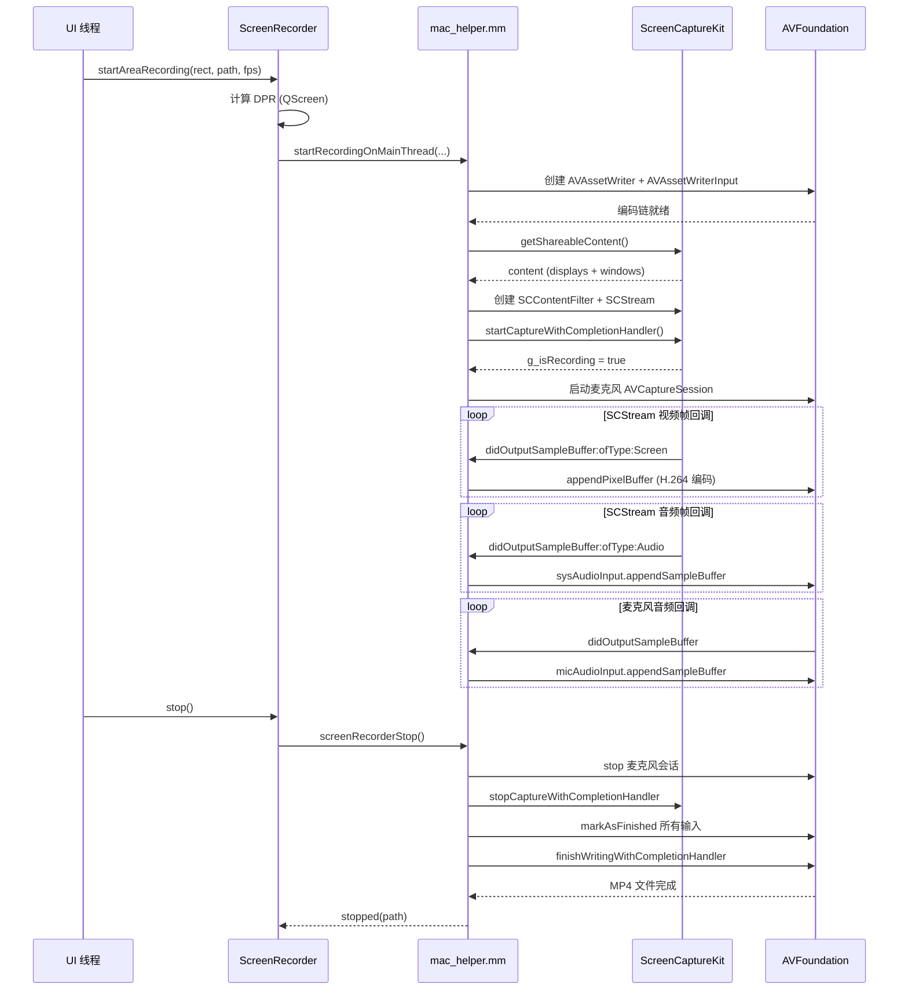

## 10. 错误处理

| 错误场景 | 处理方式 |
|----------|----------|
| macOS 版本 < 13 | `isAvailable()` 返回 false |
| ScreenCaptureKit 权限缺失 | `screenRecorderCheckPermission()` 返回 false |
| AVAssetWriter 创建失败 | 报告错误，终止录制 |
| SCStream startCapture 失败 | 日志错误，终止录制 |
| 麦克风初始化失败 | 警告，继续（仅系统音频） |
| 系统音频捕获失败 | 警告，继续（仅麦克风） |
| AVAssetWriter 写入失败 | 日志错误，继续尝试 |
| 初始化超时 | dispatch_group_wait 5s 超时保护 |
| 停止超时 | AVAssetWriter finishWriting 5s 轮询超时 |
| 取消录制 | 正常退出并删除文件 |

## 11. 文件索引

| 文件 | 说明 |
|------|------|
| `src/recording/platform/ScreenRecorder_mac.cpp` | C++ 平台桥接实现 |
| `src/recording/platform/ScreenRecorder_mac_helper.h` | C 接口声明（extern "C"） |
| `src/recording/platform/ScreenRecorder_mac_helper.mm` | Objective-C 核心实现 |
| `src/recording/ScreenRecorder.h` | 跨平台录屏器接口 |
| `src/recording/ScreenRecorder.cpp` | 跨平台公共逻辑 |