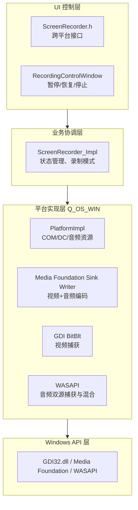
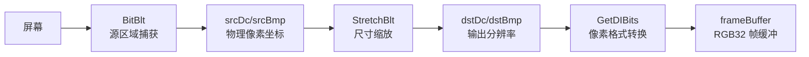
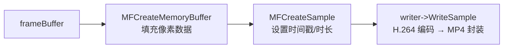
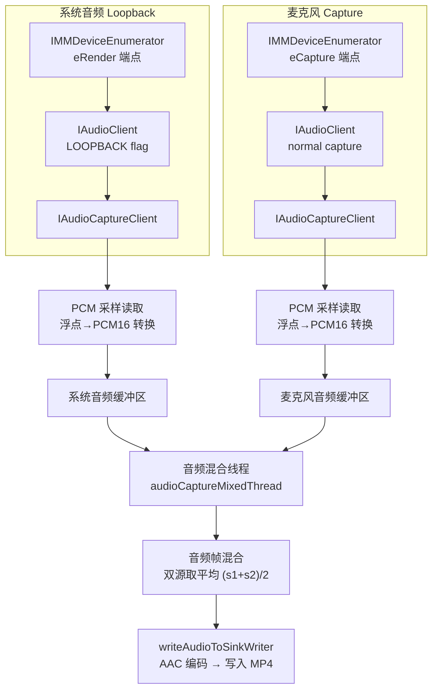
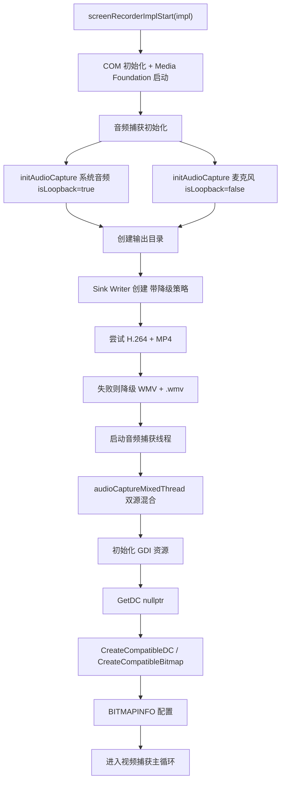
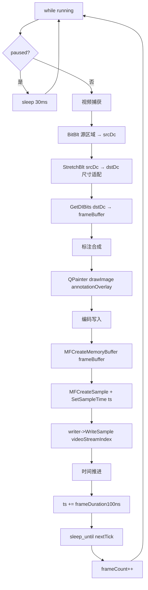
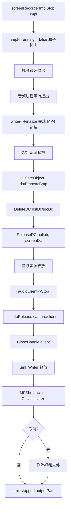
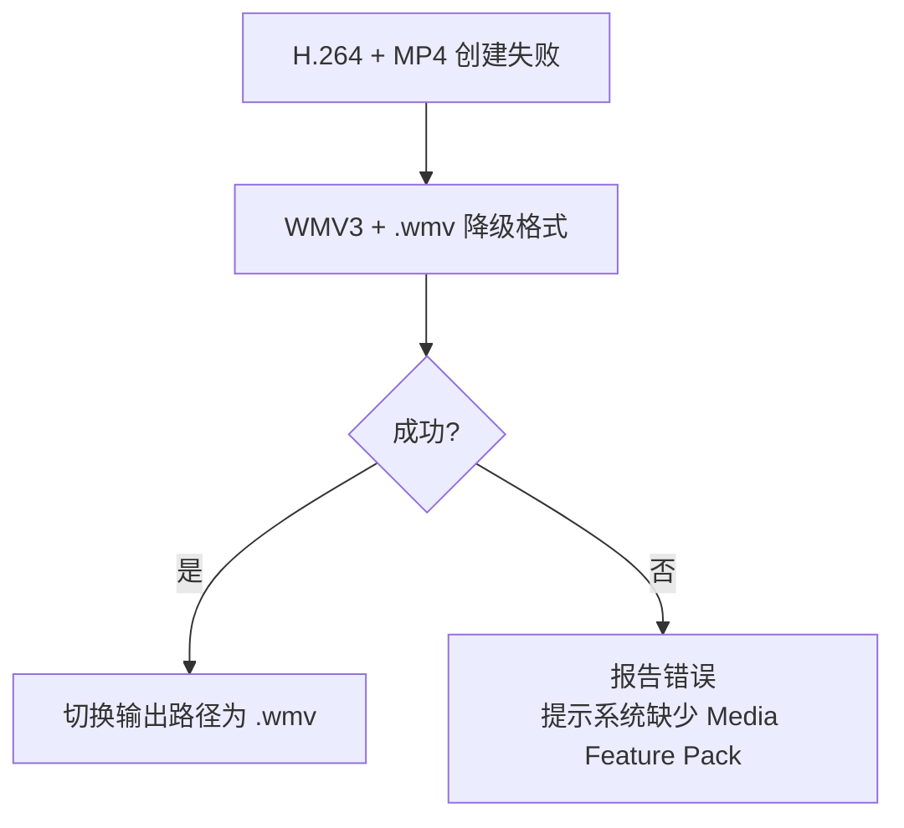
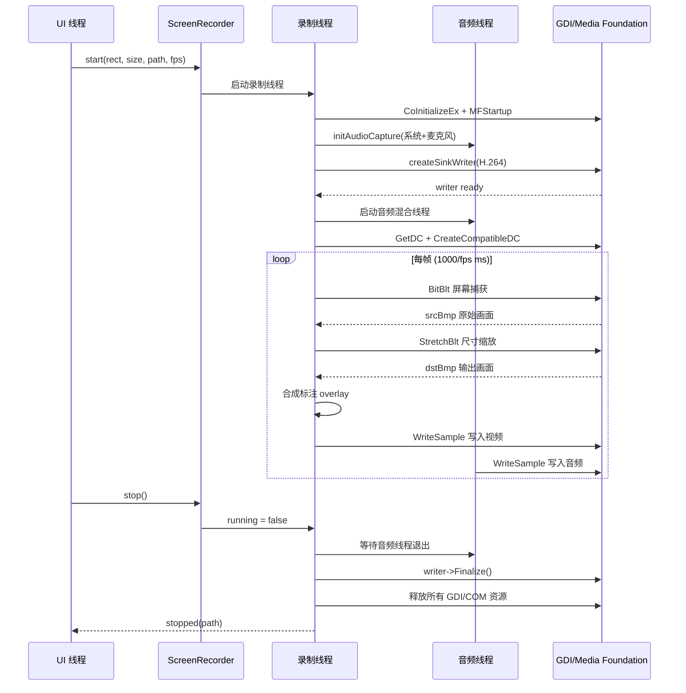

# QuickShot Windows 录屏技术文档

## 1. 技术栈

| 组件 | 技术 | 说明 |
|------|------|------|
| 视频捕获 | Win32 GDI (`BitBlt`/`StretchBlt`) | 屏幕像素抓取 |
| 视频编码 | Media Foundation (H.264) | 硬件加速视频压缩 |
| 音频捕获 | WASAPI（Loopback + 麦克风） | 系统音频回环 + 麦克风输入 |
| 音频编码 | Media Foundation (AAC) | 双声道音频压缩 |
| 容器格式 | MP4 / WMV（降级） | 视频封装 |
| 线程模型 | std::thread + std::atomic | 视频/音频独立线程 |
| 互斥同步 | QMutex | 标注叠加与帧缓冲并发保护 |

## 2. 架构设计

### 2.1 分层架构



### 2.2 核心数据结构

```cpp
struct PlatformImpl {
    // Media Foundation 编码链
    IMFSinkWriter *writer = nullptr;       // Sink Writer（视频+音频编码）
    DWORD videoStreamIndex = 0;            // 视频流索引
    DWORD audioStreamIndex = 0;             // 音频流索引
    LONGLONG frameDuration100ns = 0;        // 单帧时长（100ns 单位）

    // GDI 绘图资源
    HDC screenDc;                          // 屏幕 DC
    HDC srcDc;                             // 源 DC（存储捕获的原始画面）
    HBITMAP srcBmp;                        // 源位图
    HDC dstDc;                             // 目标 DC（存储缩放后的画面）
    HBITMAP dstBmp;                        // 目标位图
    BITMAPINFO bmi;                        // 位图信息头

    // WASAPI 系统音频（Loopback 回环）
    IAudioClient *systemAudioClient;       // 音频客户端
    IAudioCaptureClient *systemCaptureClient; // 捕获客户端
    HANDLE systemAudioEvent;               // 事件句柄
    WAVEFORMATEX systemAudioFmt;           // 音频格式

    // WASAPI 麦克风音频
    IAudioClient *micAudioClient;
    IAudioCaptureClient *micCaptureClient;
    HANDLE micAudioEvent;
    WAVEFORMATEX micAudioFmt;

    // 音频捕获线程
    std::thread audioThread;
    std::atomic<bool> audioRunning{false};

    // 录制起始时间（音频时间戳同步）
    LONGLONG recordingStartTime100ns = 0;
};
```

## 3. 视频捕获流程

### 3.1 GDI 捕获管线



**详细步骤：**

1. **获取屏幕 DC**：`GetDC(nullptr)` 获取整个虚拟桌面的设备上下文
2. **创建兼容 DC 和位图**：`CreateCompatibleDC`/`CreateCompatibleBitmap` 创建源和目标缓冲区
3. **源区域捕获**：`BitBlt(srcDc, 0, 0, cap.width, cap.height, screenDc, cap.x, cap.y, SRCCOPY | CAPTUREBLT)`
   - `CAPTUREBLT`：包含分层窗口（如透明窗口）
   - 捕获区域由 `ScreenRecorder_Impl::captureRectPx` 指定（虚拟桌面坐标，物理像素）
4. **尺寸缩放**：`StretchBlt(dstDc, 0, 0, out.w, out.h, srcDc, 0, 0, cap.w, cap.h, SRCCOPY)`
   - 当捕获区域与输出分辨率不同时进行缩放
   - 使用 `HALFTONE` 模式实现高质量缩放
5. **像素读取**：`GetDIBits(dstDc, dstBmp, 0, out.h, frameBuffer, &bmi, DIB_RGB_COLORS)`
   - 输出为 32-bit BGRA 格式帧缓冲

### 3.2 标注叠加合成

```cpp
// 在视频帧捕获后、写入编码前合成标注
QMutexLocker lock(&impl->annotationMutex);
if (!impl->annotationOverlay.isNull()) {
    QImage frameImage(reinterpret_cast<uchar*>(impl->frameBuffer.data()),
                      out.width(), out.height(), QImage::Format_RGB32);
    QPainter fp(&frameImage);
    fp.setCompositionMode(QPainter::CompositionMode_SourceOver);
    fp.drawImage(0, 0, impl->annotationOverlay);
    fp.end();
}
```

- UI 线程在标注变化时调用 `ScreenRecorder::setAnnotationOverlay()` 更新叠加图像
- 录制线程每帧在 `annotationMutex` 保护下合成
- 使用 `QPainter::CompositionMode_SourceOver` 实现 Alpha 混合

### 3.3 编码写入流程



**关键参数：**
- 编码格式：H.264（`MFVideoFormat_H264`），6Mbps 比特率
- 输入格式：RGB32，固定步长 `width * 4`
- 帧率：可配置（默认 30fps），帧时长 = `10000000 / fps`（100ns 单位）

## 4. 音频捕获流程

### 4.1 WASAPI 双源捕获



**初始化关键步骤（`initAudioCapture`）：**

1. `CoCreateInstance(IMMDeviceEnumerator)` 创建设备枚举器
2. 根据 `isLoopback` 选择端点：
   - 系统音频：`eRender` + `eConsole`（Loopback 回环）
   - 麦克风：`eCapture` + `eConsole`
3. `IAudioClient::Initialize`：`AUDCLNT_SHAREMODE_SHARED` + `AUDCLNT_STREAMFLAGS_LOOPBACK`（系统音频）+ `AUDCLNT_STREAMFLAGS_EVENTCALLBACK`
4. 获取 `IAudioCaptureClient` 用于读取音频包

**音频混合策略：**
- 单音频源：直接写入 Sink Writer
- 双音频源（系统+麦克风）：逐帧线性混合 `(s1 + s2) / 2`
- 使用 `WaitForMultipleObjects` 等待双源事件，同步采样时间
- 缓冲区溢出保护：超过 2 秒数据时丢弃最旧数据

### 4.2 音频编码

- 编码格式：AAC（`MFAudioFormat_AAC`），128kbps
- 采样率：跟随系统音频混合格式（通常 48000Hz）
- 声道数：跟随源格式（通常 2 声道立体声）
- 位深度：16-bit PCM 输入 → AAC 输出

## 5. 完整录制流程

### 5.1 启动流程



### 5.2 主循环流程



### 5.3 停止流程



## 6. 降级策略

### 6.1 视频编码降级



降级原因：Windows N/KN 版本（欧洲市场）默认不含 H.264 编码组件。

### 6.2 音频降级

- 系统音频初始化失败 → 继续录制，仅使用麦克风
- 麦克风初始化失败 → 继续录制，仅使用系统音频
- 双源均失败 → 纯视频录制（无音频）

## 7. 关键时序



## 8. 错误处理

| 错误场景 | 处理方式 |
|----------|----------|
| Media Foundation 初始化失败 | 报告错误，终止录制 |
| H.264 Sink Writer 创建失败 | 降级 WMV → 再失败则报告 |
| GDI 屏幕捕获失败 | 报告错误，终止录制 |
| 编码写入失败 | 报告错误，终止录制 |
| 系统音频初始化失败 | 警告，继续（仅麦克风） |
| 麦克风初始化失败 | 警告，继续（仅系统音频） |
| 音频写入失败 | 日志错误，继续视频录制 |
| 取消录制 | 正常退出并删除文件 |

## 9. 文件索引

| 文件 | 说明 |
|------|------|
| `src/recording/platform/ScreenRecorder_win.cpp` | Windows 平台录屏完整实现 |
| `src/recording/ScreenRecorder.h` | 跨平台录屏器接口定义 |
| `src/recording/ScreenRecorder.cpp` | 跨平台公共逻辑 |
| `src/recording/RecordingControlWindow.h` | 录制控制栏 UI |