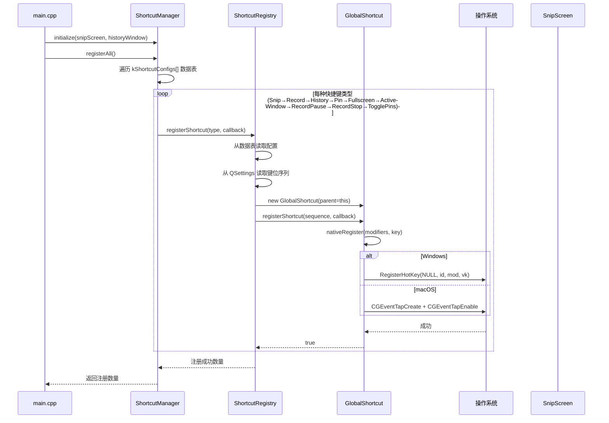
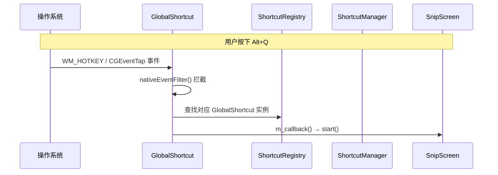
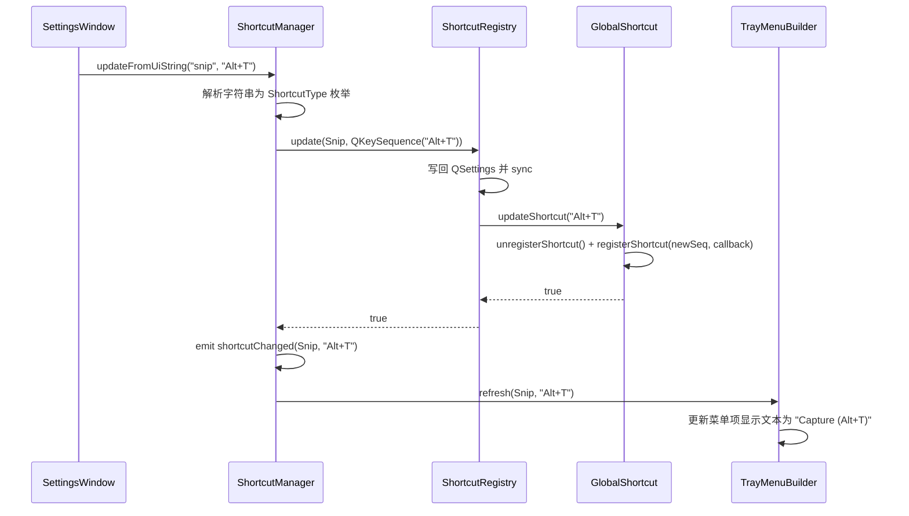
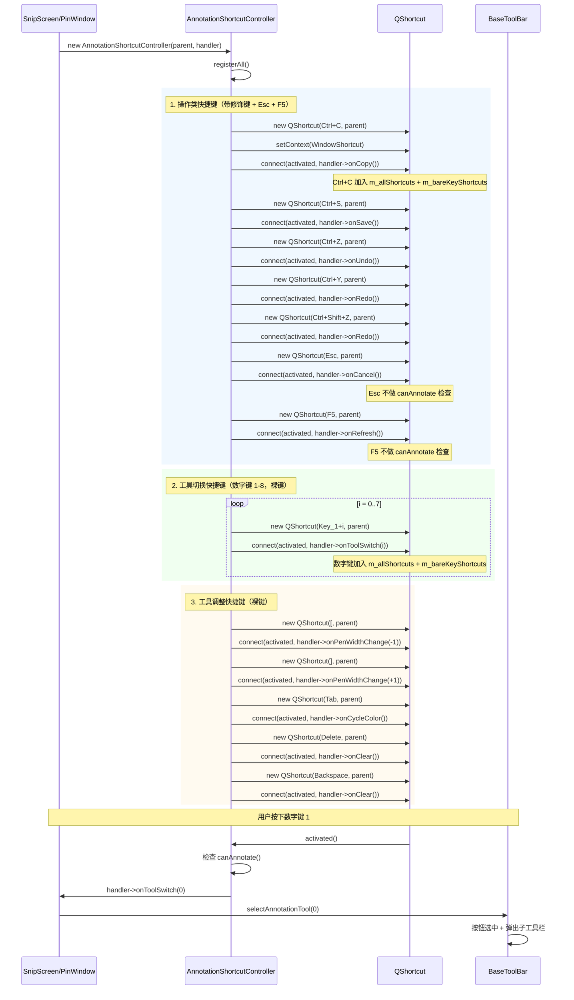
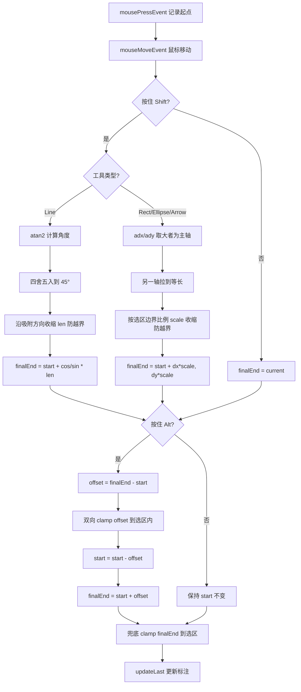
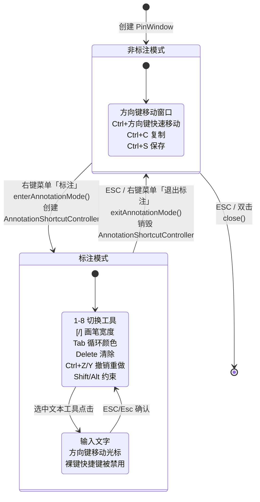
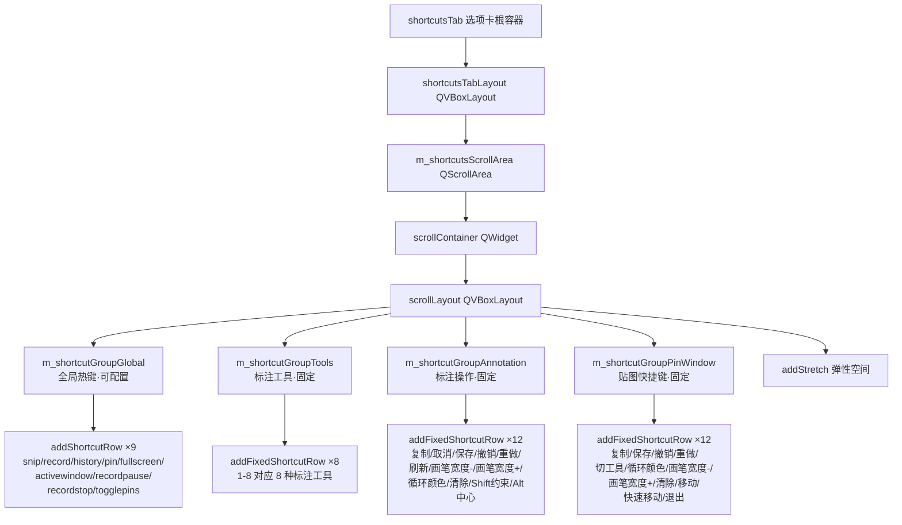
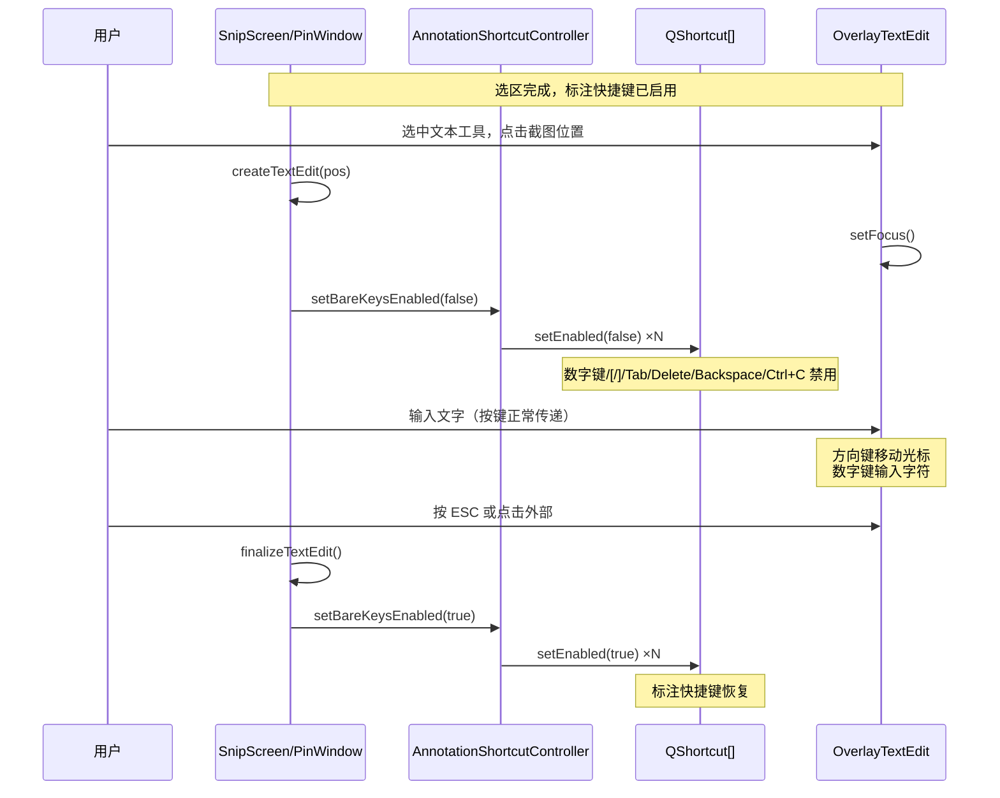

# 快捷键说明

QuickShot 的快捷键系统分为四大类，与「设置 → 快捷键」选项卡的分组一一对应：

| 分类 | 是否可配置 | 适用场景 | 实现方式 |
|---|---|---|---|
| [全局热键](#一全局热键可配置) | ✅ 可在「设置 → 快捷键」自定义 | 任意时刻系统级触发（无需激活窗口） | 系统级 API（Windows: `RegisterHotKey`，macOS: `CGEventTap`） |
| [标注工具](#二标注工具固定) | ❌ 固定约定，不进设置 | 截图/录屏选区完成或 PinWindow 标注模式下切换工具 | `QShortcut`（由 `AnnotationShortcutController` 统一管理） |
| [标注操作](#三标注操作固定) | ❌ 固定约定，不进设置 | 截图/录屏选区完成或 PinWindow 标注模式下编辑标注 | `QShortcut`（由 `AnnotationShortcutController` 统一管理） |
| [贴图快捷键](#四贴图快捷键固定) | ❌ 固定约定，不进设置 | 贴图窗口（PinWindow）激活时操作 | `QShortcut`（标注模式下由 `AnnotationShortcutController` 管理）/ `keyPressEvent`（非标注模式） |

> **设计原则**（与 Snipaste / ShareX 等主流软件一致）：**全局热键可配置，应用内编辑快捷键作为固定约定不进设置**，保持设置界面整洁、降低用户认知负担。

---

## 一、全局热键（可配置）

全局热键在任意时刻均可触发，无需激活 QuickShot 窗口。所有热键均可在「设置 → 快捷键」选项卡中自定义，修改后点击「确定」即时生效。

### 1.1 默认热键一览

| 功能 | 默认快捷键 | 配置项 | ShortcutType | 说明 |
|---|---|---|---|---|
| 截图 | `Alt+Q` | `shortcut_snip` | `Snip` | 进入区域截图模式 |
| 录屏 | `Alt+S` | `shortcut_record` | `Record` | 进入区域录屏模式 |
| 历史记录 | `Alt+H` | `shortcut_history` | `History` | 打开历史记录窗口 |
| 贴图（剪贴板） | `Alt+P` | `shortcut_pin` | `Pin` | 将剪贴板中的图片贴到桌面（鼠标所在屏幕中央） |
| 全屏截图 | `Alt+Shift+F` | `shortcut_fullscreen` | `Fullscreen` | 截取整个虚拟桌面（多屏拼接），直接复制到剪贴板 |
| 活动窗口截图 | `Alt+Shift+W` | `shortcut_activewindow` | `ActiveWindow` | 截取当前前台窗口（含标题栏与边框），直接复制到剪贴板 |
| 录屏暂停/恢复 | `Alt+Shift+S` | `shortcut_recordpause` | `RecordPause` | 录制中暂停 / 恢复（非录制状态无效） |
| 录屏停止 | `Alt+Shift+Q` | `shortcut_recordstop` | `RecordStop` | 停止录屏并保留视频文件（非录制状态无效） |
| 隐藏/显示所有贴图 | `Alt+Shift+P` | `shortcut_togglepins` | `TogglePins` | 一键隐藏所有 PinWindow，再次按下恢复显示 |

### 1.2 快捷键命名约定

- **`Alt+` 前缀**：基础截图/录屏操作，高频使用，单键组合便于盲按。
- **`Alt+Shift+` 前缀**：进阶操作（全屏/活动窗口/录屏控制/贴图显隐），与基础操作形成「基础 + Shift = 控制」的语义分组。
  - `Alt+Shift+F/W` 用 Shift 避开浏览器 / Office 的 `Alt+F` / `Alt+W` 菜单激活冲突。
  - `Alt+Shift+S/Q` 与录屏 `Alt+S` / 截图 `Alt+Q` 形成「基础触发 + Shift 控制」的成对关系。
  - `Alt+Shift+P` 与贴图 `Alt+P` 形成「基础触发 + Shift 控制」的成对关系。

### 1.3 自定义方法

1. 打开「设置 → 快捷键」选项卡。
2. 在对应功能行的输入框中按下新的快捷键组合。
3. 点击「确定」保存并即时生效；点击「取消」放弃修改；点击「恢复」重置为默认值。

> ⚠️ `Fn + 字母` 组合不推荐使用，日常打字时易误触发截图或录屏，设置时会弹出警告。macOS 平台已在 `GlobalShortcut::eventTapCallback` 中拦截 Fn+字母 组合。

### 1.4 数据驱动配置表

全局热键通过 `ShortcutTypes.h` 中的 `kShortcutConfigs[]` 数据表统一定义，新增/删除快捷键只需修改此表即可，其他代码自动生效：

```cpp
static const ShortcutConfigItem kShortcutConfigs[] = {
    { ShortcutType::Snip,         "shortcut_snip",         "Alt+Q",        "trayCapture",      "Capture" },
    { ShortcutType::Record,       "shortcut_record",       "Alt+S",        "trayRecord",       "Record" },
    { ShortcutType::History,      "shortcut_history",      "Alt+H",        "tray.history",     "History" },
    { ShortcutType::Pin,          "shortcut_pin",          "Alt+P",        "tray.pin",         "Pin Clipboard" },
    { ShortcutType::Fullscreen,   "shortcut_fullscreen",   "Alt+Shift+F",  "tray.fullscreen",  "Fullscreen Capture" },
    { ShortcutType::ActiveWindow, "shortcut_activewindow", "Alt+Shift+W",  "tray.activewindow","Active Window Capture" },
    { ShortcutType::RecordPause,  "shortcut_recordpause",  "Alt+Shift+S",  "tray.recordpause", "Record Pause/Resume" },
    { ShortcutType::RecordStop,   "shortcut_recordstop",   "Alt+Shift+Q",  "tray.recordstop",  "Record Stop" },
    { ShortcutType::TogglePins,   "shortcut_togglepins",   "Alt+Shift+P",  "tray.togglepins",  "Toggle All Pins" },
};
```

每个配置项包含：类型枚举、配置文件键名、默认快捷键、托盘菜单翻译键、托盘菜单回退文案。

---

## 二、标注工具（固定）

截图或录屏选区完成（`Captured` / `Locked` 状态）后生效，以及 PinWindow 进入标注模式后生效。数字键与标注工具一一对应（工具 ID 与 `AnnotationType` 枚举值 0-7 对应）：

| 快捷键 | 工具 | AnnotationType |
|---|---|---|
| `1` | 矩形 | `Rectangle` (0) |
| `2` | 椭圆 | `Ellipse` (1) |
| `3` | 箭头 | `Arrow` (2) |
| `4` | 画笔 | `Pen` (3) |
| `5` | 直线 | `Line` (4) |
| `6` | 文本 | `Text` (5) |
| `7` | 马赛克 | `Mosaic` (6) |
| `8` | 橡皮擦 | `Eraser` (7) |

> 按下数字键会触发完整的工具切换副作用链（按钮选中态、子工具栏弹出、当前工具切换），与鼠标点击工具按钮效果完全一致。截图模式与录屏模式均生效。

---

## 三、标注操作（固定）

截图或录屏选区完成（`Captured` / `Locked` 状态）后生效，以及 PinWindow 标注模式下生效。所有标注快捷键由 `AnnotationShortcutController` 统一注册管理，通过 `IShortcutHandler` 策略接口回调到 SnipWindow 或 PinWindow 的具体实现。

### 3.1 通用操作

| 快捷键 | 功能 | 说明 |
|---|---|---|
| `Enter` / `Return` | 复制并退出 | 选区完成后复制截图到剪贴板并退出（仅截图模式） |
| `Ctrl+C` | 复制到剪贴板 | 复制当前内容（截图模式复制后退出，PinWindow 仅复制不关闭） |
| `Esc` | 取消 | 取消文本编辑 → 取消录制 → 退出截图（按优先级逐级处理） |
| `Ctrl+S` | 保存到文件 | 将当前选区截图保存为文件 |
| `Ctrl+Z` | 撤销标注 | 撤销最近一次标注操作 |
| `Ctrl+Y` | 重做标注 | 重做最近一次撤销的标注 |
| `Ctrl+Shift+Z` | 重做标注 | 与 `Ctrl+Y` 等效，兼容不同习惯 |
| `F5` | 刷新截图 | 重新抓取屏幕内容，保留当前选区位置（仅截图模式） |

### 3.2 画笔属性调整

| 快捷键 | 功能 | 说明 |
|---|---|---|
| `[` | 画笔宽度 -1 | 范围 1-20（`kMinPenWidth` ~ `kMaxPenWidth`），与子工具栏滑块同步 |
| `]` | 画笔宽度 +1 | 范围 1-20，与子工具栏滑块同步 |
| `Tab` | 循环切换颜色 | 按工具栏颜色面板顺序切换，末尾回绕到首个颜色 |

### 3.3 清除标注

| 快捷键 | 功能 |
|---|---|
| `Delete` | 清除所有标注 |
| `Backspace` | 清除所有标注 |

### 3.4 修饰键约束（绘制时按住）

绘制矩形、椭圆、箭头、直线时，按住修饰键可约束标注形状：

| 修饰键 | 功能 | 说明 |
|---|---|---|
| `Shift` | 等比约束 | 矩形 → 正方形；椭圆 → 圆；箭头 → 等比；**直线 → 吸附到 0°/45°/90°/135°** |
| `Alt` | 中心绘制 | 按下点（起点）变为对称中心，标注向两侧对称延伸 |
| `Shift+Alt` | 组合约束 | 先 Shift 等比，再 Alt 中心化（基于等比后的形状） |

> 修饰键仅对矩形/椭圆/箭头/直线生效，画笔/文本/马赛克/橡皮擦不受影响。
> 约束后的起止点会自动限制在绘制区域（选区 / 贴图窗口）内，标注不会越界。

**算法详见**：[5. 修饰键约束算法](#5-修饰键约束算法)

### 3.5 文本编辑冲突处理

数字键、`[`/`]`、`Tab`、`Delete`/`Backspace`、`Ctrl+C` 等裸键快捷键在文本编辑框（`OverlayTextEdit`）获得焦点时会与文本输入冲突。`AnnotationShortcutController` 通过 `m_bareKeyShortcuts` 列表统一管理：

- 文本编辑框获得焦点时调用 `setBareKeysEnabled(false)` 禁用裸键
- 文本编辑框关闭时调用 `setBareKeysEnabled(true)` 恢复

`Ctrl+S`、`Ctrl+Z`、`Ctrl+Y`、`Ctrl+Shift+Z`、`Esc`、`F5` 等带修饰键的快捷键不受影响，无需禁用。

---

## 四、贴图快捷键（固定）

PinWindow（贴图窗口）激活时生效。这些快捷键为固定约定，不进设置界面。

### 4.1 复制与保存

| 快捷键 | 功能 | 说明 |
|---|---|---|
| `Ctrl+C` | 复制图片 | 复制含标注的贴图到剪贴板 |
| `Ctrl+S` | 保存图片 | 弹出保存对话框，将含标注的贴图保存为文件 |

### 4.2 窗口移动（仅非标注模式）

| 快捷键 | 功能 | 步长 |
|---|---|---|
| `←` / `→` / `↑` / `↓` | 移动窗口 | 1 像素 |
| `Ctrl+方向键` | 移动窗口 | 10 像素 |

> 标注模式下方向键让出给标注操作，不移动窗口；文本编辑框有焦点时方向键交给文本框处理光标移动。

### 4.3 标注模式操作

进入标注模式（右键菜单「标注」）后，`AnnotationShortcutController` 会被创建并注册全部标注快捷键：

| 快捷键 | 功能 |
|---|---|
| `1` - `8` | 切换标注工具（同[标注工具](#二标注工具固定)） |
| `Tab` | 循环切换颜色 |
| `[` / `]` | 画笔宽度 - / +（范围 1-20） |
| `Delete` / `Backspace` | 清除所有标注 |
| `Ctrl+Z` | 撤销标注 |
| `Ctrl+Shift+Z` | 重做标注 |
| `Ctrl+Y` | 重做标注 |

### 4.4 修饰键约束（绘制时按住）

进入标注模式后，绘制矩形、椭圆、箭头、直线时按住修饰键可约束标注形状，行为与截图标注完全一致（见 [3.4 修饰键约束](#34-修饰键约束绘制时按住)）。

### 4.5 退出与关闭

| 快捷键 | 功能 | 说明 |
|---|---|---|
| `Esc` | 退出标注模式 / 关闭窗口 | 标注模式按 Esc 仅退出标注（窗口保留）；非标注模式按 Esc 关闭窗口 |

### 4.6 鼠标操作（补充）

| 操作 | 功能 |
|---|---|
| 左键双击 | 关闭贴图窗口（标注模式下双击不关闭） |
| 左键拖动 | 移动贴图窗口 |
| 右键点击 | 弹出菜单（复制 / 标注 / OCR / 翻译 / 保存） |
| 滚轮滚动 | 缩放贴图（每次 ±10%，标注与图像同步缩放） |

---

## 附：选区阶段操作（截图/录屏选区未完成时）

选区绘制完成前，可用以下快捷键微调选区（实现在 `Selector::registerShortcuts`）：

| 快捷键 | 功能 | 说明 |
|---|---|---|
| `W` / `A` / `S` / `D` | 移动选区 | 像素级平移整个选区（上/左/下/右，±1px） |
| `方向键` | 移动选区 | 同 WASD，像素级平移（±1px） |
| `Ctrl+方向键` | 扩大选区 | 像素级外扩对应边缘（±1px） |
| `Shift+方向键` | 缩小选区 | 像素级内缩对应边缘（±1px） |
| `Ctrl+A` | 全屏选区 | 依次升级：当前窗口/矩形 → 所在显示器 → 整个桌面 |
| 鼠标拖动 | 重绘选区 | 重新绘制选区范围 |

---

## 5. 修饰键约束算法

修饰键约束在 `AnnotationManager::applyModifierConstraints` 中统一实现（静态方法），截图（SnipScreen）与贴图（PinWindow）共用同一份代码。

### 5.1 Shift 等比约束

**矩形/椭圆/箭头**：以起点为基准，取 `dx`/`dy` 绝对值较大者为主轴，另一轴拉到等长（保持符号）。

```
adx = |dx|, ady = |dy|
if adx >= ady: dy = sign(dy) * adx
else:          dx = sign(dx) * ady
```

**直线**：吸附到 0°/45°/90°/135° 方向。

```
angle = atan2(dy, dx) * 180 / π
snapped = round(angle / 45) * 45
len = hypot(dx, dy)
end = start + (cos(snapped) * len, sin(snapped) * len)
```

### 5.2 Alt 中心绘制

按下点 `start` 变为对称中心，标注向两侧延伸 `offset`：

```
offset = current - start
start_new = start - offset
end_new   = start + offset
```

### 5.3 Shift+Alt 组合约束

先 Shift 等比（基于原始 `start`）→ 再 Alt 中心化（用 Shift 后的 `end`）。

### 5.4 越界保护

所有约束均在选区 `selection` 内求解，保证变换后的 `start`/`end` 不会超出选区：

- **Shift 等比**：按各方向允许的最大比例 `scale` 同步收缩 `dx`/`dy`，保持等比。
- **Line 45° 吸附**：沿吸附方向取各轴允许的最大长度收缩 `len`。
- **Alt 中心**：对 `offset` 做双向 clamp（`|offset.x| ≤ maxX`, `|offset.y| ≤ maxY`），保持对称性。

---

## 6. 架构设计

### 6.1 类图

```mermaid
classDiagram
    class ShortcutManager {
        -ShortcutRegistry m_registry
        -TrayMenuBuilder* m_trayBuilder
        -SnipScreen* m_snipScreen
        -HistoryWindow* m_historyWindow
        +int registerAll()
        +void unregisterAll()
        +bool update(ShortcutType, QKeySequence)
        +QKeySequence reset(ShortcutType)
        +QKeySequence getSequence(ShortcutType)
        +void buildTrayMenu(...)
        +void refreshTrayMenu()
        +void retranslateTrayMenu()
        +shortcutChanged(ShortcutType, QKeySequence) signal
    }

    class ShortcutRegistry {
        -QHash~ShortcutType, GlobalShortcut*~ m_shortcuts
        -QHash~ShortcutType, function~ m_callbacks
        +bool registerShortcut(ShortcutType, callback)
        +bool update(ShortcutType, QKeySequence)
        +void unregisterShortcut(ShortcutType)
        +void unregisterAll()
        +GlobalShortcut* get(ShortcutType)
    }

    class GlobalShortcut {
        -int m_hotkeyId
        -function m_callback
        -bool m_isRegistered
        +bool registerShortcut(keySequence, callback)
        +void unregisterShortcut()
        +bool updateShortcut(newKeySequence)
        +bool nativeEventFilter(eventType, message, result)
        -bool nativeRegister(modifiers, key)
        -void nativeUnregister()
    }

    class AnnotationShortcutController {
        -QWidget* m_parent
        -IShortcutHandler* m_handler
        -QList~QShortcut*~ m_allShortcuts
        -QList~QShortcut*~ m_bareKeyShortcuts
        +void setBareKeysEnabled(bool)
        +void unregisterAll()
        -void registerAll()
        -QShortcut* registerShortcut(key, slot, isBareKey, checkCanAnnotate)
    }

    class IShortcutHandler {
        <<interface>>
        +bool canAnnotate()
        +void onToolSwitch(int)
        +void onCopy()
        +void onSave()
        +void onUndo()
        +void onRedo()
        +void onClear()
        +void onPenWidthChange(int)
        +void onCycleColor()
        +void onCancel()
        +void onRefresh()
    }

    class TrayMenuBuilder {
        -QMenu* m_menu
        -QHash~ShortcutType, QAction*~ m_actions
        +void build(menu, snipScreen, historyWindow, settingsWindow)
        +void refresh()
        +void refresh(ShortcutType, QKeySequence)
        +void retranslate()
    }

    class SnipScreen {
        -Selector* m_selector
        -ScreenshotToolBar* m_toolbar
        -RecordingToolBar* m_recordingToolbar
        -AnnotationManager m_annotationManager
        -AnnotationShortcutController* m_annotationController
        +void start()
        +void startRecording()
        +void grabFullscreen()
        +void grabActiveWindow()
        +void togglePauseRecording()
        +void stopRecording()
    }

    class PinWindow {
        -AnnotationManager m_annotationManager
        -PinAnnotationToolBar* m_toolBar
        -AnnotationShortcutController* m_annotationController
        -bool m_annotationMode
        +static void toggleAll()
        +void enterAnnotationMode()
        +void exitAnnotationMode()
    }

    class Selector {
        +void registerShortcuts()
        +void translateSelection(dx, dy)
        +void marginsSelection(left, top, right, bottom)
    }

    class AnnotationManager {
        +static void applyModifierConstraints(start, end, mods, tool, selection)
    }

    class SettingsWindow {
        -QGroupBox* m_shortcutGroupGlobal
        -QGroupBox* m_shortcutGroupTools
        -QGroupBox* m_shortcutGroupAnnotation
        -QGroupBox* m_shortcutGroupPinWindow
        -QScrollArea* m_shortcutsScrollArea
        +void setupShortcutsTab()
        +void addShortcutRow(layout, row, action, configKey, defaultKey, trKey, fallback)
        +void addFixedShortcutRow(layout, row, trKey, fallback, keys)
        +void retranslateUi()
    }

    ShortcutManager o-- ShortcutRegistry : 组合
    ShortcutManager o-- TrayMenuBuilder : 组合
    ShortcutRegistry o-- GlobalShortcut : 拥有
    ShortcutManager <|.. SettingsWindow : 配置变更触发
    AnnotationShortcutController --> IShortcutHandler : 策略引用
    SnipScreen ..|> IShortcutHandler : 实现
    PinWindow ..|> IShortcutHandler : 实现
    SnipScreen --> Selector : 选区快捷键
    SnipScreen --> AnnotationManager : 修饰键约束
    PinWindow --> AnnotationManager : 修饰键约束
    TrayMenuBuilder --> ShortcutTypes : 读取配置
```



### 6.2 全局热键注册时序图

#### 启动时批量注册（ShortcutManager::registerAll）



#### 用户触发全局热键



#### 设置界面修改快捷键



### 6.3 标注快捷键注册时序图（AnnotationShortcutController）



### 6.4 修饰键约束流程图



### 6.5 PinWindow 标注模式状态图



### 6.6 快捷键选项卡 UI 结构



### 6.7 文本编辑冲突处理时序图

数字键、`[`/`]`、`Tab`、`Delete`/`Backspace`、`Ctrl+C` 等裸键快捷键在文本编辑框获得焦点时会与文本输入冲突，`AnnotationShortcutController` 通过 `m_bareKeyShortcuts` 列表统一管理。



---

## 7. 设计决策

### 7.1 全局热键 vs 应用内快捷键

| 维度 | 全局热键 | 应用内快捷键 |
|---|---|---|
| 注册方式 | 系统级 API（Windows: `RegisterHotKey`，macOS: `CGEventTap`） | `QShortcut`（由 `AnnotationShortcutController` 统一管理） |
| 触发条件 | 任意时刻，无需激活窗口 | 对应窗口激活且处于有效状态 |
| 可配置性 | ✅ 用户可在设置中自定义 | ❌ 固定约定，不进设置 |
| 冲突处理 | 系统级抢占，需避免与其他软件冲突 | 窗口级，仅窗口激活时生效 |
| 适用场景 | 截图/录屏/历史/贴图等启动操作 | 标注编辑、工具切换、画笔调整 |
| 管理类 | `ShortcutManager` → `ShortcutRegistry` → `GlobalShortcut` | `AnnotationShortcutController` → `IShortcutHandler` |

### 7.2 外观模式 + 注册表模式（全局热键架构）

采用三层架构管理全局热键：

1. **`ShortcutManager`**（外观模式 + 单例）：对外提供统一 API，协调 `ShortcutRegistry` 和 `TrayMenuBuilder`，发射 `shortcutChanged` 信号驱动观察者刷新。
2. **`ShortcutRegistry`**（注册表模式）：集中管理所有 `GlobalShortcut` 实例的生命周期、注册、更新、注销。以 `ShortcutType` 枚举为键，避免硬编码。
3. **`GlobalShortcut`**（跨平台实现）：封装 Windows `RegisterHotKey` 和 macOS `CGEventTap` 两种平台 API，提供统一的 `registerShortcut`/`unregisterShortcut`/`updateShortcut` 接口。

数据驱动配置：`ShortcutTypes.h` 中的 `kShortcutConfigs[]` 数据表统一定义所有快捷键的类型、配置键、默认值、托盘菜单文本，新增/删除快捷键只需修改此表。

### 7.3 策略模式 + 模板方法（标注快捷键架构）

采用统一控制器管理 SnipScreen 和 PinWindow 的标注快捷键：

1. **`IShortcutHandler`**（策略接口）：定义标注快捷键的语义动作集合（`onCopy`、`onSave`、`onUndo`、`onRedo` 等），SnipScreen 和 PinWindow 各自实现此接口。
2. **`AnnotationShortcutController`**（策略模式 + 模板方法）：持有 `IShortcutHandler` 引用，在指定父窗口上注册全部 `QShortcut`，统一处理：
   - 裸键冲突管理（文本编辑时禁用数字键/`[`/`]`/`Tab`/`Delete` 等）
   - `canAnnotate()` 前置状态检查
   - Esc/F5 等特殊快捷键不做状态检查
3. **生命周期**：SnipScreen 构造时创建（成员变量，跟随生命周期）；PinWindow 进入标注模式时创建（堆对象，退出时销毁）。

### 7.4 快捷键选项卡 4 分类设计

快捷键选项卡采用数据驱动的 4 分类结构，与代码实现一一对应：

1. **全局热键（可配置）**：9 个可自定义全局热键，通过 `addShortcutRow` 数据驱动创建 `QKeySequenceEdit` + OK/Cancel/Reset 三按钮。配置来自 `kShortcutConfigs[]` 数据表。
2. **标注工具（固定）**：8 行，通过 `addFixedShortcutRow` 添加，展示数字键 1-8 与对应工具。
3. **标注操作（固定）**：12 行，展示复制/取消/保存/撤销/重做/刷新/画笔宽度-/画笔宽度+/循环颜色/清除/Shift 约束/Alt 中心。
4. **贴图快捷键（固定）**：12 行，展示 PinWindow 的复制/保存/撤销/重做/切工具/循环颜色/画笔宽度-/画笔宽度+/清除/移动/快速移动/退出。

> 分类标题统一标注「（可配置）」或「（固定）」，明确区分可配置与固定约定。

### 7.5 修饰键约束共用实现

`AnnotationManager::applyModifierConstraints` 为静态方法，截图（SnipScreen）与贴图（PinWindow）共用同一份约束逻辑：

- **SnipScreen**：在 `mouseMoveEvent` 中调用，传入选区 `m_selector->selected()` 作为 `selection` 参数。
- **PinWindow**：在 `mouseMoveEvent` 中调用，传入窗口矩形 `rect()` 作为 `selection` 参数。

两者均使用 `m_annotationAnchor` 保存鼠标按下点作为约束基准点，避免逐帧读取 `lastAnnotation->start()` 导致的基准点漂移。

### 7.6 PinWindow 显隐切换

通过静态注册表 `PinWindow::s_instances` 跟踪所有存活实例，`toggleAll()` 实现一键隐藏/恢复，并用 `m_hiddenByToggle` 标记区分「被批量隐藏」与「用户主动关闭」。

### 7.7 托盘菜单数据驱动

`TrayMenuBuilder` 工厂方法从 `kShortcutConfigs[]` 数据表逐项创建菜单项，自动拼接「菜单文本 + (快捷键)」。通过监听 `ShortcutManager::shortcutChanged` 信号实现观察者模式自动刷新，用户在设置中修改快捷键后托盘菜单实时同步。

### 7.8 文本编辑冲突处理

数字键、`[`/`]`、`Tab`、`Delete`/`Backspace`、`Ctrl+C` 等裸键快捷键在文本编辑框获得焦点时会与文本输入冲突。解决方案：

- `AnnotationShortcutController` 将裸键快捷键加入 `m_bareKeyShortcuts` 列表。
- 文本编辑框获得焦点时调用 `setBareKeysEnabled(false)` 禁用。
- 文本编辑框关闭时调用 `setBareKeysEnabled(true)` 恢复。

`Ctrl+S`、`Ctrl+Z`、`Ctrl+Y`、`Ctrl+Shift+Z`、`Esc`、`F5` 等带修饰键的快捷键不受影响，无需禁用。

### 7.9 跨平台支持

全局热键在 Windows 和 macOS 上使用不同的原生 API 实现：

| 平台 | API | 实现文件 |
|---|---|---|
| Windows | `RegisterHotKey` / `UnregisterHotKey` | `GlobalShortcut::nativeRegister` / `nativeUnregister` |
| macOS | `CGEventTapCreate` / `CGEventTapEnable` | `GlobalShortcut::nativeRegister` / `nativeUnregister` |
| Linux | 空实现（返回 false） | `GlobalShortcut::nativeRegister` / `nativeUnregister` |

macOS 额外支持 Fn 键回调（`setFnKeyCallback`），并在事件回调中拦截 Fn+字母组合防止误触发。

---

*文档版本: 3.0*
*最后更新: 2026-08-08*
*作者: QuickShot Team - chiangyang*
