# QuickShot 翻译功能技术文档

## 1. 概述

QuickShot 的翻译功能基于截图 OCR 识别结果，将识别出的文字翻译为目标语言。
提供两种使用形式：

| 形式 | 说明 | 使用场景 |
|---|---|---|
| OCR 结果弹窗翻译 | 在 OCR 识别结果弹窗底部点击「翻译」，弹窗内切换原文/译文/对照 | 查看 OCR 结果时顺带翻译 |
| 译文叠加显示 | 在截图工具栏 / 录屏工具栏 / 钉图窗口右键点击「翻译」，弹出独立窗口将译文叠加到原图位置 | 对比阅读，保留版式 |

### 1.1 技术栈

| 组件 | 技术 | 说明 |
|------|------|------|
| 翻译引擎抽象 | 纯 Qt QObject 子类 | 统一异步 translate() 接口与错误码体系 |
| 默认引擎 | MyMemory 免费 API（免注册） | 国内可直连，带 email 提升额度至 50000 词/天 |
| 扩展引擎 | 百度翻译 / DeepL / LibreTranslate | 用户自填 Key / URL，软件不预置任何凭证 |
| 网络请求 | Qt6::Network QNetworkAccessManager | HTTP GET + JSON 解析 |
| TLS 支持 | Qt TLS 后端插件 post-build 部署 | 确保 HTTPS 请求正常 |
| 批量翻译 | 逐段顺序 + 失败回退原文 | 避免单段失败中断整体流程 |
| 国际化 | 项目 TranslationManager JSON 翻译键 | 6 种语言：zh_CN/en_US/ja_JP/ko_KR/zh_TW/zh_HK |

### 1.2 核心特性

- **默认开箱即用**：MyMemory 引擎免注册，首次使用弹出隐私提示
- **多引擎可切换**：设置页提供百度/DeepL/LibreTranslate 自填 Key 入口
- **弹窗内三态对照**：OcrResultDialog 内切换原文/译文/对照
- **译文位置叠加**：译文按 OCR polygons 位置叠加回原图
- **独立叠加窗口**：TranslateOverlayWindow 支持三态切换、滚轮缩放、拖动、另存、复制原文/译文
- **文字选择模式**：叠加窗口内勾选「选择文字」，可自由跨段拖选复制
- **错误码本地化**：8 种错误分类 → 查翻译键显示，「详细信息」保留原始报错
- **公共方法复用**：TranslateService 统一前置检查 + 错误消息；TranslateOverlayWindow::translateAndShow 封装批量翻译全流程

---

## 2. 整体架构

### 2.1 架构流程图

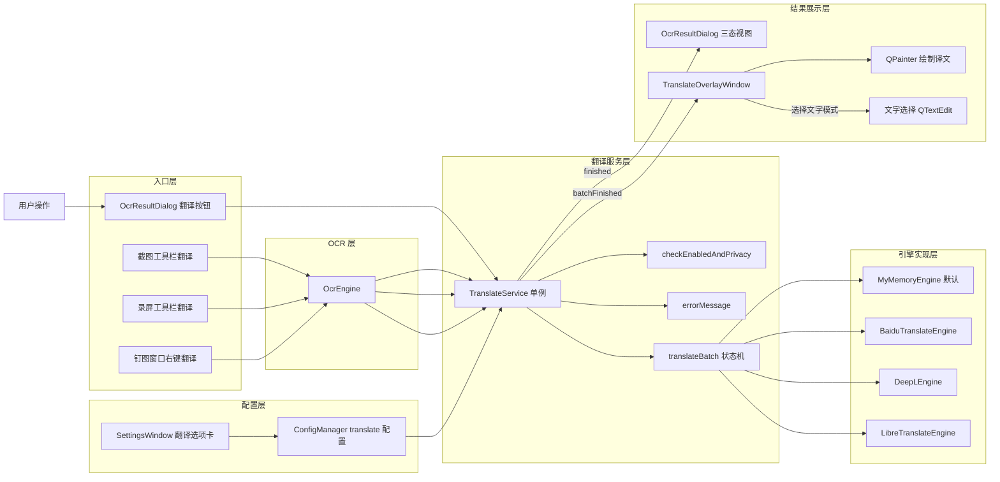

### 2.2 分层说明

- **入口层**：覆盖所有触发点
- **翻译服务层**：`TranslateService` 单例，统一管理引擎实例、配置加载、批量翻译状态机、公共静态方法
- **引擎实现层**：抽象 `TranslateEngine` 接口 + 4 种具体实现
- **结果展示层**：`OcrResultDialog`（三态视图）与 `TranslateOverlayWindow`（译文叠加 + 文字选择）
- **配置层**：`ConfigManager` 管理配置；`SettingsWindow` 提供 UI

---

## 3. 核心类图

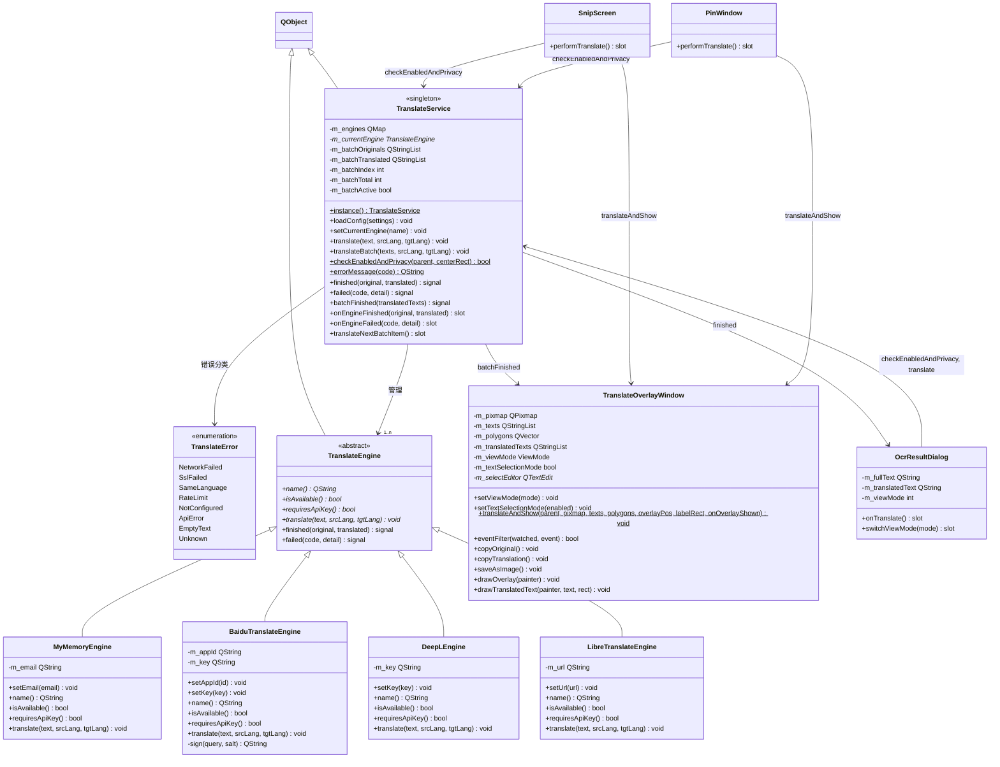

---

## 4. 翻译引擎层设计

### 4.1 抽象接口 TranslateEngine

文件：[TranslateEngine.h](file:///e:/develop/Code/github_new/quick-shot/src/translate/TranslateEngine.h)

错误码枚举：

```cpp
enum class TranslateError {
    NetworkFailed,   ///< 网络错误（DNS/超时/断开）
    SslFailed,       ///< SSL/TLS 未配置或握手失败
    SameLanguage,    ///< 源语言与目标语言相同
    RateLimit,       ///< 翻译额度用尽
    NotConfigured,   ///< 引擎未配置（缺 Key/URL）
    ApiError,        ///< 引擎业务错误（非 200）
    EmptyText,       ///< 空文本
    Unknown          ///< 未知错误兜底
};
```

### 4.2 四种引擎对比

| 引擎 | 类型 | 配置项 | 国内可达 | 额度 | 说明 |
|---|---|---|---|---|---|
| MyMemoryEngine | 默认，免注册 | 可选 email | ✅ 直连 | 无 email:5000 词/天<br>有 email:50000 词/天 | 签名不加密，最容易使用 |
| BaiduTranslateEngine | Key-Based | appId + key | ✅ 国内服务 | 每月免费 200 万字符 | 签名：`MD5(appId+query+salt+key)` |
| DeepLEngine | Key-Based | key | ❌ 需联网 | 按 Key 付费 | 翻译质量最高 |
| LibreTranslateEngine | URL-Based | 服务地址 | ✅ 自托管可达 | 取决于自托管服务 | 完全离线可实现 |

所有 Key / URL 由用户在设置页填写，存储于本地 QSettings，**软件不预置任何凭证**。

---

## 5. 配置项设计

统一前缀 `translate/`，通过 `ConfigManager::getSettings()` 读写。

| 配置键 | 类型 | 默认值 | 说明 |
|---|---|---|---|
| `translate/enabled` | bool | true | 未启用时所有翻译入口不响应 |
| `translate/engine` | QString | "mymemory" | 当前引擎 |
| `translate/targetLang` | QString | "en" | 目标语言 |
| `translate/sourceLang` | QString | "auto" | 源语言 |
| `translate/mymemoryEmail` | QString | "" | MyMemory 邮箱（提升额度） |
| `translate/baiduAppId` | QString | "" | 百度 App ID |
| `translate/baiduKey` | QString | "" | 百度 Key |
| `translate/deeplKey` | QString | "" | DeepL Key |
| `translate/libreUrl` | QString | "" | LibreTranslate 地址 |
| `translate/showPrivacyWarning` | bool | true | 首次隐私提示开关 |

### 5.1 SettingsWindow 翻译选项卡

位置在「样式」与「历史记录」之间：**常规 / 快捷键 / 样式 / 翻译 / 历史记录 / 关于**。

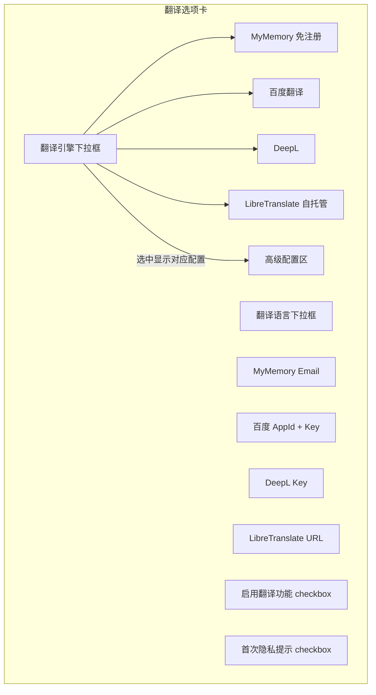

> 约定：翻译选项卡内容不多，属于「非滚动 tab」，在 `onTabChanged` 中用 `setFixedHeight` 强制高度自适应内容。

---

## 6. 形式一：OCR 结果弹窗内翻译

### 6.1 流程图

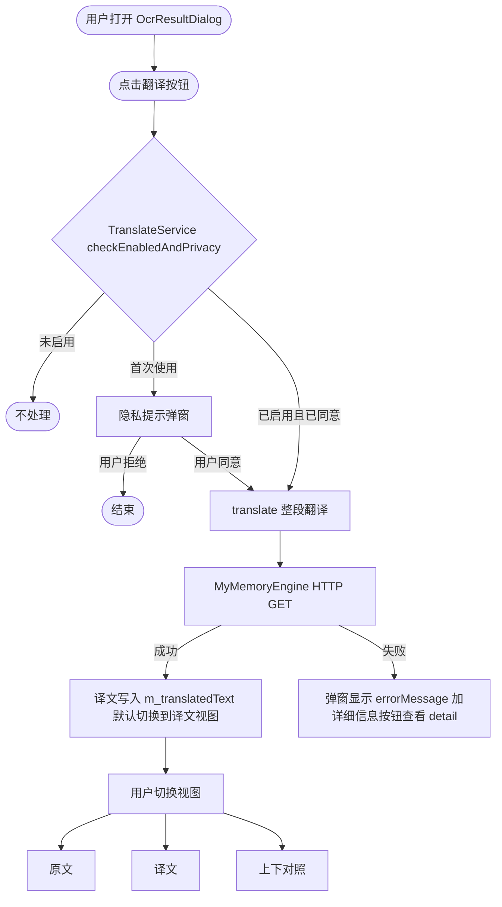

### 6.2 时序图

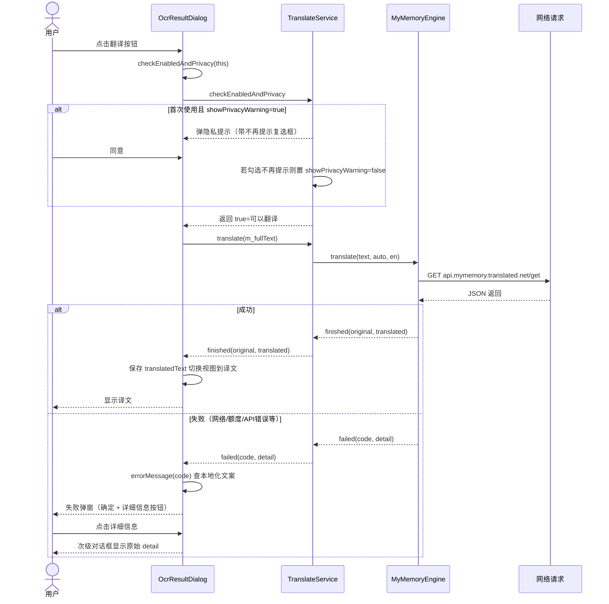

### 6.3 三态视图切换逻辑

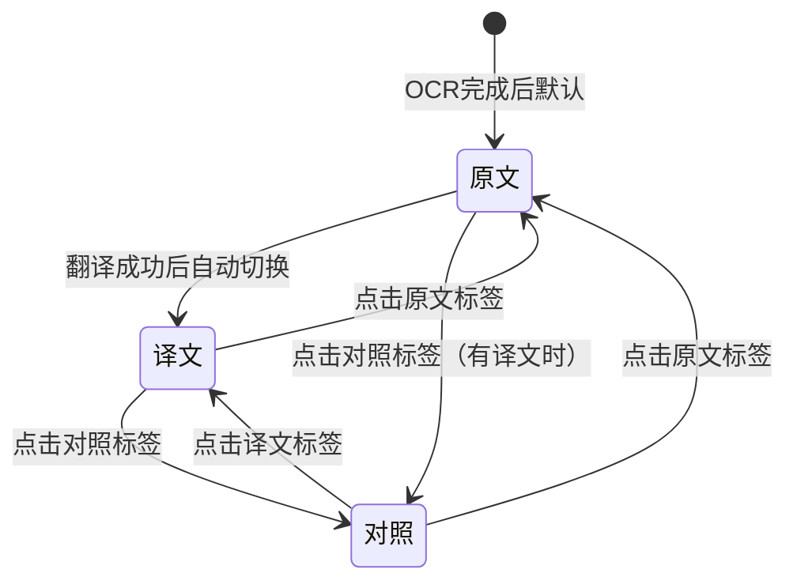

- **原文视图**：纯 OCR 识别文本
- **译文视图**：纯翻译后文本
- **对照视图**：按段原文 + 译文上下间隔显示（或左右对照）

### 6.4 翻译粒度

- 整段翻译：把 `m_fullText`（OCR 结果按行合并）整体送译
- 优点：请求次数少、额度消耗低、实现简单

---

## 7. 形式二：译文叠加显示

### 7.1 三处入口

| 入口 | 触发方式 | OCR 时机 |
|---|---|---|
| 截图工具栏 | ScreenshotToolBar 点击翻译按钮 | 截取当前选区图像 → OCR |
| 录屏工具栏 | RecordingToolBar 点击翻译按钮 | 截取当前选区图像 → OCR |
| 钉图窗口右键 | PinWindow 右键菜单「翻译」（复制→OCR→翻译→保存） | 对钉图 m_pixmap → OCR |

### 7.2 完整流程图

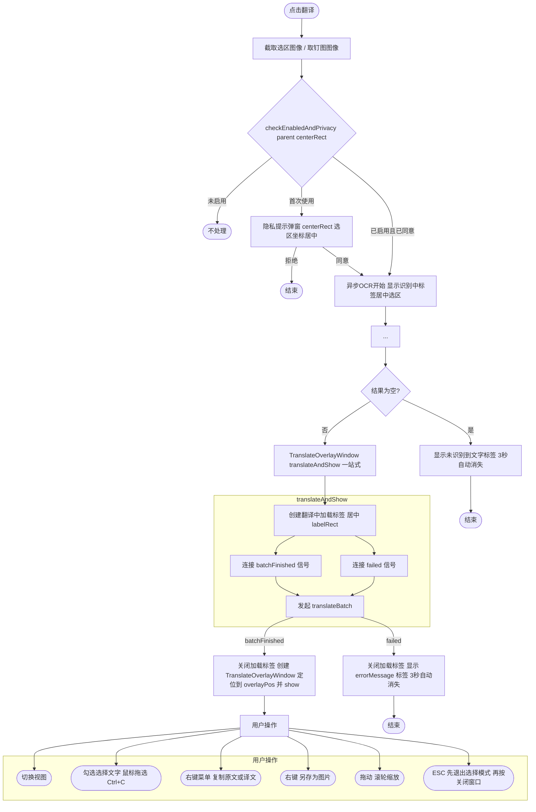

### 7.3 时序图（以 SnipScreen 截图工具栏翻译为例）

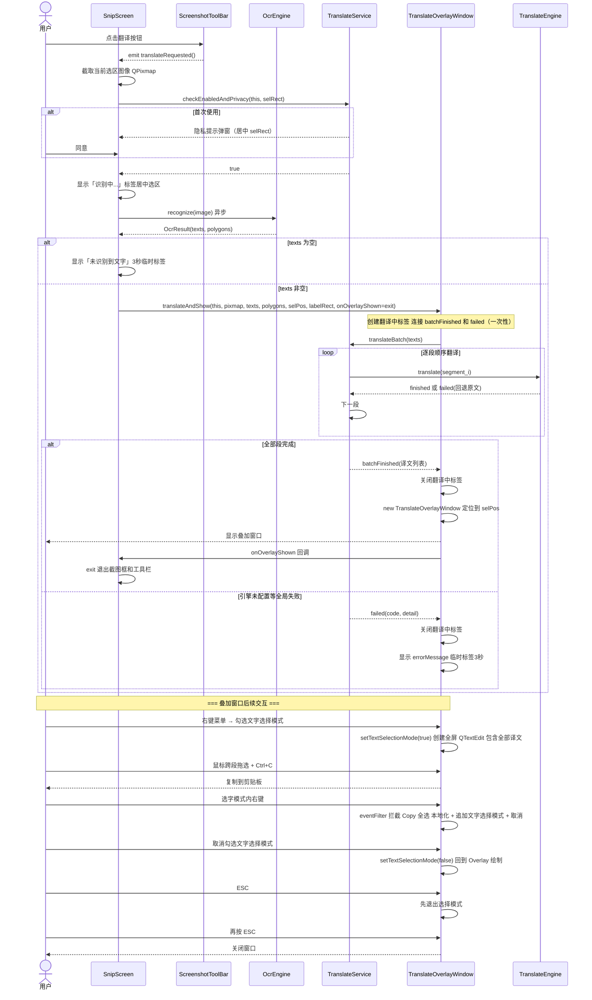

### 7.4 批量翻译状态机

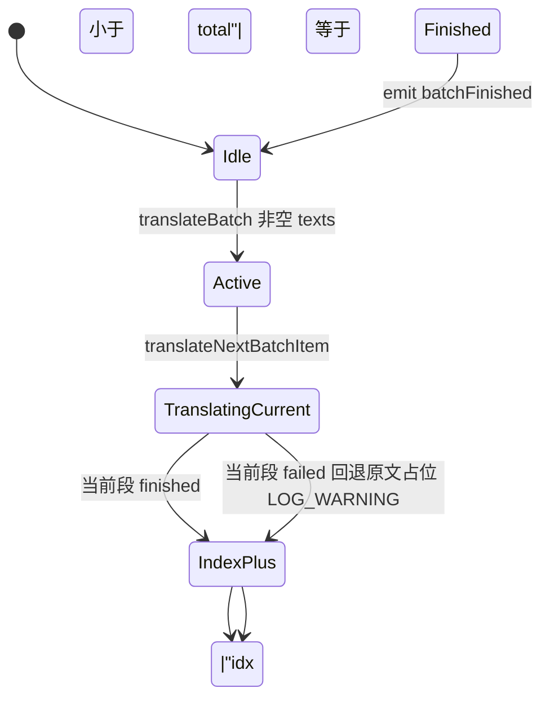

状态机成员（`TranslateService`）：
```cpp
QStringList m_batchOriginals;   // 原文列表
QStringList m_batchTranslated;  // 译文列表
int m_batchIndex = 0;           // 当前索引
int m_batchTotal = 0;           // 总段数
bool m_batchActive = false;     // 是否在批量中
```

### 7.5 TranslateOverlayWindow 渲染与文字选择

```mermaid
flowchart TB
    subgraph 渲染模式判定
        R["paintEvent 入口"] --> C1{"viewMode 等于 Original?"}
        C1 -->|"是"| R1["仅画原图"]
        C1 -->|"否"| C2{"textSelectionMode?"}
        C2 -->|"是"| R1
        C2 -->|"否"| R2["画原图 加 drawOverlay 每个多边形画半透明背景 加自动换行缩放字号的译文"]
    end

    subgraph 文字选择模式
        S0["setTextSelectionMode true"] --> S1["new QTextEdit 覆盖全屏 ReadOnly 加 TextSelectableByMouse"]
        S1 --> S1b["viewport installEventFilter 拦截右键"]
        S1b --> S2["setPlainText translatedTexts 按段拼接"]
        S2 --> S3["半透明白背景 加 深色文字"]
        S3 --> S4["用户交互"]
        S4 --> S5{"ESC?"}
        S5 -->|"是"| S6["setTextSelectionMode false deleteLater QTextEdit"]
        S4 --> S7{"右键?"}
        S7 -->|"是"| S9["eventFilter 拦截 viewport ContextMenu"]
        S9 --> S10["createStandardContextMenu 保留 Copy 全选 本地化替换"]
        S10 --> S11["追加 文字选择模式勾选 加 取消 两项"]
        S11 --> S12{"用户选择"}
        S12 -->|"取消勾选文字选择模式"| S6
        S12 -->|"取消"| S13["setTextSelectionMode false 加 close Overlay"]
        S12 -->|"Copy 或 全选"| S8["QTextEdit 原生处理 到 剪贴板"]
        S4 --> S14{"Ctrl+C"}
        S14 -->|"是"| S8
    end

    subgraph 视图切换
        V1["setViewMode"] --> V2{"textSelectionMode?"}
        V2 -->|"是"| V3["重新创建 QTextEdit 更新 geometry"]
        V2 -->|"否"| V4["update 触发 drawOverlay 重绘"]
    end
```

---

## 8. 隐私与错误处理

### 8.1 首次隐私提示定位策略

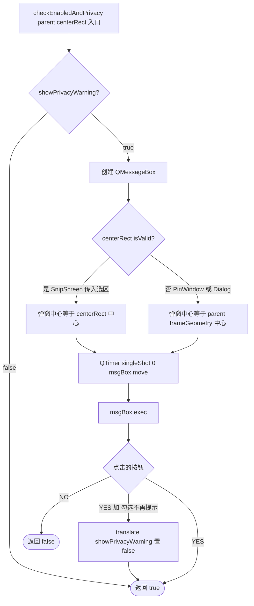

### 8.2 错误码 → 本地化消息对应表

| TranslateError | 翻译键 | zh_CN 示例 |
|---|---|---|
| NetworkFailed | `translate.error.networkFailed` | 网络连接失败，请检查网络 |
| SslFailed | `translate.error.sslFailed` | SSL/TLS 配置错误，无法建立安全连接 |
| SameLanguage | `translate.error.sameLanguage` | 源语言与目标语言相同 |
| RateLimit | `translate.error.rateLimit` | 翻译额度用尽，请稍后重试或更换引擎 |
| NotConfigured | `translate.error.notConfigured` | 翻译引擎未配置，请在设置中完善配置 |
| ApiError | `translate.error.apiError` | 翻译服务返回错误，请稍后重试 |
| EmptyText | `translate.error.emptyText` | 翻译文本为空 |
| Unknown | `translate.error.unknown` | 未知错误 |

失败弹窗结构：
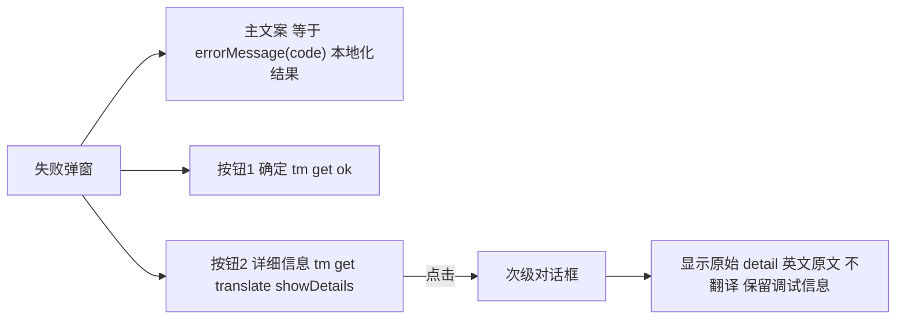

---

## 9. 公共复用方法（重构提取）

| 方法签名 | 定义位置 | 消除的重复点 |
|---|---|---|
| `TranslateService::checkEnabledAndPrivacy(parent, centerRect) → bool` | TranslateService 静态 | OcrResultDialog、SnipScreen、PinWindow 3 处各自实现的启用检查 + 隐私提示弹窗 |
| `TranslateService::errorMessage(code) → QString` | TranslateService 静态 | 3 处入口各自实现的 TranslateError → 本地化 switch-case（各 8 个 case） |
| `TranslateOverlayWindow::translateAndShow(parent, pixmap, texts, polygons, overlayPos, labelRect, onOverlayShown) → void` | TranslateOverlayWindow 静态 | SnipScreen、PinWindow 两处翻译流程中的：标签创建与居中、batchFinished + failed 一次性信号连接、Overlay 创建与定位、错误临时提示标签、翻译完成后回调（SnipScreen 退出截图框） |

---

## 10. 模块划分与文件清单

### 10.1 新增文件

| 文件 | 说明 |
|---|---|
| `src/translate/TranslateEngine.h/.cpp` | 抽象接口 + TranslateError 枚举 |
| `src/translate/MyMemoryEngine.h/.cpp` | 默认引擎（免注册） |
| `src/translate/BaiduTranslateEngine.h/.cpp` | 百度翻译（用户自填 Key） |
| `src/translate/DeepLEngine.h/.cpp` | DeepL（用户自填 Key） |
| `src/translate/LibreTranslateEngine.h/.cpp` | LibreTranslate（自托管 URL） |
| `src/translate/TranslateService.h/.cpp` | 单例 + 批量状态机 + checkEnabledAndPrivacy + errorMessage |
| `src/widgets/TranslateOverlayWindow.h/.cpp` | 叠加窗口 + 文字选择 + translateAndShow + onOverlayShown 回调 |
| `icons/translate.svg` | 翻译按钮图标（「文/A」设计） |

### 10.2 修改文件

| 文件 | 改动 |
|---|---|
| `src/ocr/OcrResultDialog.h/.cpp` | 翻译按钮、三态视图、失败弹窗（详细信息按钮） |
| `src/widgets/BaseToolBar.h/.cpp` | 加 translateRequested 信号 + m_translateBtn 公共成员 |
| `src/widgets/ScreenshotToolBar.cpp` | 创建翻译按钮并连接 translateRequested |
| `src/widgets/RecordingToolBar.cpp` | 创建翻译按钮并连接 translateRequested |
| `src/widgets/PinWindow.h/.cpp` | 右键加翻译项（顺序：复制→OCR→翻译→保存） |
| `src/capture/SnipScreen.h/.cpp` | 连接两个工具栏 translateRequested、performTranslate、隐私提示居中选区 |
| `src/widgets/SettingsWindow.h/.cpp` | 翻译选项卡（样式与历史记录之间） |
| `src/core/ConfigManager.cpp` | translate/ 默认配置初始化 |
| `src/languages/*.json`（6 个） | 加 32+ 翻译键 |
| `CMakeLists.txt` | Qt6::Network 模块 + 翻译源文件 + post-build TLS 插件部署 |
| `src/resources.qrc` | translate.svg 图标引用 |

---

## 11. 翻译键（i18n）完整清单

文件路径：`src/languages/{zh_CN,en_US,ja_JP,ko_KR,zh_TW,zh_HK}.json`

| 键 | 说明（zh_CN） |
|---|---|
| `tabTranslate` | 设置页「翻译」选项卡标题 |
| `ocr.translate` | OCR 弹窗「翻译」按钮文本 |
| `translate.button` | 工具栏「翻译」按钮文本 |
| `translate.translating` | 「翻译中...」加载提示 |
| `translate.viewMode` | 右键「视图模式」子菜单标题 |
| `translate.viewOriginal` | 原文视图 |
| `translate.viewTranslation` | 译文视图 |
| `translate.viewBoth` | 对照视图 |
| `translate.copyOriginal` | 复制原文 |
| `translate.copyTranslation` | 复制译文 |
| `translate.saveAsImage` | 另存为图片 |
| `translate.selectText` | 选择文字开关 |
| `translate.targetLang` | 设置页「目标语言」 |
| `translate.sourceLang` | 设置页「源语言」 |
| `translate.engine` | 设置页「翻译引擎」 |
| `translate.langAuto` | 自动检测 |
| `translate.engineMyMemory` | MyMemory（免注册） |
| `translate.engineBaidu` | 百度翻译 |
| `translate.engineDeepL` | DeepL |
| `translate.engineLibre` | LibreTranslate（自托管） |
| `translate.privacyTitle` | 隐私提示标题 |
| `translate.privacyMsg` | 隐私提示正文 |
| `translate.privacyDontAsk` | 不再提示复选框 |
| `translate.showDetails` | 失败弹窗「详细信息」按钮 |
| `translate.error.networkFailed` | 网络连接失败 |
| `translate.error.sslFailed` | SSL/TLS 错误 |
| `translate.error.sameLanguage` | 源目标语言相同 |
| `translate.error.rateLimit` | 额度用尽 |
| `translate.error.notConfigured` | 引擎未配置 |
| `translate.error.apiError` | 服务返回错误 |
| `translate.error.emptyText` | 文本为空 |
| `translate.error.unknown` | 未知错误 |

---

## 12. 风险与取舍

| 风险 | 影响 | 应对 |
|---|---|---|
| MyMemory 国内偶发不稳定 | 翻译失败 | 错误码友好提示；用户切换百度/自托管引擎 |
| MyMemory 额度耗尽 | 高频用户超额 | 设置引导填 email 提升额度；超额提示切换引擎 |
| 在线翻译隐私泄露 | 敏感文本外泄 | 首次隐私提示 + LibreTranslate 自托管引导 |
| 批量翻译请求多 | 慢速 + 高额度消耗 | 逐段顺序 + 失败回退原文；未来可优化短文本合并 |
| 译文长度与原文差异大 | 叠加排版错乱 | 自动换行 + 字号缩放 + 对照模式兜底 |
| 网络 API 变更 | 引擎失效 | 抽象接口隔离，单引擎失效不影响整体 |
