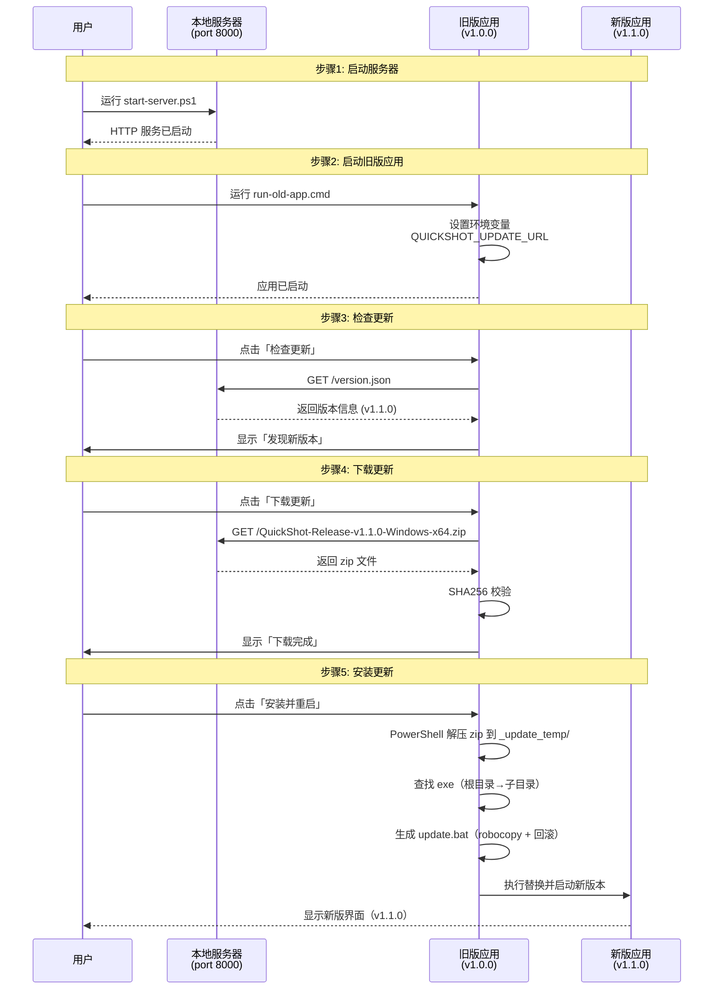

# QuickShot 更新功能本地验证指南

## 概述

本指南用于在本地环境中模拟更新服务器，验证 QuickShot 的检查更新、下载、校验和安装功能。

## 目录结构

```
update-test/
├── server/
│   ├── QuickShot-Release-v{version}-Windows-x64.zip  # 更新包（由 deploy.ps1 打包输出）
│   ├── version.json                                   # 版本信息清单
│   ├── make-version-json.ps1                          # 生成版本清单脚本
│   └── start-server.ps1                              # 启动本地HTTP服务器
├── app-v1.0.0/                                        # 旧版应用目录（手动放置）
│   ├── QuickShot.exe
│   ├── Qt6Core.dll
│   └── ... (其他依赖)
├── run-old-app.cmd                                    # 启动旧版应用
└── README.md                                          # 本文档
```

## 架构流程



## 完整操作步骤

### 步骤 1: 准备两个版本的 QuickShot

版本号由 [CMakeLists.txt](file:///e:/develop/Code/github_new/quick-shot/CMakeLists.txt#L2) 的 `project(QuickShot VERSION x.y.z)` 统一管理，修改后需在 CLion 中 **Reset Cache and Reload CMake Project**。

| 版本 | CMakeLists.txt VERSION | 用途 |
|------|------------------------|------|
| 旧版 | 1.0.0 | 放到 `app-v1.0.0/` 目录模拟用户已安装版本 |
| 新版 | 1.1.0 | 打包为 zip 放到 `server/` 目录作为更新包 |

### 步骤 2: 编译并放置旧版

```powershell
# 1. 将 CMakeLists.txt VERSION 改为 1.0.0，Reset Cache and Reload
# 2. 打包 Release
cd e:\develop\Code\github_new\quick-shot\deploy\win
.\deploy.ps1 -r
# 3. 将输出目录内容复制到 app-v1.0.0/
Copy-Item -Recurse -Force "QuickShot-Release-v1.0.0-Windows-x64\*" "e:\develop\Code\github_new\quick-shot\update-test\app-v1.0.0\"
```

### 步骤 3: 编译并打包新版

```powershell
# 1. 将 CMakeLists.txt VERSION 改为 1.1.0，Reset Cache and Reload
# 2. 打包 Release
cd e:\develop\Code\github_new\quick-shot\deploy\win
.\deploy.ps1 -r
# 3. 将 zip 包复制到 server 目录
Copy-Item "QuickShot-Release-v1.1.0-Windows-x64.zip" "e:\develop\Code\github_new\quick-shot\update-test\server\"
```

> **zip 包目录结构**：支持两种格式，代码会自动适配：
> - 顶层直接是 exe/dll（无顶层目录）
> - 包含一层顶层目录（如 `QuickShot-Release-v1.1.0-Windows-x64/QuickShot.exe`）

### 步骤 4: 生成版本清单

```powershell
cd e:\develop\Code\github_new\quick-shot\update-test\server
powershell -ExecutionPolicy Bypass -File make-version-json.ps1 -Version 1.1.0
```

脚本会自动：
- 查找 `QuickShot-Release-v1.1.0-Windows-x64.zip`
- 计算 SHA256 校验和
- 获取文件大小
- 生成无 BOM 的 UTF-8 `version.json`

生成的 `version.json` 示例：
```json
{
    "version": "1.1.0",
    "releaseNotes": "本地模拟更新测试包\n1. 验证「检查更新」功能\n2. 验证下载与 SHA256 校验\n3. 验证安装替换与自动重启",
    "downloadUrl": "http://127.0.0.1:8000/QuickShot-Release-v1.1.0-Windows-x64.zip",
    "checksum": "sha256:a1b2c3d4e5f6...",
    "fileSize": 96033920
}
```

### 步骤 5: 启动本地服务器

```powershell
cd e:\develop\Code\github_new\quick-shot\update-test\server
powershell -ExecutionPolicy Bypass -File start-server.ps1
```

服务器信息：
- 地址：`http://127.0.0.1:8000`
- 版本检查：`http://127.0.0.1:8000/version.json`
- 下载链接：`http://127.0.0.1:8000/QuickShot-Release-v1.1.0-Windows-x64.zip`

### 步骤 6: 启动旧版应用并测试更新

双击运行 `run-old-app.cmd`，脚本会：
1. 设置一次性环境变量 `QUICKSHOT_UPDATE_URL` 指向本地服务器
2. 启动 `app-v1.0.0\QuickShot.exe`

在应用中操作：
1. 打开「设置」→「关于」选项卡
2. 点击「检查更新」→ 应显示「发现新版本 v1.1.0」
3. 点击「下载更新」→ 进度条走完，SHA256 校验通过
4. 点击「安装并重启」→ 观察：
   - 旧版应用自动退出
   - 弹出 cmd 窗口执行 update.bat
   - 新版本自动启动
   - 设置→关于显示版本号 **v1.1.0**

## 安装流程技术细节

update.bat 脚本由 UpdateManager 动态生成，执行以下流程：

```
1. findstr 精确匹配 PID 等待主程序退出（每秒轮询）
2. robocopy 备份旧版本（排除 _update_temp / backup / update.bat）
3. robocopy 替换为新版本
   ├─ 退出码 < 8：成功 → 清理临时文件 → 启动安装目录新 exe
   └─ 退出码 ≥ 8：失败 → robocopy 从 backup 回滚 → 启动旧 exe → exit /b 1
```

## 环境变量说明

| 环境变量 | 作用 | 有效期 |
|---------|------|--------|
| `QUICKSHOT_UPDATE_URL` | 覆盖版本检查地址，指向本地服务器 | 一次性（cmd 窗口关闭后失效） |

**特点**：
- 仅在 `run-old-app.cmd` 启动的 cmd 窗口内有效
- 关闭窗口后自动失效，不影响系统环境
- 正常使用时未设置此变量，走 GitHub → Gitee → 官方网站多渠道回退

## 日志排查

应用日志位于安装目录下的 `logs/` 文件夹（如 `app-v1.0.0/logs/quickshot_log_YYYYMMDD.log`），搜索 `UpdateManager` 可查看：

- 版本检查结果和渠道切换
- 下载进度和 SHA256 校验
- 解压过程（包括 stderr 输出）
- exe 查找路径和子目录扫描
- update.bat 生成路径和启动状态

## 常见问题排查

### 服务器未启动

**症状**：检查更新时显示网络错误

**解决**：确保 `start-server.ps1` 正在运行，端口 8000 未被占用

### SHA256 校验失败

**症状**：下载完成后提示校验失败

**解决**：
1. 确认 `version.json` 中的 `checksum` 与 zip 包匹配
2. 重新运行 `make-version-json.ps1 -Version 1.1.0` 生成新的校验值

### "Invalid update package: executable not found"

**症状**：点击安装后提示找不到可执行文件

**解决**：
1. 查看日志中 `UpdateManager: looking for exe` 和 `subDirs in tempDir` 行
2. 确认 zip 包解压后包含 `QuickShot.exe`
3. 确认旧版应用使用的是包含修复后 UpdateManager 代码的编译版本

### 安装后仍是旧版本

**症状**：安装流程走完但版本号没变

**解决**：
1. 检查日志中 `extraction complete` 是否出现（解压是否成功）
2. 检查 `update.bat` 是否执行了 robocopy 替换（查看 ERRORLEVEL）
3. 确认旧版应用有写入安装目录的权限

## 测试检查清单

- [ ] 服务器正常运行在端口 8000
- [ ] version.json 格式正确，downloadUrl 包含 `Release` 前缀
- [ ] zip 包的 SHA256 校验值正确
- [ ] 旧版应用（app-v1.0.0）使用修复后的代码编译
- [ ] 应用能成功检查更新
- [ ] 应用能成功下载更新
- [ ] SHA256 校验通过
- [ ] 应用能成功安装更新
- [ ] 新版本应用自动启动
- [ ] 新版本版本号显示正确（v1.1.0）
